<p align="center">
 
 <h1 align="center">OpenGL</h1>
 <p align="center"><b>计算机图形</b></p>
</p>


<div align=center>


[](LICENSE)


<div align=left>
<!-- 顶部至此截止 -->
[toc]


# 目录说明

| 编号                                                         | 说明                                                         |
| ------------------------------------------------------------ | ------------------------------------------------------------ |
| [000 - Apple M1 配置测试](https://github.com/NekoSilverFox/OpenGL/tree/main/000 - Apple M1 配置测试) | 在 M1 Mac 下 OpenGL 的配置及运行（基于 Clang）               |
| [001_OpenGLWidget_HelloWidget](https://github.com/NekoSilverFox/OpenGL/tree/main/001_OpenGLWidget_HelloWidget) | 如果在 Qt 的环境下，使用初始化 OpenGL 控件                   |
| [002_Triangle_VAO_VBO](https://github.com/NekoSilverFox/OpenGL/tree/main/002_Triangle_VAO_VBO) | 基于 `001` 的初始化控件后，增加使用 VAO、VBO 代码绘制三角形的代码<br />顶点和片段着色器的编写、编译、链接和使用 |
|                                                              |                                                              |
|                                                              |                                                              |
|                                                              |                                                              |
|                                                              |                                                              |
|                                                              |                                                              |
|                                                              |                                                              |
|                                                              |                                                              |
|                                                              |                                                              |


# 简介及资料

**OpenGL 简介：**

OpenGL 是一种协议和标准，是一种小而美的东西。因为它是一种框协议，所以它是不需要管 OS 层面和不同显卡层面的差异的。

OpenGL 官方的推荐为：GLFW+GLAD，但是我们可以使用 OpenGL+Qt（MinGW）。借助于 Qt 的封装，我们无需配置第三方库，更接近于实战


**LearnOpenGL 中文版网站：**

https://learnopengl-cn.github.io/


**视频教程：**

https://ke.qq.com/course/package/40726?flowToken=1041265


**版本的使用：**

- OpenGL3.3 及以上版本，因为具备可编程管线的功能。3.3 版本是一个分水岭
- VC++ 最好使用 2013 以上的版本
- C++11 之上的版本


**Cmakelist 的编写：**

基于 M1 Mac

```cmake
cmake_minimum_required(VERSION 3.22)
project(OpenGL)

set(CMAKE_CXX_STANDARD 11)

# 包含头文件
include_directories(./glad/include)

# brew 安装的库都在下面的目录里（M1 版 Mac） /opt/homebrew/Cellar/
# 把 glfw 加进项目
include_directories(/opt/homebrew/Cellar/glfw/3.3.6/include)

# glfw 库文件也加进来
link_directories(/opt/homebrew/Cellar/glfw/3.3.6/lib)

add_executable(OpenGL  # 这个是工程的名字
        ./glad/src/glad.c
        main.cpp)

# 最后把库文件 link 到项目
target_link_libraries(
        OpenGL  # 这个是工程的名字
        glfw
)
```


# 专有名词及解释

| 名词                            | 英文                          | 解释                                                         |
| ------------------------------- | ----------------------------- | ------------------------------------------------------------ |
| 对象                            | Object                        | 一个对象是指一些选项的集合，**代表OpenGL状态的一个子集**，可以使用对象来记录状态 |
| 图形渲染管线                    | Graphics Pipeline             | 实际上指的是一堆原始图形数据途经一个输送管道，期间经过各种变化处理最终出现在屏幕的过程。图形渲染管线可以被划分为两个主要部分：第一部分把你的3**D坐标转换为2D坐标**，第二部分是把**2D坐标转变为实际的有颜色的像素** |
| 着色器                          | Shader                        | 在GPU上为每一个（渲染管线）阶段运行的小程序（小核心）        |
| 图元                            | Primitive                     | 指定坐标和颜色值构成的是什么，这些数据所表示的渲染类型；是渲染成一个点（GL_POINT）、一条线（GL_LINE_STRIP）还是三角形（GL_TRIANGLES） |
| 片段                            | Fragment                      | 在 OpenGL 中一个片段是 OpenGL 渲染一个像素所需要的所有数据   |
| 裁切                            | Clipping                      | 裁切会丢弃超出视图以外的所有像素，用来提升执行效率           |
| 深度                            |                               | 可以理解为z坐标，它代表一个像素在空间中和你的距离，如果离你远就可能被别的像素遮挡，你就看不到它了，它会被丢弃，以节省资源 |
| NDC 标准化设备坐标              | Normalized Device Coordinates | 顶点着色器中处理过后，就是标准化设备坐标了，x、y、z的值在-1.0到1.0的一小段空间（立方体）。 落在范围外的坐标都会被裁剪，因为 GPU 没有必要再去消耗算力去进行计算 |
| 顶点着色器                      | Vertex Shader                 | **图形渲染管线的第一部分**，它把一个单独的顶点作为输入。顶点着色器主要的目的是把3D坐标转为另一种3D坐标，同时允许我们对顶点属性进行一些基本处理 |
| ↓ 图元装配                      | Primitive Assembly            | 图元装配阶段将顶点着色器输出的所有顶点作为输入（如果是GL_POINTS，那么就是一个顶点），并**将所有的点装配成指定图元的形状** |
| ↓ 几何着色器                    | Geometry Shader               | 图元装配阶段的输出会传递给几何着色器(Geometry Shader)。几何着色器把图元形式的一系列顶点的集合作为输入，它可以通过产生新顶点构造出新的（或是其它的）图元来生成其他形状 |
| ↓ 光栅化阶段                    | Rasterization Stage           | 几何着色器的输出会被传入光栅化阶段，里它会把**图元映射为最终屏幕上相应的像素**，生成供片段着色器(Fragment Shader)使用的==片段==。在片段着色器运行之前会执行裁切(Clipping) |
| ↓ 片段着色器                    | Fragment Shader               | 计算一个像素的最终颜色，这也是所有OpenGL高级效果产生的地方。通常，片段着色器包含3D场景的数据（比如光照、阴影、光的颜色等等），这些数据可以被用来计算最终像素的颜色。 |
| ↓ Alpha测试和混合(Blending)阶段 |                               | 这个阶段检测片段的对应的深度（和模板(Stencil)）值，用它们来判断这个像素是其它物体的前面还是后面，决定是否应该丢弃。这个阶段也会检查alpha值（alpha值定义了一个物体的透明度）并对物体进行混合(Blend)。所以，即使在片段着色器中计算出来了一个像素输出的颜色，在渲染多个图形时最后的像素颜色也可能完全不同 |
| 顶点                            | Vertex                        | 一个3D坐标的数据集合                                         |
| 顶点数据                        | Vertex Data                   | 顶点数据是一系列顶点的集合                                   |
| 顶点属性                        | Vertex Attribute              | 顶点的数据是用顶点属性表示的，它可以包含任何我们想用的数据   |
| VAO 顶点数组对象                | Vertex Array Object           | 使用 VAO 配置 OpenGL 如何解释显存，VAO 的数据类型是唯一的，并不保存实际的数据，而是**放顶点结构的定义** |
| VBO 顶点缓冲对象                | Vertex Buffer Object          | VBO 顶点缓冲对象**管理着**顶点着色器（Vertex Shader），VBO的**类型是**`GL_ARRAY_BUFFER`；它会在 GPU 上创建内存，用于储存我们的大量顶点数据 |
| EBO/IBO 元素/索引缓冲对象       | Element/Index Buffer Object   | EBO是一个缓冲区，就像一个顶点缓冲区对象一样，它**存储 OpenGL 要绘制顶点的==索引==** |
| 着色器程序对象                  | Shader Program Object         | 多个着色器链接（Link）合并之后并最终链接完成的版本，在渲染对象时使用`glUseProgram(shaderProgram)`激活这个着色器程序 |


# OpenGL 对象

一个对象（Object）是指一些选项的集合，**代表OpenGL状态的一个子集**，可以使用对象来记录状态

通常把0penGL上下文比作一个大的结构体，包含很多子集

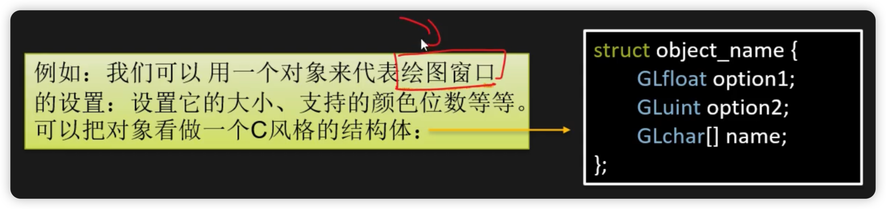


【重点】**示例：**

```cpp
// 1. 创建对象
GLuint objectId = 0;  // 创建一个 ID（GLuint 是 OpenGL 自己的 int 类型）
glGenObject(1, &objectId);  // 生成了一个对象（小助理），并给他了一个编号

// 2. 绑定至上下文对象
glBindObject(GL_WINDOW_TARGET, objectId);  // 让这个对象【记录】状态机中子集 GL_WINDOW_TARGET 的状态，也就是确定工作内容

// 3. 设置子集 GL_WINDOW_TARGET 的一些选项，以下两条的操作会被 objectId对象 记录
glSetObjectOption(GL_WINDOW_TARGET, GL_OPTION_WINDOW_WIDTH, 800);  // 设置窗口宽度
glSetObjectOption(GL_WINDOW_TARGET, GL_OPTION_WINDOW_HEIGHT, 600);  // 设置窗口高度

// 4. 将上下文的 GL_WINDOW_TARGET 设回默认
glBindObject(GL_WINDOW_TARGET, 0);  // 将objectId对象与GL_WINDOW_TARGET解绑；但 objectId对象 已经记录了上面的两条内容。需要查看记录的时候再喊他过来就好。这里的 0 代表空对象，即为不绑定任何对象

// 5. 一旦重新绑定 objectId对象 到 GL_WINDOW_TARGET，这些选项会重新生效
```

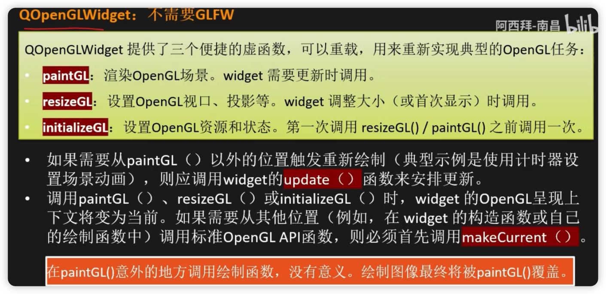

- 在进行使用 QOpenGLWidget 时，要首先要在初始化函数`initializeGL()` 中调用 `QOpenGLFunctions_X_X_Core::` 中的 init **将 Qt 里的函数指针指向显卡的函数（下图所示）**


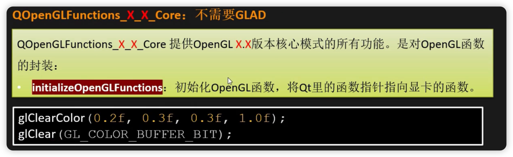


# 你好，三角形


> https://learnopengl-cn.github.io/01%20Getting%20started/04%20Hello%20Triangle/
>
> 在学习此节之前，建议将这三个单词先记下来：
>
> - 顶点数组对象：Vertex Array Object，VAO
> - 顶点缓冲对象：Vertex Buffer Object，VBO
> - 元素缓冲对象：Element Buffer Object，EBO 或 索引缓冲对象 Index Buffer Object，IBO

在OpenGL中，任何事物都在3D空间中，而屏幕和窗口却是2D像素数组，这导致OpenGL的大部分工作都是关于把3D坐标转变为适应你屏幕的2D像素。3D坐标转为2D坐标的处理过程是由OpenGL的**图形渲染管线**（Graphics Pipeline，大多译为管线，实际上指的是一堆原始图形数据途经一个输送管道，期间经过各种变化处理最终出现在屏幕的过程）管理的。图形渲染管线可以被划分为两个主要部分：第一部分把你的3D坐标转换为2D坐标，第二部分是把2D坐标转变为实际的有颜色的像素。


*2D坐标和像素也是不同的，2D坐标精确表示一个点在2D空间中的位置，而2D像素是这个点的近似值，2D像素受到你的屏幕/窗口分辨率的限制。*


图形渲染管线接受一组3D坐标，然后把它们转变为你屏幕上的有色2D像素输出。图形渲染管线可以被划分为几个阶段，每个阶段将会把前一个阶段的输出作为输入。所有这些阶段都是高度专门化的（它们都有一个特定的函数），并且很容易并行执行。正是由于它们具有并行执行的特性，当今大多数显卡都有成千上万的小处理核心，它们在GPU上为每一个（渲染管线）阶段运行各自的小程序，从而在图形渲染管线中快速处理你的数据。这些小程序叫做**着色器(Shader)。**


有些着色器可以由开发者配置，因为允许用自己写的着色器来代替默认的，所以能够更细致地控制图形渲染管线中的特定部分了。因为它们运行在GPU上，所以节省了宝贵的CPU时间。**OpenGL着色器是用OpenGL着色器语言(OpenGL Shading Language, GLSL)写成的**


1. 图形渲染管线的第一个部分是**==顶点着色器(Vertex Shader)==**，它把一个单独的顶点作为输入。顶点着色器主要的目的是把3D坐标转为另一种3D坐标（后面会解释），同时顶点着色器允许我们对顶点属性进行一些基本处理


2. **==图元装配(Primitive Assembly)==阶段将顶点着色器输出的所有顶点作为输入（如果是GL_POINTS，那么就是一个顶点），并所有的点装配成指定图元的形状**；本节例子中是一个三角形。

    为**了让OpenGL知道我们的坐标和颜色值构成的到底是什么，OpenGL需要你去指定这些数据所表示的渲染类型**。我们是希望把这些数据渲染成一系列的点？一系列的三角形？还是仅仅是一个长长的线？**做出的这些提示叫做==图元(Primitive)==**，任何一个绘制指令的调用都将把图元传递给OpenGL。**这是其中的几个：GL_POINTS、GL_TRIANGLES、GL_LINE_STRIP。**


3. **图元装配阶段的输出会传递给==几何着色器(Geometry Shader)==。几何着色器把图元形式的一系列顶点的集合作为输入，它可以通过产生新顶点构造出新的（或是其它的）图元来生成其他形状。**例子中，它生成了另一个三角形。


4. 几何着色器的输出会被传入**==光栅化阶段(Rasterization Stage)==**，**这里它会把图元映射为最终屏幕上相应的像素，生成供片段着色器(Fragment Shader)使用的片段(Fragment | OpenGL中的一个片段是OpenGL渲染一个像素所需的所有数据)。在片段着色器运行之前会执行裁切(Clipping)。裁切会丢弃超出你的视图以外的所有像素，用来提升执行效率。**
   
5. **==片段着色器==的主要目的是计算一个像素的最终颜色**，这也是所有OpenGL高级效果产生的地方。通常，片段着色器包含3D场景的数据（比如光照、阴影、光的颜色等等），这些数据可以被用来计算最终像素的颜色。


6. 在所有对应颜色值确定以后，最终的对象将会被传到最后一个阶段，我们叫做**==Alpha测试和混合(Blending)阶段==**。这个阶段检测片段的对应的深度（和模板(Stencil)）值（后面会讲），用它们来判断这个像素是其它物体的前面还是后面，决定是否应该丢弃。这个阶段也会检查alpha值（alpha值定义了一个物体的透明度）并对物体进行混合(Blend)。所以，即使在片段着色器中计算出来了一个像素输出的颜色，在渲染多个三角形的时候最后的像素颜色也可能完全不同。

    通常==**深度**==可以理解为z坐标，它代表一个像素在空间中和你的距离，如果离你远就可能被别的像素遮挡，你就看不到它了，它会被丢弃，以节省资源。


可以看到，图形渲染管线非常复杂，它包含很多可配置的部分。然而，**对于大多数场合，我们只需要配置顶点和片段着色器就行了**。几何着色器是可选的，通常使用它默认的着色器就行了。

在现代OpenGL中，我们**必须**定义至少一个顶点着色器和一个片段着色器（因为GPU中没有默认的顶点/片段着色器）。出于这个原因，刚开始学习现代OpenGL的时候可能会非常困难，因为在你能够渲染自己的第一个三角形之前已经需要了解一大堆知识了。


**下面，你会看到一个图形渲染管线的每个阶段的抽象展示。要注意蓝色部分代表的是我们可以注入自定义的着色器的部分。**


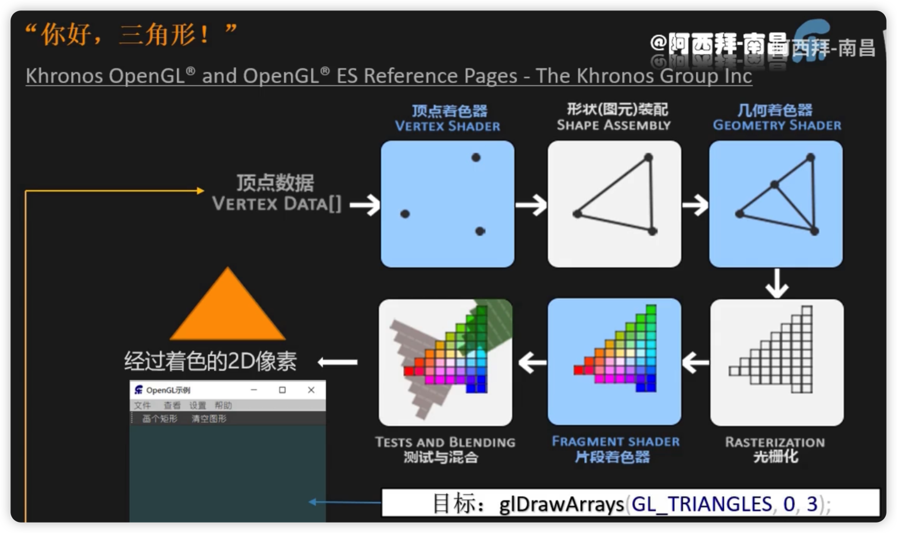


## VAO、VBO

首先，我们以数组的形式传递3个3D坐标作为图形渲染管线的输入，用来表示一个三角形，这个数组叫做**顶点数据(Vertex Data)；顶点数据是一系列顶点的集合。一个顶点(Vertex)是一个3D坐标的数据的集合。而顶点数据是用顶点属性(Vertex Attribute)表示的，它可以包含任何我们想用的数据**，但是简单起见，我们还是假定每个顶点只由一个3D位置(译注1)和一些颜色值组成的吧。


顶点数据（`Vertex DATA[]`）的传递 -> 我们要将内存里的数据传递到显卡里

1. **顶点着色器**（自己写在 `XXXOpenGLWedget::initializeGL()` 中）

    - 通过**顶点缓冲对象 `Vertex Buffer Objects, VBO`**管理，顶点缓冲对象的缓冲**类型是** `GL_ARRAY_BUFFER`。它会在 GPU 上创建内存，用于储存我们的大量顶点数据（将数据从内存读取到显存，一个缓冲区一个缓冲区的填充）。使用这些缓冲对象的好处是我们可以一次性的发送一大批数据到显卡上，而不是每个顶点发送一次。从CPU把数据发送到显卡相对较慢，所以只要可能我们都要尝试尽量一次性发送尽可能多的数据。当数据发送至显卡的内存中后，顶点着色器几乎能立即访问顶点，这是个非常快的过程。

        

    - OpenGL 允许我们同时绑定多个缓冲，只要它们是不同的缓冲类型

        

    - 配置 OpenGL 如何解释这些内存：通过**顶点数组对象 `Vertex Array Objects, VAO`** 管理，**VAO 的数据类型是唯一的，数组里的每一个项都对应一个属性的解析（类似一个类 | 结构体）**。的

        顶点**数组**对象(Vertex Array Object, VAO)可以像顶点**缓冲**对象（VBO）那样被绑定，任何随后的顶点属性调用都会储存在这个VAO中。这样的好处就是，当配置顶点属性指针时，你只需要将那些调用执行一次，之后再绘制物体的时候只需要绑定相应的VAO就行了。这使在不同顶点数据和属性配置之间切换变得非常简单，只需要绑定不同的VAO就行了。

        > **OpenGL的核心模式**要求**我们使用VAO，所以它知道该如何处理我们的顶点输入。如果我们绑定VAO失败，OpenGL会拒绝绘制任何东西。**

        

        一个顶点数组对象会储存以下这些内容：

        - `glEnableVertexAttribArray`和`glDisableVertexAttribArray`的调用。

        - 通过`glVertexAttribPointer`设置的顶点属性配置。

        - 通过`glVertexAttribPointer`调用与顶点属性关联的顶点缓冲对象

            

        要想使用VAO，要做的只是使用`glBindVertexArray`绑定VAO。从绑定之后起，我们应该绑定和配置对应的VBO和属性指针，之后解绑VAO供之后使用。当我们打算绘制一个物体的时候，我们只要在绘制物体前简单地把VAO绑定到希望使用的设定上就行了。这段代码应该看起来像这样：

        ```c++
        // ..:: 初始化代码（只运行一次 (除非你的物体频繁改变)） :: ..
        // 1. 绑定VAO
        glBindVertexArray(VAO);
        // 2. 把顶点数组复制到缓冲中供OpenGL使用
        glBindBuffer(GL_ARRAY_BUFFER, VBO);
        glBufferData(GL_ARRAY_BUFFER, sizeof(vertices), vertices, GL_STATIC_DRAW);
        // 3. 设置顶点属性指针
        glVertexAttribPointer(0, 3, GL_FLOAT, GL_FALSE, 3 * sizeof(float), (void*)0);
        glEnableVertexAttribArray(0);
        
        [...]
        
        // ..:: 绘制代码（渲染循环中） :: ..
        // 4. 绘制物体
        glUseProgram(shaderProgram);
        glBindVertexArray(VAO);
        someOpenGLFunctionThatDrawsOurTriangle();
        ```

        就这么多了！前面做的一切都是等待这一刻，一个储存了我们顶点属性配置和应使用的VBO的顶点数组对象。一般当你打算绘制多个物体时，你首先要生成/配置所有的VAO（和必须的VBO及属性指针)，然后储存它们供后面使用。**当我们打算绘制物体的时候就拿出相应的VAO，绑定它，绘制完物体后，再解绑VAO。**

        

    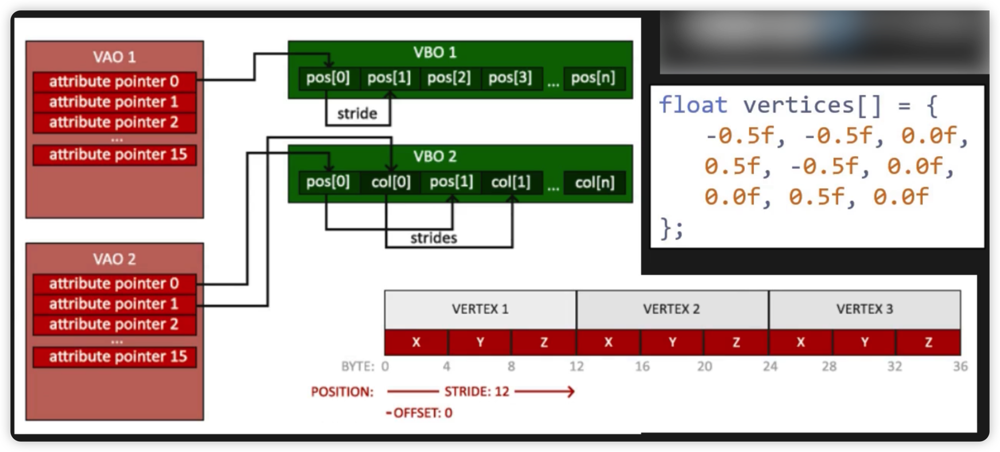

    ```c++
    // 顶点数据，由于OpenGL是在3D空间中工作的，而我们渲染的是一个2D三角形，我们将它顶点的z坐标设置为0.0
    float vertices[] = {
      -0.5f, -0.5f, 0.0f,
       0.5f, -0.5f, 0.0f,
       0.0f,  0.5f, 0.0f
    };
    
    // 创建 VAO 和 VBO 对象并且赋予 ID
    unsigned int VAO, VBO;
    glGenVertexArrays(1, &VAO);  // Array 存放数据结构的定义
    glGenBuffers(1, &VBO);  // Buffer 缓冲区才是真正存放顶点数据的
    
    // 绑定 VAO、VBO 对象
    glBindVertexArray(VAO);  // 【重点】VAO会储存glBindBuffer的函数调用
    glBindBuffer(GL_ARRAY_BUFFER, VBO); // 新创建的缓冲绑定到GL_ARRAY_BUFFER目标上，顶点缓冲对象的缓冲类型是GL_ARRAY_BUFFER
    
    
    /* glBufferData是一个专门用来把用户定义的数据复制到当前绑定缓冲的函数。它的第一个参数是目标缓冲的类型：顶点缓冲对象当前绑定到GL_ARRAY_BUFFER目标上。第二个参数指定传输数据的大小(以字节为单位)；用一个简单的sizeof计算出顶点数据大小就行。第三个参数是我们希望发送的实际数据。
    	为当前绑定到 target 的缓冲区对象创建一个新的数据存储（在 GPU 上创建对应的存储区域，并将内存中的数据发送过去）
    	如果 data 不是 NULL，则使用来自此指针的数据初始化数据存储
    	void glBufferData(GLenum target,  // 目标缓冲的类型，需要在 GPU 上创建的目标
    										GLsizeipter size,  // 创建的显存大小(以字节为单位)
    										const GLvoid* data,  // 希望发送的实际数据
    										GLenum usage)  // 创建在 GPU 上的哪一片区域（显存上的每个区域的性能是不一样的）https://registry.khronos.org/OpenGL-Refpages/es3.0/
    										GL_STATIC_DRAW ：数据不会或几乎不会改变。
    										GL_DYNAMIC_DRAW：数据会被改变很多。
    										GL_STREAM_DRAW ：数据每次绘制时都会改变。
    */
    glBufferData(GL_ARRAY_BUFFER, sizeof(vertices), vertices, GL_STATIC_DRAW);  // 现在我们已经把顶点数据储存在显卡的内存中，用VBO这个顶点缓冲对象管理
    
    /* 告知显卡如何解析缓冲区里面的属性值（设置顶点属性指针）
    	void glVertexAttribPointer(
    															GLuint index,  // VAO 中的第几个属性（VAO 属性的索引），我们在顶点着色器中使用layout(location = 0)定义了
    															GLint size,  // 顶点属性的大小，VAO 中的第几个属性中对应的位置放几份数据，顶点属性是一个vec3，它由3个值组成，所以大小是3
    															GLEnum type,  // 存放数据的数据类型，这里是GL_FLOAT(GLSL中vec*都是由浮点数值组成的)
    															GLboolean normalized,  // 是否标准化(Normalize)，如设置为GL_TRUE，所有数据都会被映射到0（对于有符号型signed数据是-1）到1之间。
    															GLsizei stride,  // 步长(Stride)，它告诉我们在连续的顶点属性组之间的间隔。我们也可以设置为0来让OpenGL决定具体步长是多少（只有当数值是紧密排列时才可用）
    															const void* offset  // 位置数据在缓冲中起始位置的偏移量
    	)
    */
    glVertexAttribPointer(0, 3, GL_FLOAT, GL_FALSE, 3 * sizeof(float), (void*)0);  // 第一个属性，所以不需要偏移
    
    // 开始 VAO 管理的第一个属性值
    glEnableVertexAttribArray(0);
    
    // 解绑 VAO 和 VBO ???将两行反过来写，试试还能不能绘制???
    glBindVertexArray(0);
    glBindBuffer(GL_ARRAY_BUFFER, 0);
    ```

    **编写完上述代码之后，如果要使用的话，需要在 `XXXOpenGLWedget::paintGL()` 中重新绑定 VAO 和 VBO：**

    ```c++
    glBindVertexArray(VAO);
    ```

    

    

2. 形状（图元）装配

3. **几何着色器**（可以自己写也可以不写）

4. 光栅化

5. **片段着色器**（自己写）

6. 测试与混合


**标准化设备坐标**：(Normalized Device Coordinates, NDC) 顶点着色器中处理过后，就应该是标准化设备坐标了，x、y和Z的值在-1.0到1.0的一小段空间（立方体）。 落在范围外的坐标都会被裁剪，因为 GPU 没有必要再去消耗算力去进行计算


## 编译着色器

> https://www.imgeek.org/article/825358359

**渲染管线的作用是将3D模型转换为2维图像。**

- **顶点着色器**

    就是和GPU打交道，在GPU上运行的代码是一对着色器，一个是顶点着色器，另一个是片段着色器。每次调用着色程序都会先执行顶点着色器，再执行片元着色器。

    一个顶点着色器的工作是生成裁剪空间坐标值，是用着色器语言GLSL(OpenGL Shading Language)编写：

    ```c++
    #version 330 core
    layout (location = 0) in vec3 aPos;
    
    void main()
    {
        gl_Position = vec4(aPos.x, aPos.y, aPos.z, 1.0);
    }
    ```

    可以看到，GLSL看起来很像C语言。每个着色器都起始于一个版本声明。OpenGL 3.3以及和更高版本中，GLSL版本号和OpenGL的版本是匹配的（比如说GLSL 420版本对应于OpenGL 4.2）。我们同样明确表示我们会使用核心模式。

    

    下一步，使用`in`关键字，在顶点着色器中声明所有的输入顶点属性(Input Vertex Attribute)。现在我们只关心位置(Position)数据，所以我们只需要一个顶点属性。GLSL有一个向量数据类型，它包含1到4个`float`分量，包含的数量可以从它的后缀数字看出来。由于每个顶点都有一个3D坐标，我们就创建一个`vec3`输入变量aPos。我们同样也通过`layout (location = 0)`设定了输入变量的位置值(Location)你后面会看到为什么我们会需要这个位置值。

    

    > **向量(Vector)**
    >
    > 在图形编程中我们经常会使用向量这个数学概念，因为它简明地表达了**任意空间中的位置和方向**，并且它有非常有用的数学属性。在GLSL中一个向量有最多4个分量，每个分量值都代表空间中的一个坐标，它们可以通过`vec.x`、`vec.y`、`vec.z`和`vec.w`来获取。注意`vec.w`分量不是用作表达空间中的位置的（我们处理的是3D不是4D），而是用在所谓透视除法(Perspective Division)上。我们会在后面的教程中更详细地讨论向量。

    

    每个顶点调用一次（顶点）着色器，每次调用都需要设置一个特殊的全局变量 **gl_Position**。 该变量的值就是裁减空间坐标值。何为裁剪空间坐标？就是无论你的画布有多大，裁剪坐标的坐标范围永远是 -1 到 1 。

    

    如果运行一次顶点着色器， 那么gl_Position 就是 **（-0.5，-0.5，0，1）** 记住他永远是个 **Vec4**, 简单理解就是对应**x、y、z、w**。即使你没用其他的，也要设置默认值， 这就是所谓的 3维模型转换到我们屏幕中。

    

    ---

    

    **顶点着色器的编译过程：**

    这个过程类似于 CPP 的（编写、编译、链接）过程；我们通过在 CPP 中编写、编译、链接面向 GPU 的代码

    1. **编写源码**（最好作为全局或成员变量）

        现在，我们暂时将顶点着色器的*GLSL源代码*硬编码在代码文件顶部的C风格字符串中：

        ```c++
        // 【原码】顶点着色器就是把 xyz 原封不动的送出去
        const char* vertexShaderSource = "#version 330 core\n"
                                         "layout (location = 0) in vec3 aPos;\n"
                                         "void main()\n"
                                         "{\n"
                                         "   gl_Position = vec4(aPos.x, aPos.y, aPos.z, 1.0);\n"
                                         "}\0";
        ```

        为了能够让OpenGL使用它，我们必须在**运行时动态编译它的GLSL源代码**。
        
    1. **编译顶点着色器**（写在 `XXXOpenGLWedget::initializeGL()` 中）
    
        ```c++
        unsigned int vertexShader = glCreateShader(GL_VERTEX_SHADER);  // 创建顶点着色器（框架 | 对象）并给予编号，由于我们正在创建一个【顶点】着色器，传递的参数是GL_VERTEX_SHADER。
        
        /* 绑定至着色器原码
        	void glShaderSource(
        											GLuint shader,  要着色器框架 | 对象
        											GLsize count,  着色器字符串的数量
        											const CLchar** string,  着色器源码字符串
        											const GLint* length  着色器源码的长度，如果是单个字符串可以填 NULL（代表源码字符串以 NULL 结尾）
        	)
        
        */
        glShaderSource(vertexShader, 1, &vertexShaderSource, NULL);  // 绑定至着色器原码
        
        glCompileSharder(vertexShader);  // 编译着色器
        
        /* 因为可能出错，所以进行错误检查，也就是判断时候成功编译 */
        int success;  // 是否成功的标志
        char infolog[512];  // 错误日志（信息）
        glGetShaderiv(vertexShader, GL_COMPILES_TATUS, &success);  // 检查是否编译成功
        if(!success)
        {
          glGetShaderInfoLog(vertexShader, 512, NULL, infolog);  // 获取错误消息
          qDebug() << "ERROR::SHADER::VERTEX::COMPILATION_FAILED\n" << infolog;
        }
        ```
    
        
    
- **片段着色器**

    片段着色器(Fragment Shader)是第二个也是最后一个我们打算创建的用于渲染三角形的着色器。片段着色器所做的是计算像素最后的颜色输出。
    
    > 在计算机图形中颜色被表示为有4个元素的数组：红色、绿色、蓝色和alpha(透明度)分量，通常缩写为RGBA。当在OpenGL或GLSL中定义一个颜色的时候，我们把颜色每个分量的强度设置在0.0到1.0之间。比如说我们设置红为1.0f，绿为1.0f，我们会得到两个颜色的混合色，即黄色。这三种颜色分量的不同调配可以生成超过1600万种不同的颜色！
    
    
    
    1. **编写源码**
    
        片段着色器只需要一个输出变量，这个变量是一个4分量向量，它表示的是最终的输出颜色，我们应该自己将其计算出来。声明输出变量可以使用`out`关键字，这里我们命名为`FragColor`。下面，我们将一个Alpha值为1.0(1.0代表完全不透明)的橘黄色的`vec4`赋值给颜色输出。
    
    ```c++
    // 【原码】片段着色器就是给一个固定的颜色
    const char *fragmentShaderSource = "#version 330 core\n"
                                       "out vec4 FragColor;\n"
                                       "void main()\n"
                                       "{\n"
                                       "   FragColor = vec4(1.0f, 0.5f, 0.2f, 1.0f);\n"
                                       "}\n\0";
    ```
    
    
    
    2. **编译片段着色器**（写在 `XXXOpenGLWedget::initializeGL()` 中）
    
    过程跟编译顶点着色器的框架是一样的，用的是同一套函数
    
    ```c++
    unsigned int fragmentShader = glCreateShader(GL_FRAGMENT_SHADER);  // 创建片段着色器（框架 | 对象）并给予编号
    glShaderSource(fragmentShader, 1, &fragmentShaderSource, NULL);  // 绑定至着色器原码
    glCompileShader(fragmentShader);  // 编译着色器
    
    /* 因为可能出错，所以进行错误检查，也就是判断时候成功编译 */
    // int success;  // 是否成功的标志
    // char infolog[512];  // 错误日志（信息）
    glGetShaderiv(fragmentShader, GL_COMPILE_STATUS, &success);
    if(!success)
    {
      glGetShaderInfoLog(fragmentShader, 512, NULL, infolog);
      qDebug() << "ERROR::SHADER::FRAGMENT::COMPILATION_FAILED\n" << infolog;
    }
    ```
    
    两个着色器现在都**编译**了，剩下的事情是把两个着色器对象**==链接==**到一个用来渲染的**着色器程序(Shader Program)**中。


## 链接着色器为着色器程序

在进行完上面一节的着色器编写和编译后，需要**将顶点着色器和片段着色器进行链接*（就像 CPP 生成可执行文件的顺序那样：编写(.cpp) ->编译(.o) ->链接(.exe)）***

**着色器程序对象(Shader Program Object)是多个着色器合并之后并最终链接完成的版本**。如果**要使用刚才编译的着色器我们必须把它们链接(Link)为一个着色器程序对象，然后在渲染对象的时候激活这个着色器程序**。已激活着色器程序的着色器将在我们发送渲染调用的时候被使用。

当链接着色器至一个程序的时候，它会把每个着色器的输出链接到下个着色器的输入。当输出和输入不匹配的时候，你会得到一个连接错误

```c++
/* 链接顶点着色器和片段着色器，并生成最后的着色器程序 */
unsigned int shaderProgram = glCreateProgram();  // 注意，这里是 `glCreateProgram()`，因为链接之后生成的便是最后的程序
glAttahcShader(shaderProgram, vertexShader);  // 加入顶点着色器
glAttachShader(shaderProgram, fragmentShader);  // 加入片段着色器
glLinkProgram(shaderProgram);  // 链接

/* 因为可能出错，所以进行错误检查，也就是判断时候成功链接 */
// int success;  // 是否成功的标志
// char infolog[512];  // 错误日志（信息）
glGetShaderiv(shaderProgram, GL_LINK_STATUS, &success);
if(!success)
{
  glGetShaderInfoLog(shaderProgram, 512, NULL, infolog);
  qDebug() << "ERROR::SHADER::PROGRAM::LINKING_FAILED\n" << infolog;
}

/* 在把着色器对象链接到程序对象以后，删除已经不需要的编译的结果 */
glDeleteShader(vertexShader);
glDeleteShader(fragmentShader);
```


得到的结果就是一个程序对象，我们可以调用`glUseProgram`函数，用刚创建的程序对象作为它的参数，以激活这个程序对象：

*在 `XXXOpenGLWedget::paintGL()` 中使用（开启）着色器*

```c++
glUseProgram(shaderProgram);
```

在`glUseProgram`函数调用之后，每个着色器调用和渲染调用都会使用这个程序对象（也就是之前写的着色器)了。


现在，我们已经把输入顶点数据发送给了GPU，并指示了GPU如何在顶点和片段着色器中处理它。


## 绘制三角形

要想绘制我们想要的物体，OpenGL给我们提供了`glDrawArrays`函数，**它使用当前激活的着色器，之前定义的顶点属性配置，和VBO的顶点数据（通过VAO间接绑定）来绘制图元。**

```c++
glUseProgram(shaderProgram);
glBindVertexArray(VAO);
glDrawArrays(GL_TRIANGLES, 0, 3);
```

`glDrawArrays()`函数：

- 第一个参数是我们打算绘制的**OpenGL图元的类型**。由于我们在一开始时说过，我们希望绘制的是一个三角形，这里传递`GL_TRIANGLES`给它。
- 第二个参数指定了顶点数组的起始索引，我们这里填`0`。
- 最后一个参数指定我们打算**绘制多少个顶点**，这里是`3`（我们只从我们的数据中渲染一个三角形，它只有3个顶点长）。

现在尝试编译代码，如果弹出了任何错误，回头检查你的代码。如果你编译通过了，你应该看到下面的结果：


## EBO 元素缓冲对象

元素缓冲对象(Element Buffer Object，EBO)，也叫索引缓冲对象(Index Buffer Object，IBO)

假设我们不再绘制一个三角形而是绘制一个矩形。我们可以绘制两个三角形来组成一个矩形（OpenGL主要处理三角形）。这会生成下面的顶点的集合：

```c++
float vertices[] = {
    // 第一个三角形
    0.5f, 0.5f, 0.0f,   // 右上角
    0.5f, -0.5f, 0.0f,  // 右下角
    -0.5f, 0.5f, 0.0f,  // 左上角
    // 第二个三角形
    0.5f, -0.5f, 0.0f,  // 右下角
    -0.5f, -0.5f, 0.0f, // 左下角
    -0.5f, 0.5f, 0.0f   // 左上角
};
```

可以看到，有几个顶点叠加了。我们指定了`右下角`和`左上角`两次！一个矩形只有4个而不是6个顶点，这样就产生50%的额外开销。当我们有包括上千个三角形的模型之后这个问题会更糟糕，这会产生一大堆浪费。更好的解决方案是只储存不同的顶点，并设定绘制这些顶点的顺序。这样子我们只要储存4个顶点就能绘制矩形了，之后只要指定绘制的顺序就行了。如果OpenGL提供这个功能就好了，对吧？

值得庆幸的是，元素缓冲区对象的工作方式正是如此。 **EBO是一个缓冲区，就像一个顶点缓冲区对象一样，它存储 OpenGL 要绘制顶点的==索引==**。这种所谓的**索引绘制(Indexed Drawing)**正是我们问题的解决方案。首先，我们先要定义（不重复的）顶点，和绘制出矩形所需的索引：

```c++
float vertices[] = {
    0.5f, 0.5f, 0.0f,   // 右上角
    0.5f, -0.5f, 0.0f,  // 右下角
    -0.5f, -0.5f, 0.0f, // 左下角
    -0.5f, 0.5f, 0.0f   // 左上角
};

unsigned int indices[] = {
    // 注意索引从0开始! 
    // 此例的索引(0,1,2,3)就是顶点数组vertices的下标，
    // 这样可以由下标代表顶点组合成矩形

    0, 1, 3, // 第一个三角形
    1, 2, 3  // 第二个三角形
};
```

你可以看到，当使用索引的时候，我们只定义了4个顶点，而不是6个。下一步我们需要创建元素缓冲对象：

```c++
unsigned int EBO;
glGenBuffers(1, &EBO);
```

与VBO类似，我们先绑定EBO然后用glBufferData把索引复制到缓冲里。同样，和VBO类似，我们会把这些函数调用放在绑定和解绑函数调用之间，只不过这次我们把缓冲的类型定义为GL_ELEMENT_ARRAY_BUFFER。

```c++
glBindBuffer(GL_ELEMENT_ARRAY_BUFFER, EBO);
glBufferData(GL_ELEMENT_ARRAY_BUFFER, sizeof(indices), indices, GL_STATIC_DRAW);
```

注意：我们传递了GL_ELEMENT_ARRAY_BUFFER当作缓冲目标。最后一件要做的事是用glDrawElements来替换glDrawArrays函数，表示我们要从索引缓冲区渲染三角形。使用glDrawElements时，我们会使用当前绑定的索引缓冲对象中的索引进行绘制：

```c++
glBindBuffer(GL_ELEMENT_ARRAY_BUFFER, EBO);
glDrawElements(GL_TRIANGLES, 6, GL_UNSIGNED_INT, 0);
```

- 第一个参数指定了我们**绘制的模式**，这个和glDrawArrays的一样。
- 第二个参数是我们打算**绘制顶点的个数**，这里填6，也就是说我们一共需要绘制6个顶点。
- 第三个参数是**索引的类型**，这里是GL_UNSIGNED_INT。
- 最后一个参数里我们可以指定**EBO中的偏移量（或者传递一个索引数组，但是这是当你不在使用索引缓冲对象的时候），但是我们会在这里填写0。**

`glDrawElements`函数从当前绑定到`GL_ELEMENT_ARRAY_BUFFER`目标的EBO中获取其索引。这意味着我们每次想要使用索引渲染对象时都必须绑定相应的EBO，这又有点麻烦。碰巧顶点数组对象也跟踪元素缓冲区对象绑定。在绑定VAO时，绑定的最后一个元素缓冲区对象存储为VAO的元素缓冲区对象。然后，绑定到VAO也会自动绑定该EBO。


**当目标是`GL_ELEMENT_ARRAY_BUFFER`的时候，VAO会储存`glBindBuffer`的函数调用。这也意味着它也会储存解绑调用，所以确保你没有在解绑VAO之前解绑索引数组缓冲，否则它就没有这个EBO配置了。**但是 VAO 不参与 VBO 的管理，所有一定要注意 VAO 和 EBO 的解绑顺序（先解绑 VAO，再解绑 EBO）

最后的初始化和绘制代码现在看起来像这样：

```c++
// ..:: 初始化代码 :: ..
// 1. 绑定顶点数组对象
glBindVertexArray(VAO);
// 2. 把我们的顶点数组复制到一个顶点缓冲中，供OpenGL使用
glBindBuffer(GL_ARRAY_BUFFER, VBO);
glBufferData(GL_ARRAY_BUFFER, sizeof(vertices), vertices, GL_STATIC_DRAW);
// 3. 复制我们的索引数组到一个索引缓冲中，供OpenGL使用
glBindBuffer(GL_ELEMENT_ARRAY_BUFFER, EBO);
glBufferData(GL_ELEMENT_ARRAY_BUFFER, sizeof(indices), indices, GL_STATIC_DRAW);
// 4. 设定顶点属性指针
glVertexAttribPointer(0, 3, GL_FLOAT, GL_FALSE, 3 * sizeof(float), (void*)0);
glEnableVertexAttribArray(0);

[...]

// ..:: 绘制代码（渲染循环中） :: ..
glUseProgram(shaderProgram);
glBindVertexArray(VAO);
glDrawElements(GL_TRIANGLES, 6, GL_UNSIGNED_INT, 0);
glBindVertexArray(0);
```

运行程序会获得下面这样的图片的结果。左侧图片看应该起来很熟悉，而右侧的则是使用线框模式(Wireframe Mode)绘制的。线框矩形可以显示出矩形的确是由两个三角形组成的。


**线框模式(Wireframe Mode)**

要想用线框模式绘制你的三角形，你可以通过`glPolygonMode(GL_FRONT_AND_BACK, GL_LINE)`函数配置OpenGL如何绘制图元。第一个参数表示我们打算将其应用到所有的三角形的正面和背面，第二个参数告诉我们用线来绘制。之后的绘制调用会一直以线框模式绘制三角形，直到我们用`glPolygonMode(GL_FRONT_AND_BACK, GL_FILL)`将其设置回默认模式。


# Qt 交互

- 如果需要从 `paintGL()` 以外的位置触发重新绘制（比如使用计时器设置场景动画），则应调用 widget 的 `update()` 函数来安排更新
- 调用 `paintGL()`、`resizeGL()` 或 `initializeGL()` 时，widget 的 OpenGL 呈现上下文将变为当前。如果需要从其他位置（例如：在 widget 的构造函数或自己的绘制函数中）调用标准 OpenGL API 函数，则必须首先调用 `makeCurrent()`


> **在 `paintGL()` 以外的地方调用绘制函数，没有意义。绘制图形最终将会被 `paintGL()` 覆盖**
>
> 我们在写自己函数的时候，可以采用一下结构：
>
> 【注意】只在 `paintGL()` 外部，且**中间是代码调用了 OpenGL 功能时**才这么写
>
> ```c++
> ...
>   makeCurrent();
> 
> 	... 自己写的调用了 OpenGL 功能的代码 ...
>     
>     
>   doneCurrent();
> 	update();  执行重绘，这条语句会重新执行 paintGL()
> ...
> ```
>
> **`update();`  会执行重绘，也就是这条语句会==重新调用== `paintGL()`**


## QOpenGLShaderProgram

可以通过 Qt 提供的 `QOpenGLShaderProgram` 对象进行 GLSL 源码（着色器）的编译和链接

在同名的头文件 `#include <QOpenGLShaderProgram>`中，提供的方法有：

- **添加（顶点 | 片段）着色器原码：**

    - 通过**源码GLSL字符串**添加：

        `QOpenGLShaderProgram.addShaderFromSourceCode(QOpenGLShader::源码类型, 源码);`

        

    - 通过**包含有GLSL源码的资源文件**添加：

        `QOpenGLShaderProgram.addShaderFromSourceFile(QOpenGLShader::源码类型, ":/路径");`

        **顶点着色器的文件名后缀应该是 `.vert`，片段着色器为 `.frag`**

        *可以通过右键文件，拷贝文件路径*

        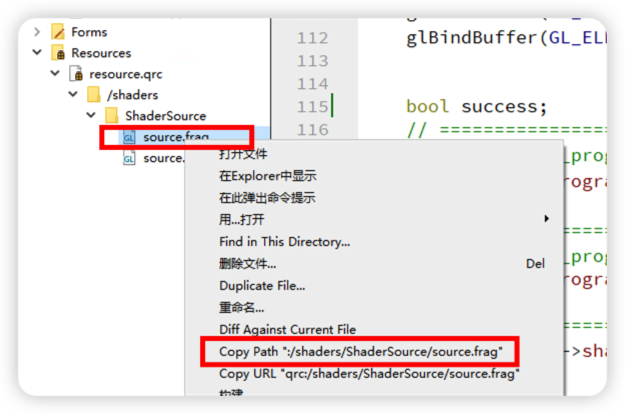

        

- **需要传入的第一个参数类型可以为：**

    - `QOpenGLShader::Vertex` - 顶点着色器
    - `QOpenGLShader::Fragment` - 片段着色器

```c++
#include <QOpenGLShaderProgram>

class FoxOpenGLWidget : public QOpenGLWidget, QOpenGLFunctions_X_X_Core
{
  
  ...
    
    
private:
  ...
  QOpenGLShaderProgram shader_program_;
}

/**
* 可以通过 Qt 提供的 `QOpenGLShaderProgram` 对象进行 GLSL 源码（着色器）的编译和链接，可以使代码量大幅度减少
*/
void FoxOpenGLWidget::initializeGL()
{
    initializeOpenGLFunctions();  // 【重点】初始化OpenGL函数，将 Qt 里的函数指针指向显卡的函数（头文件 QOpenGLFunctions_X_X_Core）


    // ===================== VAO | VBO =====================
    ...

    // ===================== EBO =====================
    ...


    bool success;
    // ===================== 顶点着色器 =====================
    this->shader_program_.addShaderFromSourceCode(QOpenGLShader::Vertex, vertexShaderSource);

    // ===================== 片段着色器 =====================
    this->shader_program_.addShaderFromSourceCode(QOpenGLShader::Fragment, fragmentShaderSource);

    // ===================== 链接着色器 =====================
    success = this->shader_program_.link();

    if (!success)
    {
        qDebug << "ERROR: " << this->shader_program_.log();
    }
		
  ...
}
```


**通过 Qt 资源文件的形式将 GLSL 源码传入：**

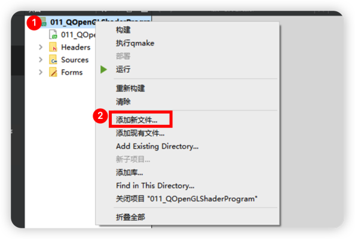

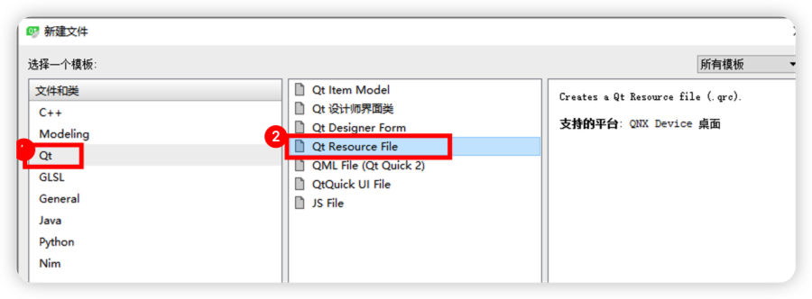

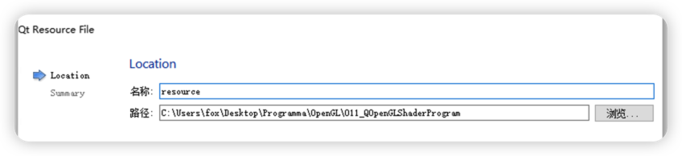

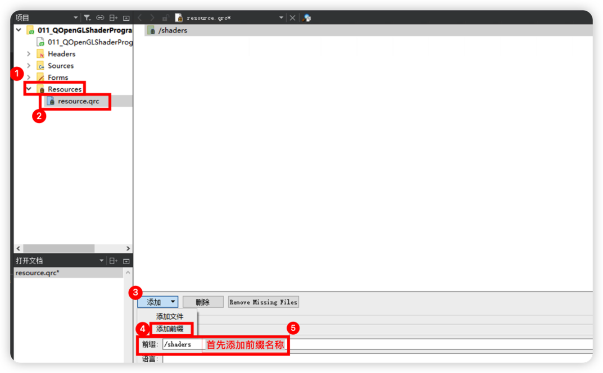

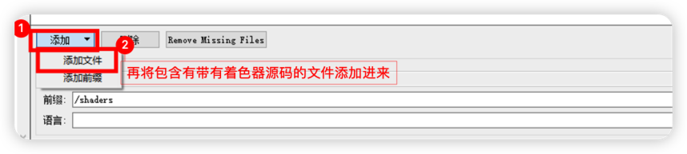
