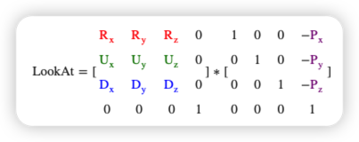
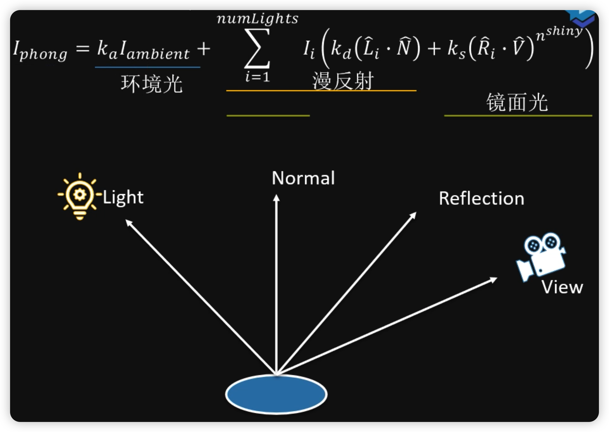
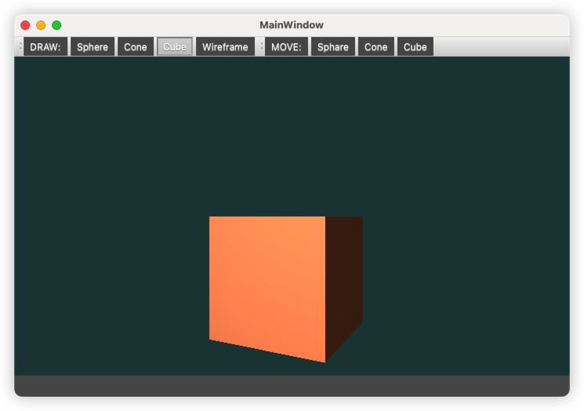
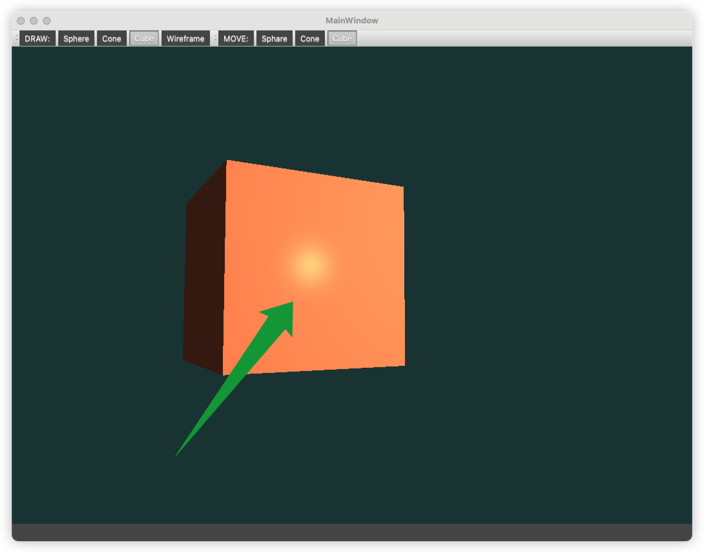
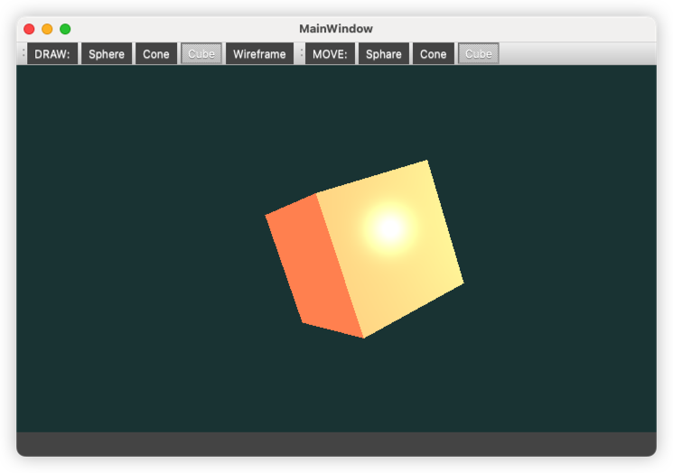
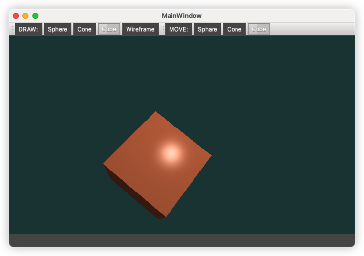
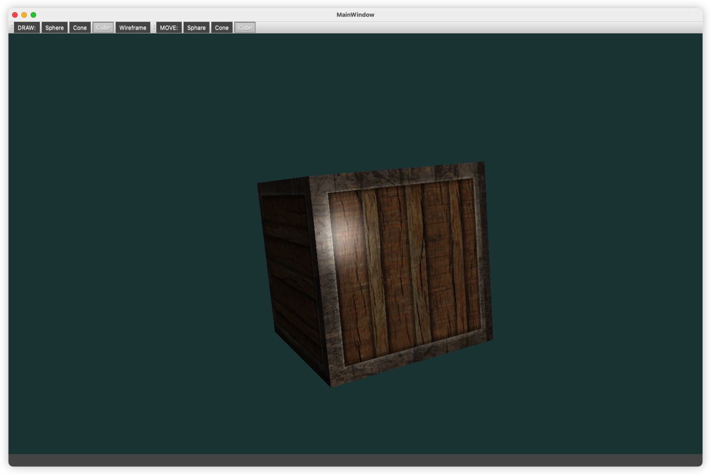
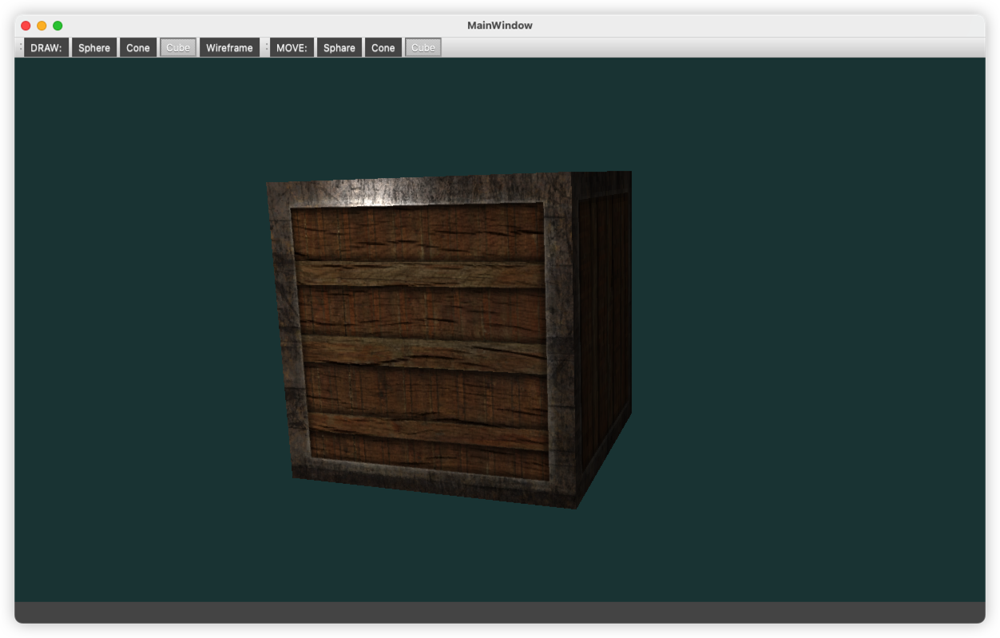
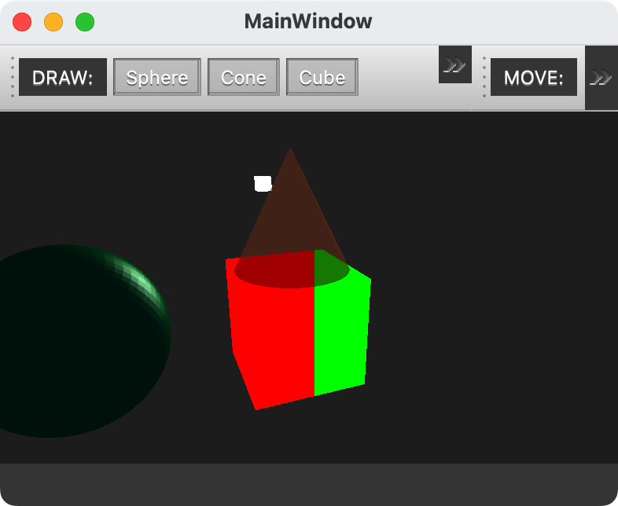

<p align="center">
 
 <h1 align="center">OpenGL</h1>
 <p align="center"><b>计算机图形学</b></p>
</p>


 <p align="center">
  
  </br>
  </br>
  <b><b>Санкт-Петербургский государственный политехнический университет</b></br></b>
  <b>Институт компьютерных наук и технологий</b>
 </p>

<div align=left>
<!-- SPbSTU 最后一行 -->


<div align=center>


[](LICENSE)


<div align=left>
<!-- 顶部至此截止 -->


> “绝不能恐惧，恐惧是思维杀手。恐惧是引向毁灭的死神。我将正视恐惧，任由它穿过我的躯体。当恐惧逝去，我会洞悉它的轨迹。恐惧所过之处，万物无存，唯我独立。”


[toc]


# 目录说明

| 编号                                                         | 说明                                                         |
| ------------------------------------------------------------ | ------------------------------------------------------------ |
| [000 - Apple M1 配置测试](https://github.com/NekoSilverFox/OpenGL/tree/main/000 - Apple M1 配置测试) | 在 M1 Mac 下 OpenGL 的配置及运行（基于 Clang）               |
| [001_OpenGLWidget_HelloWidget](https://github.com/NekoSilverFox/OpenGL/tree/main/001_OpenGLWidget_HelloWidget) | 如果在 Qt 的环境下，使用初始化 OpenGL 控件                   |
| [002_Triangle_VAO_VBO](https://github.com/NekoSilverFox/OpenGL/tree/main/002_Triangle_VAO_VBO) | 基于 `001` 的初始化控件后，增加使用 VAO、VBO 代码绘制三角形的代码<br />顶点和片段着色器的编写、编译、链接和使用 |
| [003_Triangle_EBO](https://github.com/NekoSilverFox/OpenGL/tree/main/003_Triangle_EBO) | 通过 EBO（元素/索引缓冲对象）进行了 2 个三角形的绘制（绘制为 1 个矩形） |
| [005_Two_triangle_exercise](https://github.com/NekoSilverFox/OpenGL/tree/main/005_Two_triangle_exercise) | 小练习：使用 VAO 和 VBO 数组进行对不同三角形的绘制；使用 2 个片段着色器进行分别着色 |
|                                                              |                                                              |
| [010_Qt_UI_with_OpenGL](https://github.com/NekoSilverFox/OpenGL/tree/main/010_Qt_UI_with_OpenGL) | Qt UI 调用 OpenGL 功能：通过 QOpenGLWidget 上的按钮实现三角形的绘制、清除、是否开启线框模式<br />Qt`update()` 函数的注意事项及使用 |
| [011_QOpenGLShaderProgram](https://github.com/NekoSilverFox/OpenGL/tree/main/011_QOpenGLShaderProgram) | 使用 Qt 提供的 QOpenGLShaderProgram 类，进行顶点和片段着色器的编译链接和使用。并且将 GLSL 代码以 Qt 资源文件的方式传入和使用 |
|                                                              |                                                              |
| [020_GLSL_in_out](https://github.com/NekoSilverFox/OpenGL/tree/main/020_GLSL_in_out) | 讲解了 GLSL 代码中 `in` 和 `out` 关键字                      |
| [021_GLSL_layout](https://github.com/NekoSilverFox/OpenGL/tree/main/021_GLSL_layout) | 讲解了 GLSL 代码中 `layout` 关键字，比如 `layout (location = 2) in vec3 aPos;` 定义了顶点属性 `aPos` 的位置是 2 |
| [022_GLSL_uniform](https://github.com/NekoSilverFox/OpenGL/tree/main/022_GLSL_uniform) | 讲解了 GLSL 代码中 `uniform` 关键字，使用 `uniform` 是一种从 CPU 向 GPU 传送数据的方式 |
| [023_GLSL_more_Attrib](https://github.com/NekoSilverFox/OpenGL/tree/main/023_GLSL_more_Attrib) | 使用 `layout` 关键字实现了更多的顶点属性（增加颜色值）       |
| [024_GLSL_exercise](https://github.com/NekoSilverFox/OpenGL/tree/main/024_GLSL_exercise) | GLSL 小练习                                                  |
|                                                              |                                                              |
| [030_Texel](https://github.com/NekoSilverFox/OpenGL/tree/main/030_Texel) | 纹理                                                         |
| [031_Texel_wrap](https://github.com/NekoSilverFox/OpenGL/tree/main/031_Texel_wrap) | 设置纹理环绕方式（重复、镜像、颜色填充等）                   |
| [032_Texture_Filtering](https://github.com/NekoSilverFox/OpenGL/tree/main/032_Texture_Filtering) | 纹理的过滤方式（`GL_LINEAR` - 线性过滤；`GL_NEAREST` - 临近过滤） |
| [033_Texture_exercise](https://github.com/NekoSilverFox/OpenGL/tree/main/033_Texture_exercise) | 纹理小练习                                                   |
|                                                              |                                                              |
| [040_Rotate_and_Move](https://github.com/NekoSilverFox/OpenGL/tree/main/040_Rotate_and_Move) | 使用矩阵移动和缩放                                           |
| [045_3D](https://github.com/NekoSilverFox/OpenGL/tree/main/045_3D) | 实现 3D 立方体效果                                           |
| [046_3D_exercise](https://github.com/NekoSilverFox/OpenGL/tree/main/046_3D_exercise) | 3D 小练习                                                    |
|                                                              |                                                              |


# 简介及资料

**OpenGL 简介：**

OpenGL 是一种协议和标准，是一种小而美的东西。因为它是一种框协议，所以它是不需要管 OS 层面和不同显卡层面的差异的。

OpenGL 官方的推荐为：GLFW+GLAD，但是我们可以使用 OpenGL+Qt（MinGW）。借助于 Qt 的封装，我们无需配置第三方库，更接近于实战


**LearnOpenGL 中文版网站：**

https://learnopengl-cn.github.io/


**视频教程：**

https://ke.qq.com/course/package/40726?flowToken=1041265


**版本的使用：**

- OpenGL3.3 及以上版本，因为具备可编程管线的功能。3.3 版本是一个分水岭
- VC++ 最好使用 2013 以上的版本
- C++11 之上的版本


**Cmakelist 的编写：**

基于 M1 Mac

```cmake
cmake_minimum_required(VERSION 3.22)
project(OpenGL)

set(CMAKE_CXX_STANDARD 11)

# 包含头文件
include_directories(./glad/include)

# brew 安装的库都在下面的目录里（M1 版 Mac） /opt/homebrew/Cellar/
# 把 glfw 加进项目
include_directories(/opt/homebrew/Cellar/glfw/3.3.6/include)

# glfw 库文件也加进来
link_directories(/opt/homebrew/Cellar/glfw/3.3.6/lib)

add_executable(OpenGL  # 这个是工程的名字
        ./glad/src/glad.c
        main.cpp)

# 最后把库文件 link 到项目
target_link_libraries(
        OpenGL  # 这个是工程的名字
        glfw
)
```


**在使用 Qt 下，对于 M 系列芯片应该编写如下 .pro文件：**

```properties
QT       += core gui widgets opengl openglwidgets

...

LIBS += -lopengl32

```


`main.cpp` 中加入：

```c++
    QSurfaceFormat format;
    format.setMajorVersion(3);
    format.setMinorVersion(3);
    format.setProfile(QSurfaceFormat::CoreProfile);
    QSurfaceFormat::setDefaultFormat(format);
```

`main.cpp` 整体：

```c++
#include "mainwindow.h"
#include <QApplication>
#include <QSurfaceFormat>

int main(int argc, char *argv[])
{
    QApplication a(argc, argv);

    /**
     *  在 M1 的 Mac 要设置这里
     *  ！！3.3 的版本可用，但是 4.5 用不了！，initializeOpenGLFunctions 返回 false
    */
    QSurfaceFormat format;
    format.setMajorVersion(3);
    format.setMinorVersion(3);
    format.setProfile(QSurfaceFormat::CoreProfile);
    QSurfaceFormat::setDefaultFormat(format);


    MainWindow w;
    w.show();

    return a.exec();
}
```


# 专有名词及解释

| 名词                            | 英文                          | 解释                                                         |
| ------------------------------- | ----------------------------- | ------------------------------------------------------------ |
| 对象                            | Object                        | 一个对象是指一些选项的集合，**代表OpenGL状态的一个子集**，可以使用对象来记录状态 |
| 图形渲染管线                    | Graphics Pipeline             | 实际上指的是一堆原始图形数据途经一个输送管道，期间经过各种变化处理最终出现在屏幕的过程。图形渲染管线可以被划分为两个主要部分：第一部分把你的3**D坐标转换为2D坐标**，第二部分是把**2D坐标转变为实际的有颜色的像素** |
| 着色器                          | Shader                        | 在GPU上为每一个（渲染管线）阶段运行的小程序（小核心）        |
| 图元                            | Primitive                     | 指定坐标和颜色值构成的是什么，这些数据所表示的渲染类型；是渲染成一个点（GL_POINT）、一条线（GL_LINE_STRIP）还是三角形（GL_TRIANGLES） |
| 片段                            | Fragment                      | 在 OpenGL 中一个片段是 OpenGL 渲染一个像素所需要的所有数据   |
| 裁切                            | Clipping                      | 裁切会丢弃超出视图以外的所有像素，用来提升执行效率           |
| 深度                            |                               | 可以理解为z坐标，它代表一个像素在空间中和你的距离，如果离你远就可能被别的像素遮挡，你就看不到它了，它会被丢弃，以节省资源 |
| NDC 标准化设备坐标              | Normalized Device Coordinates | 顶点着色器中处理过后，就是标准化设备坐标了，x、y、z的值在-1.0到1.0的一小段空间（立方体）。 落在范围外的坐标都会被裁剪，因为 GPU 没有必要再去消耗算力去进行计算 |
| 顶点着色器                      | Vertex Shader                 | **图形渲染管线的第一部分**，它把一个单独的顶点作为输入。顶点着色器主要的目的是把3D坐标转为另一种3D坐标，同时允许我们对顶点属性进行一些基本处理 |
| ↓ 图元装配                      | Primitive Assembly            | 图元装配阶段将顶点着色器输出的所有顶点作为输入（如果是GL_POINTS，那么就是一个顶点），并**将所有的点装配成指定图元的形状** |
| ↓ 几何着色器                    | Geometry Shader               | 图元装配阶段的输出会传递给几何着色器(Geometry Shader)。几何着色器把图元形式的一系列顶点的集合作为输入，它可以通过产生新顶点构造出新的（或是其它的）图元来生成其他形状 |
| ↓ 光栅化阶段                    | Rasterization Stage           | 几何着色器的输出会被传入光栅化阶段，里它会把**图元映射为最终屏幕上相应的像素**，生成供片段着色器(Fragment Shader)使用的==片段==。在片段着色器运行之前会执行裁切(Clipping) |
| ↓ 片段着色器                    | Fragment Shader               | 计算一个像素的最终颜色，这也是所有OpenGL高级效果产生的地方。通常，片段着色器包含3D场景的数据（比如光照、阴影、光的颜色等等），这些数据可以被用来计算最终像素的颜色。 |
| ↓ Alpha测试和混合(Blending)阶段 |                               | 这个阶段检测片段的对应的深度（和模板(Stencil)）值，用它们来判断这个像素是其它物体的前面还是后面，决定是否应该丢弃。这个阶段也会检查alpha值（alpha值定义了一个物体的透明度）并对物体进行混合(Blend)。所以，即使在片段着色器中计算出来了一个像素输出的颜色，在渲染多个图形时最后的像素颜色也可能完全不同 |
| 顶点                            | Vertex                        | 一个3D坐标的数据集合                                         |
| 顶点数据                        | Vertex Data                   | 顶点数据是一系列顶点的集合                                   |
| 顶点属性                        | Vertex Attribute              | 顶点的数据是用顶点属性表示的，它可以包含任何我们想用的数据   |
| VAO 顶点数组对象                | Vertex Array Object           | 使用 VAO 配置 OpenGL 如何解释显存，VAO 的数据类型是唯一的，并不保存实际的数据，而是**放顶点结构的定义** |
| VBO 顶点缓冲对象                | Vertex Buffer Object          | VBO 顶点缓冲对象**管理着**顶点着色器（Vertex Shader），VBO的**类型是**`GL_ARRAY_BUFFER`；它会在 GPU 上创建内存，用于储存我们的大量顶点数据 |
| EBO/IBO 元素/索引缓冲对象       | Element/Index Buffer Object   | EBO是一个缓冲区，就像一个顶点缓冲区对象一样，它**存储 OpenGL 要绘制顶点的==索引==** |
| 着色器程序对象                  | Shader Program Object         | 多个着色器链接（Link）合并之后并最终链接完成的版本，在渲染对象时使用`glUseProgram(shaderProgram)`激活这个着色器程序 |
| 映射                            | Map                           |                                                              |
| 纹理                            | Texture                       | 纹理是一个2D图片（甚至也有1D和3D的纹理），它可以用来添加物体的细节 |
| 纹理坐标                        | Texture Coordinate            | 我们绘制图形的每个顶点关联着一个纹理坐标，它用来标明该从纹理图像的哪个部分采样（译注：采集片段颜色） |
| 采样器/采样                     | Sampler/Sampling              |                                                              |
| 纹理过滤                        |                               |                                                              |
| 多级渐远纹理                    | Mipmap                        |                                                              |


# OpenGL 对象

一个对象（Object）是指一些选项的集合，**代表OpenGL状态的一个子集**，可以使用对象来记录状态

通常把0penGL上下文比作一个大的结构体，包含很多子集


【重点】**示例：**

```cpp
// 1. 创建对象
GLuint objectId = 0;  // 创建一个 ID（GLuint 是 OpenGL 自己的 int 类型）
glGenObject(1, &objectId);  // 生成了一个对象（小助理），并给他了一个编号

// 2. 绑定至上下文对象
glBindObject(GL_WINDOW_TARGET, objectId);  // 让这个对象【记录】状态机中子集 GL_WINDOW_TARGET 的状态，也就是确定工作内容

// 3. 设置子集 GL_WINDOW_TARGET 的一些选项，以下两条的操作会被 objectId对象 记录
glSetObjectOption(GL_WINDOW_TARGET, GL_OPTION_WINDOW_WIDTH, 800);  // 设置窗口宽度
glSetObjectOption(GL_WINDOW_TARGET, GL_OPTION_WINDOW_HEIGHT, 600);  // 设置窗口高度

// 4. 将上下文的 GL_WINDOW_TARGET 设回默认
glBindObject(GL_WINDOW_TARGET, 0);  // 将objectId对象与GL_WINDOW_TARGET解绑；但 objectId对象 已经记录了上面的两条内容。需要查看记录的时候再喊他过来就好。这里的 0 代表空对象，即为不绑定任何对象

// 5. 一旦重新绑定 objectId对象 到 GL_WINDOW_TARGET，这些选项会重新生效
```


- 在进行使用 QOpenGLWidget 时，要首先要在初始化函数`initializeGL()` 中调用 `QOpenGLFunctions_X_X_Core::` 中的 init **将 Qt 里的函数指针指向显卡的函数（下图所示）**


# 你好，三角形


> https://learnopengl-cn.github.io/01%20Getting%20started/04%20Hello%20Triangle/
>
> 在学习此节之前，建议将这三个单词先记下来：
>
> - 顶点数组对象：Vertex Array Object，VAO
> - 顶点缓冲对象：Vertex Buffer Object，VBO
> - 元素缓冲对象：Element Buffer Object，EBO 或 索引缓冲对象 Index Buffer Object，IBO

在OpenGL中，任何事物都在3D空间中，而屏幕和窗口却是2D像素数组，这导致OpenGL的大部分工作都是关于把3D坐标转变为适应你屏幕的2D像素。3D坐标转为2D坐标的处理过程是由OpenGL的**图形渲染管线**（Graphics Pipeline，大多译为管线，实际上指的是一堆原始图形数据途经一个输送管道，期间经过各种变化处理最终出现在屏幕的过程）管理的。图形渲染管线可以被划分为两个主要部分：第一部分把你的3D坐标转换为2D坐标，第二部分是把2D坐标转变为实际的有颜色的像素。


*2D坐标和像素也是不同的，2D坐标精确表示一个点在2D空间中的位置，而2D像素是这个点的近似值，2D像素受到你的屏幕/窗口分辨率的限制。*


图形渲染管线接受一组3D坐标，然后把它们转变为你屏幕上的有色2D像素输出。图形渲染管线可以被划分为几个阶段，每个阶段将会把前一个阶段的输出作为输入。所有这些阶段都是高度专门化的（它们都有一个特定的函数），并且很容易并行执行。正是由于它们具有并行执行的特性，当今大多数显卡都有成千上万的小处理核心，它们在GPU上为每一个（渲染管线）阶段运行各自的小程序，从而在图形渲染管线中快速处理你的数据。这些小程序叫做**着色器(Shader)。**


有些着色器可以由开发者配置，因为允许用自己写的着色器来代替默认的，所以能够更细致地控制图形渲染管线中的特定部分了。因为它们运行在GPU上，所以节省了宝贵的CPU时间。**OpenGL着色器是用OpenGL着色器语言(OpenGL Shading Language, GLSL)写成的**


1. 图形渲染管线的第一个部分是**==顶点着色器(Vertex Shader)==**，它把一个单独的顶点作为输入。顶点着色器主要的目的是把3D坐标转为另一种3D坐标（后面会解释），同时顶点着色器允许我们对顶点属性进行一些基本处理


2. **==图元装配(Primitive Assembly)==阶段将顶点着色器输出的所有顶点作为输入（如果是GL_POINTS，那么就是一个顶点），并所有的点装配成指定图元的形状**；本节例子中是一个三角形。

    为**了让OpenGL知道我们的坐标和颜色值构成的到底是什么，OpenGL需要你去指定这些数据所表示的渲染类型**。我们是希望把这些数据渲染成一系列的点？一系列的三角形？还是仅仅是一个长长的线？**做出的这些提示叫做==图元(Primitive)==**，任何一个绘制指令的调用都将把图元传递给OpenGL。**这是其中的几个：GL_POINTS、GL_TRIANGLES、GL_LINE_STRIP。**


3. **图元装配阶段的输出会传递给==几何着色器(Geometry Shader)==。几何着色器把图元形式的一系列顶点的集合作为输入，它可以通过产生新顶点构造出新的（或是其它的）图元来生成其他形状。**例子中，它生成了另一个三角形。


4. 几何着色器的输出会被传入**==光栅化阶段(Rasterization Stage)==**，**这里它会把图元映射为最终屏幕上相应的像素，生成供片段着色器(Fragment Shader)使用的片段(Fragment | OpenGL中的一个片段是OpenGL渲染一个像素所需的所有数据)。在片段着色器运行之前会执行裁切(Clipping)。裁切会丢弃超出你的视图以外的所有像素，用来提升执行效率。**

5. **==片段着色器==的主要目的是计算一个像素的最终颜色**，这也是所有OpenGL高级效果产生的地方。通常，片段着色器包含3D场景的数据（比如光照、阴影、光的颜色等等），这些数据可以被用来计算最终像素的颜色。


6. 在所有对应颜色值确定以后，最终的对象将会被传到最后一个阶段，我们叫做**==Alpha测试和混合(Blending)阶段==**。这个阶段检测片段的对应的深度（和模板(Stencil)）值（后面会讲），用它们来判断这个像素是其它物体的前面还是后面，决定是否应该丢弃。这个阶段也会检查alpha值（alpha值定义了一个物体的透明度）并对物体进行混合(Blend)。所以，即使在片段着色器中计算出来了一个像素输出的颜色，在渲染多个三角形的时候最后的像素颜色也可能完全不同。

    通常==**深度**==可以理解为z坐标，它代表一个像素在空间中和你的距离，如果离你远就可能被别的像素遮挡，你就看不到它了，它会被丢弃，以节省资源。


可以看到，图形渲染管线非常复杂，它包含很多可配置的部分。然而，**对于大多数场合，我们只需要配置顶点和片段着色器就行了**。几何着色器是可选的，通常使用它默认的着色器就行了。

在现代OpenGL中，我们**必须**定义至少一个顶点着色器和一个片段着色器（因为GPU中没有默认的顶点/片段着色器）。出于这个原因，刚开始学习现代OpenGL的时候可能会非常困难，因为在你能够渲染自己的第一个三角形之前已经需要了解一大堆知识了。


**下面，你会看到一个图形渲染管线的每个阶段的抽象展示。要注意蓝色部分代表的是我们可以注入自定义的着色器的部分。**


## VAO、VBO

首先，我们以数组的形式传递3个3D坐标作为图形渲染管线的输入，用来表示一个三角形，这个数组叫做**顶点数据(Vertex Data)；顶点数据是一系列顶点的集合。一个顶点(Vertex)是一个3D坐标的数据的集合。而顶点数据是用顶点属性(Vertex Attribute)表示的，它可以包含任何我们想用的数据**，但是简单起见，我们还是假定每个顶点只由一个3D位置(译注1)和一些颜色值组成的吧。


顶点数据（`Vertex DATA[]`）的传递 -> 我们要将内存里的数据传递到显卡里

1. **顶点着色器**（自己写在 `XXXOpenGLWedget::initializeGL()` 中）

    - 通过**顶点缓冲对象 `Vertex Buffer Objects, VBO`**管理，顶点缓冲对象的缓冲**类型是** `GL_ARRAY_BUFFER`。它会在 GPU 上创建内存，用于储存我们的大量顶点数据（将数据从内存读取到显存，一个缓冲区一个缓冲区的填充）。使用这些缓冲对象的好处是我们可以一次性的发送一大批数据到显卡上，而不是每个顶点发送一次。从CPU把数据发送到显卡相对较慢，所以只要可能我们都要尝试尽量一次性发送尽可能多的数据。当数据发送至显卡的内存中后，顶点着色器几乎能立即访问顶点，这是个非常快的过程。

      ​    

    - OpenGL 允许我们同时绑定多个缓冲，只要它们是不同的缓冲类型

      ​    

    - 配置 OpenGL 如何解释这些内存：通过**顶点数组对象 `Vertex Array Objects, VAO`** 管理，**VAO 的数据类型是唯一的，数组里的每一个项都对应一个属性的解析（类似一个类 | 结构体）**。的

        顶点**数组**对象(Vertex Array Object, VAO)可以像顶点**缓冲**对象（VBO）那样被绑定，任何随后的顶点属性调用都会储存在这个VAO中。这样的好处就是，当配置顶点属性指针时，你只需要将那些调用执行一次，之后再绘制物体的时候只需要绑定相应的VAO就行了。这使在不同顶点数据和属性配置之间切换变得非常简单，只需要绑定不同的VAO就行了。

        > **OpenGL的核心模式**要求**我们使用VAO，所以它知道该如何处理我们的顶点输入。如果我们绑定VAO失败，OpenGL会拒绝绘制任何东西。**

        

        一个顶点数组对象会储存以下这些内容：

        - `glEnableVertexAttribArray`和`glDisableVertexAttribArray`的调用。

        - 通过`glVertexAttribPointer`设置的顶点属性配置。

        - 通过`glVertexAttribPointer`调用与顶点属性关联的顶点缓冲对象

          ​    

        要想使用VAO，要做的只是使用`glBindVertexArray`绑定VAO。从绑定之后起，我们应该绑定和配置对应的VBO和属性指针，之后解绑VAO供之后使用。当我们打算绘制一个物体的时候，我们只要在绘制物体前简单地把VAO绑定到希望使用的设定上就行了。这段代码应该看起来像这样：

        ```c++
        // ..:: 初始化代码（只运行一次 (除非你的物体频繁改变)） :: ..
        // 1. 绑定VAO
        glBindVertexArray(VAO);
        // 2. 把顶点数组复制到缓冲中供OpenGL使用
        glBindBuffer(GL_ARRAY_BUFFER, VBO);
        glBufferData(GL_ARRAY_BUFFER, sizeof(vertices), vertices, GL_STATIC_DRAW);
        // 3. 设置顶点属性指针
        glVertexAttribPointer(0, 3, GL_FLOAT, GL_FALSE, 3 * sizeof(float), (void*)0);
        glEnableVertexAttribArray(0);
        
        [...]
        
        // ..:: 绘制代码（渲染循环中） :: ..
        // 4. 绘制物体
        glUseProgram(shaderProgram);
        glBindVertexArray(VAO);
        someOpenGLFunctionThatDrawsOurTriangle();
        ```

        就这么多了！前面做的一切都是等待这一刻，一个储存了我们顶点属性配置和应使用的VBO的顶点数组对象。一般当你打算绘制多个物体时，你首先要生成/配置所有的VAO（和必须的VBO及属性指针)，然后储存它们供后面使用。**当我们打算绘制物体的时候就拿出相应的VAO，绑定它，绘制完物体后，再解绑VAO。**

        

    

    ```c++
    // 顶点数据，由于OpenGL是在3D空间中工作的，而我们渲染的是一个2D三角形，我们将它顶点的z坐标设置为0.0
    float vertices[] = {
      -0.5f, -0.5f, 0.0f,
       0.5f, -0.5f, 0.0f,
       0.0f,  0.5f, 0.0f
    };
    
    // 创建 VAO 和 VBO 对象并且赋予 ID
    unsigned int VAO, VBO;
    glGenVertexArrays(1, &VAO);  // Array 存放数据结构的定义
    glGenBuffers(1, &VBO);  // Buffer 缓冲区才是真正存放顶点数据的
    
    // 绑定 VAO、VBO 对象
    glBindVertexArray(VAO);  // 【重点】VAO会储存glBindBuffer的函数调用
    glBindBuffer(GL_ARRAY_BUFFER, VBO); // 新创建的缓冲绑定到GL_ARRAY_BUFFER目标上，顶点缓冲对象的缓冲类型是GL_ARRAY_BUFFER
    
    
    /* glBufferData是一个专门用来把用户定义的数据复制到当前绑定缓冲的函数。它的第一个参数是目标缓冲的类型：顶点缓冲对象当前绑定到GL_ARRAY_BUFFER目标上。第二个参数指定传输数据的大小(以字节为单位)；用一个简单的sizeof计算出顶点数据大小就行。第三个参数是我们希望发送的实际数据。
    	为当前绑定到 target 的缓冲区对象创建一个新的数据存储（在 GPU 上创建对应的存储区域，并将内存中的数据发送过去）
    	如果 data 不是 NULL，则使用来自此指针的数据初始化数据存储
    	void glBufferData(GLenum target,  // 目标缓冲的类型，需要在 GPU 上创建的目标
    										GLsizeipter size,  // 创建的显存大小(以字节为单位)
    										const GLvoid* data,  // 希望发送的实际数据
    										GLenum usage)  // 创建在 GPU 上的哪一片区域（显存上的每个区域的性能是不一样的）https://registry.khronos.org/OpenGL-Refpages/es3.0/
    										GL_STATIC_DRAW ：数据不会或几乎不会改变。
    										GL_DYNAMIC_DRAW：数据会被改变很多。
    										GL_STREAM_DRAW ：数据每次绘制时都会改变。
    */
    glBufferData(GL_ARRAY_BUFFER, sizeof(vertices), vertices, GL_STATIC_DRAW);  // 现在我们已经把顶点数据储存在显卡的内存中，用VBO这个顶点缓冲对象管理
    
    /* 告知显卡如何解析缓冲区里面的属性值（设置顶点属性指针）
    	void glVertexAttribPointer(
    															GLuint index,  // VAO 中的第几个属性（VAO 属性的索引），我们在顶点着色器中使用layout(location = 0)定义了
    															GLint size,  // 顶点属性的大小，VAO 中的第几个属性中对应的位置放几份数据，顶点属性是一个vec3，它由3个值组成，所以大小是3
    															GLEnum type,  // 存放数据的数据类型，这里是GL_FLOAT(GLSL中vec*都是由浮点数值组成的)
    															GLboolean normalized,  // 是否标准化(Normalize)，如设置为GL_TRUE，所有数据都会被映射到0（对于有符号型signed数据是-1）到1之间。
    															GLsizei stride,  // 步长(Stride)，它告诉我们在连续的顶点属性组之间的间隔。我们也可以设置为0来让OpenGL决定具体步长是多少（只有当数值是紧密排列时才可用）
    															const void* offset  // 位置数据在缓冲中起始位置的偏移量
    	)
    */
    glVertexAttribPointer(0, 3, GL_FLOAT, GL_FALSE, 3 * sizeof(float), (void*)0);  // 第一个属性，所以不需要偏移
    
    // 开始 VAO 管理的第一个属性值
    glEnableVertexAttribArray(0);
    
    // 解绑 VAO 和 VBO ???将两行反过来写，试试还能不能绘制???
    glBindVertexArray(0);
    glBindBuffer(GL_ARRAY_BUFFER, 0);
    ```

    **编写完上述代码之后，如果要使用的话，需要在 `XXXOpenGLWedget::paintGL()` 中重新绑定 VAO 和 VBO：**

    ```c++
    glBindVertexArray(VAO);
    ```

    

    

2. 形状（图元）装配

3. **几何着色器**（可以自己写也可以不写）

4. 光栅化

5. **片段着色器**（自己写）

6. 测试与混合


**标准化设备坐标**：(Normalized Device Coordinates, NDC) 顶点着色器中处理过后，就应该是标准化设备坐标了，x、y和Z的值在-1.0到1.0的一小段空间（立方体）。 落在范围外的坐标都会被裁剪，因为 GPU 没有必要再去消耗算力去进行计算


## 编译着色器

> https://www.imgeek.org/article/825358359

**渲染管线的作用是将3D模型转换为2维图像。**

- **顶点着色器**

    就是和GPU打交道，在GPU上运行的代码是一对着色器，一个是顶点着色器，另一个是片段着色器。每次调用着色程序都会先执行顶点着色器，再执行片元着色器。

    一个顶点着色器的工作是生成裁剪空间坐标值，是用着色器语言GLSL(OpenGL Shading Language)编写：

    ```c++
    #version 330 core
    layout (location = 0) in vec3 aPos;
    
    void main()
    {
        gl_Position = vec4(aPos.x, aPos.y, aPos.z, 1.0);
    }
    ```

    可以看到，GLSL看起来很像C语言。每个着色器都起始于一个版本声明。OpenGL 3.3以及和更高版本中，GLSL版本号和OpenGL的版本是匹配的（比如说GLSL 420版本对应于OpenGL 4.2）。我们同样明确表示我们会使用核心模式。

    

    下一步，使用`in`关键字，在顶点着色器中声明所有的输入顶点属性(Input Vertex Attribute)。现在我们只关心位置(Position)数据，所以我们只需要一个顶点属性。GLSL有一个向量数据类型，它包含1到4个`float`分量，包含的数量可以从它的后缀数字看出来。由于每个顶点都有一个3D坐标，我们就创建一个`vec3`输入变量aPos。我们同样也通过`layout (location = 0)`设定了输入变量的位置值(Location)你后面会看到为什么我们会需要这个位置值。

    

    > **向量(Vector)**
    >
    > 在图形编程中我们经常会使用向量这个数学概念，因为它简明地表达了**任意空间中的位置和方向**，并且它有非常有用的数学属性。在GLSL中一个向量有最多4个分量，每个分量值都代表空间中的一个坐标，它们可以通过`vec.x`、`vec.y`、`vec.z`和`vec.w`来获取。注意`vec.w`分量不是用作表达空间中的位置的（我们处理的是3D不是4D），而是用在所谓透视除法(Perspective Division)上。我们会在后面的教程中更详细地讨论向量。

    

    每个顶点调用一次（顶点）着色器，每次调用都需要设置一个特殊的全局变量 **gl_Position**。 该变量的值就是裁减空间坐标值。何为裁剪空间坐标？就是无论你的画布有多大，裁剪坐标的坐标范围永远是 -1 到 1 。

    

    如果运行一次顶点着色器， 那么gl_Position 就是 **（-0.5，-0.5，0，1）** 记住他永远是个 **Vec4**, 简单理解就是对应**x、y、z、w**。即使你没用其他的，也要设置默认值， 这就是所谓的 3维模型转换到我们屏幕中。

    

    ---

    

    **顶点着色器的编译过程：**

    这个过程类似于 CPP 的（编写、编译、链接）过程；我们通过在 CPP 中编写、编译、链接面向 GPU 的代码

    1. **编写源码**（最好作为全局或成员变量）

        现在，我们暂时将顶点着色器的*GLSL源代码*硬编码在代码文件顶部的C风格字符串中：

        ```c++
        // 【原码】顶点着色器就是把 xyz 原封不动的送出去
        const char* vertexShaderSource = "#version 330 core\n"
                                         "layout (location = 0) in vec3 aPos;\n"
                                         "void main()\n"
                                         "{\n"
                                         "   gl_Position = vec4(aPos.x, aPos.y, aPos.z, 1.0);\n"
                                         "}\0";
        ```

        为了能够让OpenGL使用它，我们必须在**运行时动态编译它的GLSL源代码**。

    1. **编译顶点着色器**（写在 `XXXOpenGLWedget::initializeGL()` 中）

        ```c++
        unsigned int vertexShader = glCreateShader(GL_VERTEX_SHADER);  // 创建顶点着色器（框架 | 对象）并给予编号，由于我们正在创建一个【顶点】着色器，传递的参数是GL_VERTEX_SHADER。
        
        /* 绑定至着色器原码
        	void glShaderSource(
        											GLuint shader,  要着色器框架 | 对象
        											GLsize count,  着色器字符串的数量
        											const CLchar** string,  着色器源码字符串
        											const GLint* length  着色器源码的长度，如果是单个字符串可以填 NULL（代表源码字符串以 NULL 结尾）
        	)
        
        */
        glShaderSource(vertexShader, 1, &vertexShaderSource, NULL);  // 绑定至着色器原码
        
        glCompileSharder(vertexShader);  // 编译着色器
        
        /* 因为可能出错，所以进行错误检查，也就是判断时候成功编译 */
        int success;  // 是否成功的标志
        char infolog[512];  // 错误日志（信息）
        glGetShaderiv(vertexShader, GL_COMPILES_TATUS, &success);  // 检查是否编译成功
        if(!success)
        {
          glGetShaderInfoLog(vertexShader, 512, NULL, infolog);  // 获取错误消息
          qDebug() << "ERROR::SHADER::VERTEX::COMPILATION_FAILED\n" << infolog;
        }
        ```

        

- **片段着色器**

    片段着色器(Fragment Shader)是第二个也是最后一个我们打算创建的用于渲染三角形的着色器。片段着色器所做的是计算像素最后的颜色输出。

    > 在计算机图形中颜色被表示为有4个元素的数组：红色、绿色、蓝色和alpha(透明度)分量，通常缩写为RGBA。当在OpenGL或GLSL中定义一个颜色的时候，我们把颜色每个分量的强度设置在0.0到1.0之间。比如说我们设置红为1.0f，绿为1.0f，我们会得到两个颜色的混合色，即黄色。这三种颜色分量的不同调配可以生成超过1600万种不同的颜色！

    

    1. **编写源码**

        片段着色器只需要一个输出变量，这个变量是一个4分量向量，它表示的是最终的输出颜色，我们应该自己将其计算出来。声明输出变量可以使用`out`关键字，这里我们命名为`FragColor`。下面，我们将一个Alpha值为1.0(1.0代表完全不透明)的橘黄色的`vec4`赋值给颜色输出。

    ```c++
    // 【原码】片段着色器就是给一个固定的颜色
    const char *fragmentShaderSource = "#version 330 core\n"
                                       "out vec4 FragColor;\n"
                                       "void main()\n"
                                       "{\n"
                                       "   FragColor = vec4(1.0f, 0.5f, 0.2f, 1.0f);\n"
                                       "}\n\0";
    ```

    

    2. **编译片段着色器**（写在 `XXXOpenGLWedget::initializeGL()` 中）

    过程跟编译顶点着色器的框架是一样的，用的是同一套函数

    ```c++
    unsigned int fragmentShader = glCreateShader(GL_FRAGMENT_SHADER);  // 创建片段着色器（框架 | 对象）并给予编号
    glShaderSource(fragmentShader, 1, &fragmentShaderSource, NULL);  // 绑定至着色器原码
    glCompileShader(fragmentShader);  // 编译着色器
    
    /* 因为可能出错，所以进行错误检查，也就是判断时候成功编译 */
    // int success;  // 是否成功的标志
    // char infolog[512];  // 错误日志（信息）
    glGetShaderiv(fragmentShader, GL_COMPILE_STATUS, &success);
    if(!success)
    {
      glGetShaderInfoLog(fragmentShader, 512, NULL, infolog);
      qDebug() << "ERROR::SHADER::FRAGMENT::COMPILATION_FAILED\n" << infolog;
    }
    ```

    两个着色器现在都**编译**了，剩下的事情是把两个着色器对象**==链接==**到一个用来渲染的**着色器程序(Shader Program)**中。


## 链接着色器为着色器程序

在进行完上面一节的着色器编写和编译后，需要**将顶点着色器和片段着色器进行链接*（就像 CPP 生成可执行文件的顺序那样：编写(.cpp) ->编译(.o) ->链接(.exe)）***

**着色器程序对象(Shader Program Object)是多个着色器合并之后并最终链接完成的版本**。如果**要使用刚才编译的着色器我们必须把它们链接(Link)为一个着色器程序对象，然后在渲染对象的时候激活这个着色器程序**。已激活着色器程序的着色器将在我们发送渲染调用的时候被使用。

当链接着色器至一个程序的时候，它会把每个着色器的输出链接到下个着色器的输入。当输出和输入不匹配的时候，你会得到一个连接错误

```c++
/* 链接顶点着色器和片段着色器，并生成最后的着色器程序 */
unsigned int shaderProgram = glCreateProgram();  // 注意，这里是 `glCreateProgram()`，因为链接之后生成的便是最后的程序
glAttahcShader(shaderProgram, vertexShader);  // 加入顶点着色器
glAttachShader(shaderProgram, fragmentShader);  // 加入片段着色器
glLinkProgram(shaderProgram);  // 链接

/* 因为可能出错，所以进行错误检查，也就是判断时候成功链接 */
// int success;  // 是否成功的标志
// char infolog[512];  // 错误日志（信息）
glGetShaderiv(shaderProgram, GL_LINK_STATUS, &success);
if(!success)
{
  glGetShaderInfoLog(shaderProgram, 512, NULL, infolog);
  qDebug() << "ERROR::SHADER::PROGRAM::LINKING_FAILED\n" << infolog;
}

/* 在把着色器对象链接到程序对象以后，删除已经不需要的编译的结果 */
glDeleteShader(vertexShader);
glDeleteShader(fragmentShader);
```


得到的结果就是一个程序对象，我们可以调用`glUseProgram`函数，用刚创建的程序对象作为它的参数，以激活这个程序对象：

*在 `XXXOpenGLWedget::paintGL()` 中使用（开启）着色器*

```c++
glUseProgram(shaderProgram);
```

在`glUseProgram`函数调用之后，每个着色器调用和渲染调用都会使用这个程序对象（也就是之前写的着色器)了。


现在，我们已经把输入顶点数据发送给了GPU，并指示了GPU如何在顶点和片段着色器中处理它。


## 绘制三角形

要想绘制我们想要的物体，OpenGL给我们提供了`glDrawArrays`函数，**它使用当前激活的着色器，之前定义的顶点属性配置，和VBO的顶点数据（通过VAO间接绑定）来绘制图元。**

```c++
glUseProgram(shaderProgram);
glBindVertexArray(VAO);
glDrawArrays(GL_TRIANGLES, 0, 3);
```

`glDrawArrays()`函数：

- 第一个参数是我们打算绘制的**OpenGL图元的类型**。由于我们在一开始时说过，我们希望绘制的是一个三角形，这里传递`GL_TRIANGLES`给它。
- 第二个参数指定了顶点数组的起始索引，我们这里填`0`。
- 最后一个参数指定我们打算**绘制多少个顶点**，这里是`3`（我们只从我们的数据中渲染一个三角形，它只有3个顶点长）。

现在尝试编译代码，如果弹出了任何错误，回头检查你的代码。如果你编译通过了，你应该看到下面的结果：


## EBO 元素缓冲对象

元素缓冲对象(Element Buffer Object，EBO)，也叫索引缓冲对象(Index Buffer Object，IBO)

假设我们不再绘制一个三角形而是绘制一个矩形。我们可以绘制两个三角形来组成一个矩形（OpenGL主要处理三角形）。这会生成下面的顶点的集合：

```c++
float vertices[] = {
    // 第一个三角形
    0.5f, 0.5f, 0.0f,   // 右上角
    0.5f, -0.5f, 0.0f,  // 右下角
    -0.5f, 0.5f, 0.0f,  // 左上角
    // 第二个三角形
    0.5f, -0.5f, 0.0f,  // 右下角
    -0.5f, -0.5f, 0.0f, // 左下角
    -0.5f, 0.5f, 0.0f   // 左上角
};
```

可以看到，有几个顶点叠加了。我们指定了`右下角`和`左上角`两次！一个矩形只有4个而不是6个顶点，这样就产生50%的额外开销。当我们有包括上千个三角形的模型之后这个问题会更糟糕，这会产生一大堆浪费。更好的解决方案是只储存不同的顶点，并设定绘制这些顶点的顺序。这样子我们只要储存4个顶点就能绘制矩形了，之后只要指定绘制的顺序就行了。如果OpenGL提供这个功能就好了，对吧？

值得庆幸的是，元素缓冲区对象的工作方式正是如此。 **EBO是一个缓冲区，就像一个顶点缓冲区对象一样，它存储 OpenGL 要绘制顶点的==索引==**。这种所谓的**索引绘制(Indexed Drawing)**正是我们问题的解决方案。首先，我们先要定义（不重复的）顶点，和绘制出矩形所需的索引：

```c++
float vertices[] = {
    0.5f, 0.5f, 0.0f,   // 右上角
    0.5f, -0.5f, 0.0f,  // 右下角
    -0.5f, -0.5f, 0.0f, // 左下角
    -0.5f, 0.5f, 0.0f   // 左上角
};

unsigned int indices[] = {
    // 注意索引从0开始! 
    // 此例的索引(0,1,2,3)就是顶点数组vertices的下标，
    // 这样可以由下标代表顶点组合成矩形

    0, 1, 3, // 第一个三角形
    1, 2, 3  // 第二个三角形
};
```

你可以看到，当使用索引的时候，我们只定义了4个顶点，而不是6个。下一步我们需要创建元素缓冲对象：

```c++
unsigned int EBO;
glGenBuffers(1, &EBO);
```

与VBO类似，我们先绑定EBO然后用glBufferData把索引复制到缓冲里。同样，和VBO类似，我们会把这些函数调用放在绑定和解绑函数调用之间，只不过这次我们把缓冲的类型定义为GL_ELEMENT_ARRAY_BUFFER。

```c++
glBindBuffer(GL_ELEMENT_ARRAY_BUFFER, EBO);
glBufferData(GL_ELEMENT_ARRAY_BUFFER, sizeof(indices), indices, GL_STATIC_DRAW);
```

注意：我们传递了GL_ELEMENT_ARRAY_BUFFER当作缓冲目标。最后一件要做的事是用glDrawElements来替换glDrawArrays函数，表示我们要从索引缓冲区渲染三角形。使用glDrawElements时，我们会使用当前绑定的索引缓冲对象中的索引进行绘制：

```c++
glBindBuffer(GL_ELEMENT_ARRAY_BUFFER, EBO);
glDrawElements(GL_TRIANGLES, 6, GL_UNSIGNED_INT, 0);
```

- 第一个参数指定了我们**绘制的模式**，这个和glDrawArrays的一样。
- 第二个参数是我们打算**绘制顶点的个数**，这里填6，也就是说我们一共需要绘制6个顶点。
- 第三个参数是**索引的类型**，这里是GL_UNSIGNED_INT。
- 最后一个参数里我们可以指定**EBO中的偏移量（或者传递一个索引数组，但是这是当你不在使用索引缓冲对象的时候），但是我们会在这里填写0。**

`glDrawElements`函数从当前绑定到`GL_ELEMENT_ARRAY_BUFFER`目标的EBO中获取其索引。这意味着我们每次想要使用索引渲染对象时都必须绑定相应的EBO，这又有点麻烦。碰巧顶点数组对象也跟踪元素缓冲区对象绑定。在绑定VAO时，绑定的最后一个元素缓冲区对象存储为VAO的元素缓冲区对象。然后，绑定到VAO也会自动绑定该EBO。


**当目标是`GL_ELEMENT_ARRAY_BUFFER`的时候，VAO会储存`glBindBuffer`的函数调用。这也意味着它也会储存解绑调用，所以确保你没有在解绑VAO之前解绑索引数组缓冲，否则它就没有这个EBO配置了。**但是 VAO 不参与 VBO 的管理，所有一定要注意 VAO 和 EBO 的解绑顺序（先解绑 VAO，再解绑 EBO）

最后的初始化和绘制代码现在看起来像这样：

```c++
// ..:: 初始化代码 :: ..
// 1. 绑定顶点数组对象
glBindVertexArray(VAO);
// 2. 把我们的顶点数组复制到一个顶点缓冲中，供OpenGL使用
glBindBuffer(GL_ARRAY_BUFFER, VBO);
glBufferData(GL_ARRAY_BUFFER, sizeof(vertices), vertices, GL_STATIC_DRAW);
// 3. 复制我们的索引数组到一个索引缓冲中，供OpenGL使用
glBindBuffer(GL_ELEMENT_ARRAY_BUFFER, EBO);
glBufferData(GL_ELEMENT_ARRAY_BUFFER, sizeof(indices), indices, GL_STATIC_DRAW);
// 4. 设定顶点属性指针
glVertexAttribPointer(0, 3, GL_FLOAT, GL_FALSE, 3 * sizeof(float), (void*)0);
glEnableVertexAttribArray(0);

[...]

// ..:: 绘制代码（渲染循环中） :: ..
glUseProgram(shaderProgram);
glBindVertexArray(VAO);
glDrawElements(GL_TRIANGLES, 6, GL_UNSIGNED_INT, 0);
glBindVertexArray(0);
```

运行程序会获得下面这样的图片的结果。左侧图片看应该起来很熟悉，而右侧的则是使用线框模式(Wireframe Mode)绘制的。线框矩形可以显示出矩形的确是由两个三角形组成的。


**线框模式(Wireframe Mode)**

要想用线框模式绘制你的三角形，你可以通过`glPolygonMode(GL_FRONT_AND_BACK, GL_LINE)`函数配置OpenGL如何绘制图元。第一个参数表示我们打算将其应用到所有的三角形的正面和背面，第二个参数告诉我们用线来绘制。之后的绘制调用会一直以线框模式绘制三角形，直到我们用`glPolygonMode(GL_FRONT_AND_BACK, GL_FILL)`将其设置回默认模式。


# Qt 交互

- 如果需要从 `paintGL()` 以外的位置触发重新绘制（比如使用计时器设置场景动画），则应调用 widget 的 `update()` 函数来安排更新
- 调用 `paintGL()`、`resizeGL()` 或 `initializeGL()` 时，widget 的 OpenGL 呈现上下文将变为当前。如果需要从其他位置（例如：在 widget 的构造函数或自己的绘制函数中）调用标准 OpenGL API 函数，则必须首先调用 `makeCurrent()`


> **在 `paintGL()` 以外的地方调用绘制函数，没有意义。绘制图形最终将会被 `paintGL()` 覆盖**
>
> 我们在写自己函数的时候，可以采用一下结构：
>
> 【注意】只在 `paintGL()` 外部，且**中间是代码调用了 OpenGL 功能时**才这么写
>
> ```c++
> ...
> makeCurrent();
> 
> 	... 自己写的调用了 OpenGL 功能的代码 ...
> 
> 
> doneCurrent();
> 	update();  执行重绘，这条语句会重新执行 paintGL()
> ...
> ```
>
> **`update();`  会执行重绘，也就是这条语句会==重新调用== `paintGL()`**


## QOpenGLShaderProgram

可以通过 Qt 提供的 `QOpenGLShaderProgram` 对象进行 GLSL 源码（着色器）的编译和链接

在同名的头文件 `#include <QOpenGLShaderProgram>`中，提供的方法有：

- **添加（顶点 | 片段）着色器原码：**

    - 通过**源码GLSL字符串**添加：

        `QOpenGLShaderProgram.addShaderFromSourceCode(QOpenGLShader::源码类型, 源码);`

        

    - 通过**包含有GLSL源码的资源文件**添加：

        `QOpenGLShaderProgram.addShaderFromSourceFile(QOpenGLShader::源码类型, ":/路径");`

        **顶点着色器的文件名后缀应该是 `.vert`，片段着色器为 `.frag`**

        *可以通过右键文件，拷贝文件路径*

        

        

- **需要传入的第一个参数类型可以为：**

    - `QOpenGLShader::Vertex` - 顶点着色器
    - `QOpenGLShader::Fragment` - 片段着色器

```c++
#include <QOpenGLShaderProgram>

class FoxOpenGLWidget : public QOpenGLWidget, QOpenGLFunctions_X_X_Core
{
  
  ...
    
    
private:
  ...
  QOpenGLShaderProgram shader_program_;
}

/**
* 可以通过 Qt 提供的 `QOpenGLShaderProgram` 对象进行 GLSL 源码（着色器）的编译和链接，可以使代码量大幅度减少
*/
void FoxOpenGLWidget::initializeGL()
{
    initializeOpenGLFunctions();  // 【重点】初始化OpenGL函数，将 Qt 里的函数指针指向显卡的函数（头文件 QOpenGLFunctions_X_X_Core）


    // ===================== VAO | VBO =====================
    ...

    // ===================== EBO =====================
    ...


    bool success;
    // ===================== 顶点着色器 =====================
    this->shader_program_.addShaderFromSourceCode(QOpenGLShader::Vertex, vertexShaderSource);

    // ===================== 片段着色器 =====================
    this->shader_program_.addShaderFromSourceCode(QOpenGLShader::Fragment, fragmentShaderSource);

    // ===================== 链接着色器 =====================
    success = this->shader_program_.link();

    if (!success)
    {
        qDebug << "ERROR: " << this->shader_program_.log();
    }
		
  ...
}
```


**通过 Qt 资源文件的形式将 GLSL 源码传入：**


# GLSL

**GLSL** - Open**GL** Shading **L**anguage 的缩写，是一种类 C 语言，一般拥有以下结构：

```glsl
#version VERSION_NUMBER  // 版本号
in TYPE IN_VARIABLE_NAME;  // `in` 代表在流水线上的来自其他模块的输入
in TYPE IN_VARIABLE_NAME;
out TYPE OUT_VARIABLE_NAME;  // `out` 代表本模块的输出，要输入到下一个模块的东西
uniform TYPE UNIFORM_NAME;  // 

void main() {
  // 处理输入并进行一些图形操作
  ...
  // 输出处理过的结果到输出变量
  OUR_VARIABLE_NAME = WEIRD_STUFF_WE_PROCESSED;
}
```

当我们特别谈论到顶点着色器的时候，每个输入变量也叫**顶点属性(Vertex Attribute)**，也就是我们写在 GLSL `layout (location = ?)`那里的。我们能声明的顶点属性是有上限的，它一般由硬件来决定。OpenGL确保至少有16个包含4分量的顶点属性可用，但是有些硬件或许允许更多的顶点属性，你可以查询GL_MAX_VERTEX_ATTRIBS来获取具体的上限：

```
int nrAttributes;
glGetIntegerv(GL_MAX_VERTEX_ATTRIBS, &nrAttributes);
std::cout << "Maximum nr of vertex attributes supported: " << nrAttributes << std::endl;
```

通常情况下它至少会返回16个，大部分情况下是够用了。


## 数据类型

GLSL中包含C等其它语言大部分的默认基础数据类型：`int`、`float`、`double`、`uint`和`bool`。GLSL也有两种容器类型，它们会在这个教程中使用很多，分别是向量(Vector)和矩阵(Matrix)，其中矩阵我们会在之后的教程里再讨论。

### 向量

GLSL中的向量是一个可以包含有2、3或者4个分量的容器，分量的类型可以是前面默认基础类型的任意一个。它们可以是下面的形式（`n`代表分量的数量）：

| 类型    | 含义                            |
| :------ | :------------------------------ |
| `vecn`  | 包含`n`个float分量的默认向量    |
| `bvecn` | 包含`n`个bool分量的向量         |
| `ivecn` | 包含`n`个int分量的向量          |
| `uvecn` | 包含`n`个unsigned int分量的向量 |
| `dvecn` | 包含`n`个double分量的向量       |

**大多数时候我们使用`vecn`，因为float足够满足大多数要求了。**

一个向量的分量可以通过`vec.x`这种方式获取，这里`x`是指这个向量的第一个分量。你可以分别使用`.x`、`.y`、`.z`和`.w`来获取它们的第1、2、3、4个分量。GLSL也允许你对颜色使用`rgba`，或是对纹理坐标使用`stpq`访问相同的分量。

向量这一数据类型也允许一些有趣而灵活的分量选择方式，叫做**重组(Swizzling)**。重组允许这样的语法：

```glsl
vec2 someVec;
vec4 differentVec = someVec.xyxx;
vec3 anotherVec = differentVec.zyw;
vec4 otherVec = someVec.xxxx + anotherVec.yxzy;
```

你可以使用上面4个字母任意组合来创建一个和原来向量一样长的（同类型）新向量，只要原来向量有那些分量即可；然而，你不允许在一个`vec2`向量中去获取`.z`元素。我们也可以把一个向量作为一个参数传给不同的向量构造函数，以减少需求参数的数量：

```glsl
vec2 vect = vec2(0.5, 0.7);
vec4 result = vec4(vect, 0.0, 0.0);
vec4 otherResult = vec4(result.xyz, 1.0);
```


## 输入与输出

### in & out

**因为 OpenGL 像是一个流水线，`in` 就是流水线上流进来的变量，`out` 就是流出的变量**

虽然着色器是各自独立的小程序，但是它们都是一个整体的一部分，出于这样的原因，我们希望每个着色器都有输入和输出，这样才能进行数据交流和传递。GLSL定义了`in`和`out`关键字专门来实现这个目的。**每个着色器使用这两个关键字设定输入和输出，只要一个输出变量与下一个着色器阶段的输入匹配，它就会传递下去。但在顶点和片段着色器中会有点不同。**

所以，如果我们打算从一个着色器向另一个着色器发送数据，我们必须在发送方着色器中声明一个输出，在接收方着色器中声明一个类似的输入。**当类型和名字都一样的时候，OpenGL就会把两个变量链接到一起，它们之间就能发送数据了（这是在==链接程序对象时完成的==）**。为了展示这是如何工作的，我们会稍微改动一下之前教程里的那个着色器，让顶点着色器为片段着色器决定颜色。


**顶点着色器**

```glsl
#version 330 core
layout (location = 0) in vec3 aPos; // 位置变量的属性位置值为0

out vec4 vertexColor; // 为片段着色器指定一个颜色输出

void main()
{
    gl_Position = vec4(aPos, 1.0); // 注意我们如何把一个vec3作为vec4的构造器的参数
    vertexColor = vec4(0.5, 0.0, 0.0, 1.0); // 把输出变量设置为暗红色
}
```

**片段着色器**

```glsl
#version 330 core
out vec4 FragColor;

in vec4 vertexColor; // 从顶点着色器传来的输入变量（名称相同、类型相同）

void main()
{
    FragColor = vertexColor;
}
```

你可以看到我们在顶点着色器中声明了一个vertexColor变量作为`vec4`输出，并在片段着色器中声明了一个类似的vertexColor。由于它们名字相同且类型相同，片段着色器中的vertexColor就和顶点着色器中的vertexColor链接了。由于我们在顶点着色器中将颜色设置为深红色，最终的片段也是深红色的。下面的图片展示了输出结果：


### layout

**顶点着色器应该接收的是一种特殊形式的输入，否则就会效率低下。**顶点着色器的输入特殊在，它从顶点数据中直接接收输入。**数据是来自于 CPU 端**


为了定义顶点数据该如何管理，我们使用`location`这一元数据指定输入变量，这样我们才可以在CPU上配置顶点属性。我们已经在前面的教程看过这个了，`layout (location = 0)`。顶点着色器需要为它的输入提供一个额外的`layout`标识，这样我们才能把它**链接到顶点数据**。

你也可以忽略`layout (location = 0)`标识符，通过在OpenGL代码中使用`glGetAttribLocation`查询属性位置值(Location) 再使用 `glBindAttribLocation()` 设置位置值，但是我更喜欢在着色器中设置它们，这样会更容易理解而且节省你（和OpenGL）的工作量。


另一个例外是**片段着色器，它需要一个`vec4`颜色输出变量，因为片段着色器需要生成一个最终输出的颜色。**如果你在片段着色器没有定义输出颜色，OpenGL会把你的物体渲染为黑色（或白色）。

> 如果使用 QOpenGLShaderProgram，则在**绑定着色器原码之后**可以通过其提供的：
>
> - `QOpenGLShaderProgram.attributeLocation("aPos");` 方法手动找到顶点属性的位置
> - 如果顶点着色器里没写 `layout`，则可以用`QOpenGLShaderProgram.bindAttributeLocation("aPos", LOCATION_NUMBER);` 手动指定顶点属性位置
>
> **但是注意，使用 QOpenGLShaderProgram 前最好先 `.bind()` 一下，避免出错**

```c++
    // ===================== 顶点着色器 =====================
//    this->shader_program_.addShaderFromSourceCode(QOpenGLShader::Vertex, vertexShaderSource);  // 通过字符串对象添加
    this->shader_program_.addShaderFromSourceFile(QOpenGLShader::Vertex, ":/shaders/ShaderSource/source.vert");  // 通过资源文件

    // ===================== 片段着色器 =====================
//    this->shader_program_.addShaderFromSourceCode(QOpenGLShader::Fragment, fragmentShaderSource);
    this->shader_program_.addShaderFromSourceFile(QOpenGLShader::Fragment, ":/shaders/ShaderSource/source.frag");

    // ===================== 链接着色器 =====================
    bool success = this->shader_program_.link();

    if (!success)
    {
        qDebug() << "ERROR: " << this->shader_program_.log();
    }

#if 0
    /* 告知显卡如何解析缓冲区里面的属性值
        void glVertexAttribPointer(
                                    GLuint index,  // VAO 中的第几个属性（VAO 属性的索引）
                                    GLint size,  // VAO 中的第几个属性中对应的位置放几份数据
                                    GLEnum type,  // 存放数据的数据类型
                                    GLboolean normalized,  // 是否标准化
                                    GLsizei stride,  // 步长
                                    const void* offset  // 偏移量
        )
    */
    this->shader_program_.bind();  // 如果使用 QShaderProgram，那么最好在获取顶点属性位置前，先 bind()
    GLint aPosLocation = this->shader_program_.attributeLocation("aPos");  // 获取顶点着色器中顶点属性 aPos 的位置
    glVertexAttribPointer(aPosLocation, 3, GL_FLOAT, GL_FALSE, 3 * sizeof(float), (void*)0);  // 手动传入第几个属性
    glEnableVertexAttribArray(aPosLocation); // 开始 VAO 管理的第一个属性值
#endif

#if 1
    /* 当我们在顶点着色器中没有写 layout 时，也可以在此处代码根据名字手动指定某个顶点属性的位置 */
    this->shader_program_.bind();
    GLint aPosLocation = 2;
    this->shader_program_.bindAttributeLocation("aPos", aPosLocation);
    glVertexAttribPointer(aPosLocation, 3, GL_FLOAT, GL_FALSE, 3 * sizeof(float), (void*)0);
    glEnableVertexAttribArray(aPosLocation);
#endif
```


## uniform

**Uniform 是一种从CPU中的应用向GPU中的着色器发送数据的方式**，但uniform和顶点属性有些不同。

- 首先，**uniform是全局的(Global)**。全局意味着uniform变量必须在每个着色器程序对象中都是独一无二的，而且**它可以被着色器程序的任意着色器在任意阶段访问**。
- 第二，无论你把uniform值设置成什么，uniform 会一直保存它们的数据，直到它们被重置或更新。

我们可以在一个着色器中添加`uniform`关键字至类型和变量名前来声明一个GLSL的uniform。从此处开始我们就可以在着色器中使用新声明的uniform了。我们来看看这次是否能通过uniform设置三角形的颜色：

```glsl
#version 330 core
out vec4 FragColor;

uniform vec4 ourColor; // 在OpenGL程序代码中设定这个变量

void main()
{
    FragColor = ourColor;
}
```

我们在片段着色器中声明了一个uniform `vec4`的ourColor，并把片段着色器的输出颜色设置为uniform值的内容。因为uniform是全局变量，我们可以在任何着色器中定义它们，而无需通过顶点着色器作为中介。顶点着色器中不需要这个uniform，所以我们不用在那里定义它。

*如果你声明了一个uniform却在GLSL代码中没用过，编译器会静默移除这个变量，导致最后编译出的版本中并不会包含它，这可能导致几个非常麻烦的错误，记住这点！*

这个uniform现在还是空的；我们还没有给它添加任何数据，所以下面我们就做这件事。我们**首先需要找到着色器中uniform属性的索引/位置值。当我们得到uniform的索引/位置值后，我们就可以更新它的值了**。这次我们不去给像素传递单独一个颜色，而是让它随着时间改变颜色：

```c++
int timeValue = QTime::currentTime().second();
float greenValue = (sin(timeValue)/2.0f) + 0.5f;
shaderProgram.setUniformValue("ourColor", 0.0f, greenValue, 0.0f, 1.0f);
```

以上部分其实是 QShaderProgram 进行了封装，**源代码**应该为：

```c++
int vertexColorLocation = glGetUniformLocation(shaderProgram, "outColor");
glUseProgram(shaderProgram);
glUniform4f(vertexColorLocation, 0.0f, greenValue, 0.0f, 0.0f);
```


OpenGL在其核心是一个C库， 所以它不支持类型重载，在函数参数类型不同的时候就要为其定义新的函数； glUniform是一个典型例子。 这个函数有一个特定的后缀，标识设定的uniform的类型。可能的后缀有：


## 更多属性

在前面的教程中，我们了解了如何填充VBO、配置顶点属性指针以及如何把它们都储存到一个VAO里。这次，我们同样打算把颜色数据加进顶点数据中。我们将把颜色数据添加为3个float值至vertices数组。我们将把三角形的三个角分别指定为红色、绿色和蓝色：

```c++
float vertices[] = {
    // 位置              // 颜色
     0.5f, -0.5f, 0.0f,  1.0f, 0.0f, 0.0f,   // 右下
    -0.5f, -0.5f, 0.0f,  0.0f, 1.0f, 0.0f,   // 左下
     0.0f,  0.5f, 0.0f,  0.0f, 0.0f, 1.0f    // 顶部
};
```

由于现在有更多的数据要发送到顶点着色器，我们有必要去调整一下顶点着色器，使它能够接收颜色值作为一个顶点属性输入。需要注意的是我们用`layout`标识符来把aColor属性的位置值设置为1：

```glsl
#version 330 core
layout (location = 0) in vec3 aPos;   // 位置变量的属性位置值为 0 
layout (location = 1) in vec3 aColor; // 颜色变量的属性位置值为 1

out vec3 ourColor; // 向片段着色器输出一个颜色

void main()
{
    gl_Position = vec4(aPos, 1.0);
    ourColor = aColor; // 将ourColor设置为我们从顶点数据那里得到的输入颜色
}
```

由于我们不再使用uniform来传递片段的颜色了，现在使用`ourColor`输出变量，我们必须再修改一下片段着色器：

```glsl
#version 330 core
out vec4 FragColor;  
in vec3 ourColor;

void main()
{
    FragColor = vec4(ourColor, 1.0);
}
```

因为我们添加了另一个顶点属性，并且更新了VBO的内存，我们就必须重新配置顶点属性指针。更新后的VBO内存中的数据现在看起来像这样：


知道了现在使用的布局，我们就可以使用glVertexAttribPointer函数更新顶点格式，

```c++
// 位置属性
glVertexAttribPointer(0, 3, GL_FLOAT, GL_FALSE, 6 * sizeof(float), (void*)0);
glEnableVertexAttribArray(0);
// 颜色属性
glVertexAttribPointer(1, 3, GL_FLOAT, GL_FALSE, 6 * sizeof(float), (void*)(3* sizeof(float)));
glEnableVertexAttribArray(1);
```

glVertexAttribPointer函数的前几个参数比较明了。这次我们配置属性位置值为1的顶点属性。颜色值有3个float那么大，我们不去标准化这些值。

由于我们现在有了两个顶点属性，我们不得不重新计算**步长**值。为获得数据队列中下一个属性值（比如位置向量的下个`x`分量）我们必须向右移动6个float，其中3个是位置值，另外3个是颜色值。这使我们的步长值为6乘以float的字节数（=24字节）。
同样，这次我们必须指定一个偏移量。对于每个顶点来说，位置顶点属性在前，所以它的偏移量是0。颜色属性紧随位置数据之后，所以偏移量就是`3 * sizeof(float)`，用字节来计算就是12字节。

运行程序你应该会看到如下结果：


如果你在哪卡住了，可以在[这里](https://learnopengl.com/code_viewer_gh.php?code=src/1.getting_started/3.2.shaders_interpolation/shaders_interpolation.cpp)查看源码。

这个图片可能不是你所期望的那种，因为我们只提供了3个颜色，而不是我们现在看到的大调色板。这是在片段着色器中进行的所谓**片段插值(Fragment Interpolation)**的结果。当渲染一个三角形时，**光栅化(Rasterization)**阶段通常会造成比原指定顶点更多的片段。光栅会根据每个片段在三角形形状上所处相对位置决定这些片段的位置。
基于这些位置，它会**插值(Interpolate)**所有片段着色器的输入变量。比如说，我们有一个线段，上面的端点是绿色的，下面的端点是蓝色的。如果一个片段着色器在线段的70%的位置运行，它的颜色输入属性就会是一个绿色和蓝色的线性结合；更精确地说就是30%蓝 + 70%绿。

这正是在这个三角形中发生了什么。我们有3个顶点，和相应的3个颜色，从这个三角形的像素来看它可能包含50000左右的片段，片段着色器为这些像素进行插值颜色。如果你仔细看这些颜色就应该能明白了：红首先变成到紫再变为蓝色。片段插值会被应用到片段着色器的所有输入属性上。


# 纹理

纹理 - Texel

艺术家和程序员更喜欢使用**纹理(Texture)**。纹理是一个2D图片（甚至也有1D和3D的纹理），它可以用来添加物体的细节；你可以想象纹理是一张绘有砖块的纸，无缝折叠贴合到你的3D的房子上，这样你的房子看起来就像有砖墙外表了。因为我们可以在一张图片上插入非常多的细节，这样就可以让物体非常精细而不用指定额外的顶点。

除了图像以外，纹理也可以被用来储存大量的数据，这些数据可以发送到着色器上，但是这不是我们现在的主题。

下面你会看到之前教程的那个三角形贴上了一张[砖墙](https://learnopengl-cn.github.io/img/01/06/wall.jpg)图片。


为了能够把纹理**映射(Map)**到三角形上，我们需要指定三角形的每个顶点各自对应纹理的哪个部分。这样每个顶点就会关联着一个**纹理坐标(Texture Coordinate)**，用来标明该从纹理图像的哪个部分采样（译注：采集片段颜色）。之后在图形的其它片段上进行片段**插值(Fragment Interpolation)**。

纹理坐标在x和y轴上，范围为0到1之间（注意我们使用的是2D纹理图像）。使用纹理坐标获取纹理颜色叫做**采样(Sampling)**。纹理坐标起始于(0, 0)，也就是纹理图片的左下角，终始于(1, 1)，即纹理图片的右上角。下面的图片展示了我们是如何把纹理坐标映射到三角形上的。


我们为三角形指定了3个纹理坐标点。如上图所示，我们希望三角形的左下角对应纹理的左下角，因此我们把三角形左下角顶点的纹理坐标设置为(0, 0)；三角形的上顶点对应于图片的上中位置所以我们把它的纹理坐标设置为(0.5, 1.0)；同理右下方的顶点设置为(1, 0)。我们只要给顶点着色器传递这三个纹理坐标就行了，接下来它们会被传片段着色器中，它会为每个片段进行纹理坐标的插值。

纹理坐标看起来就像这样：

```
float texCoords[] = {
    0.0f, 0.0f, // 左下角
    1.0f, 0.0f, // 右下角
    0.5f, 1.0f // 上中
};
```

对纹理采样的解释非常宽松，它可以采用几种不同的插值方式。所以我们需要自己告诉OpenGL该怎样对纹理**采样**。

---

## QOpenGLTexture

OpenGL 保证最少有 16 个**纹理单元**，也就是说你可以激活从 `GL_TEXTURE0` 到 `GL_TEXTURE15`。他们都是按顺序定义的，`GL_TEXTURE0+8`，可以得到 `GL_TEXTURE8`。 

如果使用 QOpenGLTexture：

- 我们自己的头文件

    ```c++
    #include <QOpenGLTexture>
    
    class FoxOpenGLWidget : public QOpenGLWidget, QOpenGLFunction_4_5_Core
    {
      
      ...
      
    private:
      QOpenGLTexture* texture_pic_;  // 用于存储图片数据
    }
    ```

    

- cpp 文件

    ```c++
    FoxOpenGLWidget::FoxOpenGLWidget(QWidget *parent) : QOpenGLWidget(parent)
    {
      ...
      // ===================== 纹理 =====================
      this->shader_program_.bind();
      this->shader_program_.setUniformValue("texture0", 0);  // 【重点】当涉及到多个纹理使，一定要为 uniform 设置纹理单元的编号
      this->texture_pic_ = new QOpenGLTexture(QImage(":/Pictures/pic.jpg").mirrored());  // 因为QOpenGL的y轴是反的（镜像），所以需要mirrored翻转一下
    }
    
    void FoxOpenGLWidget::paintGL()
    {
      ...
        
      this->texture_pic_->bind(NUMBER);  // 绑定纹理单元NUMBER的数据，并激活对应区域
      
      ...
    }
    ```


## 环绕方式

> **纹理坐标**的范围通常是从(0, 0)到(1, 1)

纹理的环绕发生在纹理**坐标**被映射到更大区域是时候（注意！不是单纯的放大），比如当纹理**坐标** (0, 0)~(1, 1) 放大到 (0, 0)~(2, 2) 时 

| 环绕方式           | 描述                                                         |
| ------------------ | ------------------------------------------------------------ |
| GL_REPEAT          | 【默认】对纹理的默认行为，重复当前图像                       |
| GL_MIRRORED_REPEAT | 和 GL_REPEAT 一样，但是每次重复图片是镜像的                  |
| GL_CLAMP_TO_EDGE   | 纹理坐标会被约束在 0 到 1 之间，超出的部分会重复纹理坐标的边缘，产生一种边缘被拉伸的效果 |
| GL_CLAMP_TO_BORDER | 超出的坐标为用户指定的边缘颜色                               |

当**纹理坐标超出默认范围时**，每个选项都有不同的视觉效果输出


前面提到的每个选项都可以使用`glTexParameter*`函数对单独的一个坐标轴设置（`s`、`t`（如果是使用3D纹理那么还有一个`r`）它们和`x`、`y`、`z`是等价的）：

```
glTexParameteri(GL_TEXTURE_2D, GL_TEXTURE_WRAP_S, GL_MIRRORED_REPEAT);
glTexParameteri(GL_TEXTURE_2D, GL_TEXTURE_WRAP_T, GL_MIRRORED_REPEAT);
```

- 第一个参数指定了纹理目标；我们使用的是2D纹理，因此纹理目标是GL_TEXTURE_2D。
- 第二个参数需要我们指定设置的选项与应用的纹理轴。我们打算配置的是`WRAP`选项，并且指定`S`和`T`轴。注意：**需要对每个轴都进行单独的设置**
- 最后一个参数需要我们传递一个环绕方式(Wrapping)，在这个例子中OpenGL会给当前激活的纹理设定纹理环绕方式为`GL_MIRRORED_REPEAT`。

如果我们选择GL_CLAMP_TO_BORDER选项，我们还需要指定一个边缘的颜色。这需要使用glTexParameter函数的`fv`后缀形式，用GL_TEXTURE_BORDER_COLOR作为它的选项，并且传递一个float数组作为边缘的颜色值：

```
float borderColor[] = { 1.0f, 1.0f, 0.0f, 1.0f };
glTexParameterfv(GL_TEXTURE_2D, GL_TEXTURE_BORDER_COLOR, borderColor);
```

## 纹理过滤

纹理过滤(Texture Filtering)

- **纹理像素≠分辨率**，纹理像素是构成图片的像素，而分辨率是依赖于显示器的
- **纹理坐标**的精度是无限的，可以是任意的浮点值。比如纹理坐标可以选取 (0.15, 0.36) 和 (0.15686456, 0.36489458)，但它们可能取到的是同一个纹理像素
- **纹理像素**是有限的（图片分辨率）
- 一个像素需要一个颜色
- **采样**就是，用过纹理坐标问图片要纹理像素的颜色值

> Texture Pixel也叫Texel，你可以想象你打开一张`.jpg`格式图片，不断放大你会发现它是由无数像素点组成的，这个点就是纹理像素；注意不要和纹理坐标搞混，纹理坐标是你给模型顶点设置的那个数组，OpenGL以这个顶点的纹理坐标数据去查找纹理图像上的像素，然后进行采样提取纹理像素的颜色。


在**纹理过滤**常见的有 2 种方式：

- `GL_NEAREST`（也叫邻近过滤，Nearest Neighbor Filtering）

    是OpenGL默认的纹理过滤方式。当设置为GL_NEAREST的时候，OpenGL会**选择中心点最接近纹理坐标的那个像素**。下图中你可以看到四个像素，加号代表纹理坐标。左上角那个纹理像素的中心距离纹理坐标最近，所以它会被选择为样本颜色：

    

    

- `GL_LINEAR`（也叫线性过滤，(Bi)linear Filtering）

    它会**基于纹理坐标附近的纹理像素，计算出一个插值，近似出这些纹理像素之间的颜色**。一个纹理像素的中心距离纹理坐标越近，那么这个纹理像素的颜色对最终的样本颜色的贡献越大。下图中你可以看到返回的颜色是邻近像素的混合色：

    

    

那么这两种纹理过滤方式有怎样的视觉效果呢？让我们看看在一个很大的物体上应用一张**低分辨率**的纹理会发生什么吧（纹理被放大了，每个纹理像素都能看到）：


**纹理放大 | 缩小：**

- **放大(Magnify)**

    这里所说的纹理放大其实是将一张纹理放大到远大于它图片分辨率的情况。也就是原图片中一个像素，可能在显示器上占用多个像素

    

- **缩小(Minify)**

    就是将一张图片缩小


当进行**放大(Magnify)**和**缩小(Minify)**操作的时候可以**分别设置纹理过滤的选项**，比如你可以在纹理被缩小的时候使用邻近过滤，被放大时使用线性过滤。我们需要使用 `glTexParameter*` 函数为放大和缩小指定过滤方式。这段代码看起来会和纹理环绕方式的设置很相似：

```c++
glTexParameteri(GL_TEXTURE_2D, GL_TEXTURE_MIN_FILTER, GL_NEAREST);  // 纹理缩小的时候采用的过滤策略
glTexParameteri(GL_TEXTURE_2D, GL_TEXTURE_MAG_FILTER, GL_LINEAR);  // 纹理放大的时候采取的过滤策略
```


## 多级渐远纹理

> 多级渐远纹理主要是使用在纹理被缩小的情况下

当一个物理靠近和远离观察者的时候，所占用的分辨率是不一样的。所以在物体远离观察者的时候，为了节省资源我们就不需要渲染这个物体的所有像素。而且由于远处的物体可能只产生很少的片段，OpenGL从高分辨率纹理中为这些片段获取正确的颜色值就很困难，因为它需要对一个跨过纹理很大部分的片段只拾取一个纹理颜色。在小物体上这会产生不真实的感觉。

OpenGL使用一种叫做**多级渐远纹理(Mipmap)**的概念来解决这个问题，它简单来说就是一系列的纹理图像，后一个纹理图像是前一个的二分之一。多级渐远纹理背后的理念很简单：距观察者的距离超过一定的阈值，OpenGL会使用不同的多级渐远纹理，即最适合物体的距离的那个。由于距离远，解析度不高也不会被用户注意到。同时，多级渐远纹理另一加分之处是它的性能非常好。让我们看一下多级渐远纹理是什么样子的：


手工为每个纹理图像创建一系列多级渐远纹理很麻烦，幸好OpenGL有一个`glGenerateMipmaps`函数，在创建完一个纹理后调用它OpenGL就会承担接下来的所有工作了。后面的教程中你会看到该如何使用它。

在渲染中切换多级渐远纹理级别(Level)时，OpenGL在两个不同级别的多级渐远纹理层之间会产生不真实的生硬边界。就像普通的纹理过滤一样，切换多级渐远纹理级别时你也可以在两个不同多级渐远纹理级别之间使用`NEAREST`和`LINEAR`过滤。为了指定不同多级渐远纹理级别之间的过滤方式，你可以使用下面四个选项中的一个代替原有的过滤方式：

**前面的是采样方式，后面的是多级渐远时再采用的方式**

| 过滤方式                  | 描述                                                         |
| :------------------------ | :----------------------------------------------------------- |
| GL_NEAREST_MIPMAP_NEAREST | 使用最邻近的多级渐远纹理来匹配像素大小，并使用邻近插值进行纹理采样 |
| GL_LINEAR_MIPMAP_NEAREST  | 使用最邻近的多级渐远纹理级别，并使用线性插值进行采样         |
| GL_NEAREST_MIPMAP_LINEAR  | 在两个最匹配像素大小的多级渐远纹理之间进行线性插值，使用邻近插值进行采样 |
| GL_LINEAR_MIPMAP_LINEAR   | 在两个邻近的多级渐远纹理之间使用线性插值，并使用线性插值进行采样 |

就像纹理过滤一样，我们可以使用`glTexParameteri`将过滤方式设置为前面四种提到的方法之一：

```
glTexParameteri(GL_TEXTURE_2D, GL_TEXTURE_MIN_FILTER, GL_LINEAR_MIPMAP_LINEAR);
glTexParameteri(GL_TEXTURE_2D, GL_TEXTURE_MAG_FILTER, GL_LINEAR);
```

一个常见的错误是，将放大过滤的选项设置为多级渐远纹理过滤选项之一。这样没有任何效果，因为**多级渐远纹理主要是使用在纹理被缩小的情况下**的：纹理放大不会使用多级渐远纹理，为放大过滤设置多级渐远纹理的选项会产生一个GL_INVALID_ENUM错误代码。


# 线性代数

## 缩放

在 $x, y, z$ 上分别实现缩放 $S_1, S_2, S_3$ 倍可以使用以下的矩阵运算：
$$
\left[\begin{array}{cccc}
S_1 & 0 & 0 & 0 \\
0 & S_2 & 0 & 0 \\
0 & 0 & S_3 & 0 \\
0 & 0 & 0 & 1
\end{array}\right] \cdot\left(\begin{array}{c}
x \\
y \\
z \\
1
\end{array}\right)=\left(\begin{array}{c}
S_1 \cdot x \\
S_2 \cdot y \\
S_3 \cdot z \\
1
\end{array}\right)
$$
注意，第四个缩放向量仍然是1，因为**在3D空间中缩放w分量是无意义的**。

> w分量也就是齐次坐标(Homogeneous Coordinates)
>
> 向量的w分量也叫齐次坐标。想要从齐次向量得到3D向量，我们可以把x、y和z坐标分别除以w坐标。**使用齐次坐标有几点好处:它允许我们在3D向量上进行位移(如果没有w分量我们是不能位移向量的)**，而且下一章我们会用w值创建3D视觉效果。
> **如果一个向量的齐次坐标是0，这个坐标就是方向向量，这个向量就不能位移**


## 位移

位移(Translation)是在原始向量的基础上加上另一个向量从而获得一个在不同位置的新向量的过程，从而在位移向量基础上移动了原始向量。

在 $x, y, z$ 上分别实现位移 $T_1, T_2, T_3$ 倍可以使用以下的矩阵运算：
$$
\left[\begin{array}{cccc}
1 & 0 & 0 & T_x \\
0 & 1 & 0 & T_y \\
0 & 0 & 1 & T_z \\
0 & 0 & 0 & 1
\end{array}\right] \cdot\left(\begin{array}{c}
x \\
y \\
z \\
1
\end{array}\right)=\left(\begin{array}{c}
x+T_x \\
y+T_y \\
z+T_z \\
1
\end{array}\right)
$$
这里的 $T_1, T_2, T_3$ 也就是**位移向量**


## 旋转

大多数旋转函数采用弧度制，但幸运的是角度制的角也可以很容易地转化为弧度制的:

- 弧度转角度：`角度 = 弧度 * (180.0f / PI)`
- 角度转弧度：`弧度 = 角度 * (PI / 180.0f)`

`PI`约等于3.14159265359。


**沿着 $x, y, z$ 轴旋转的公式为:**

- **沿着 x 轴旋转**
    $$
    &{\left[\begin{array}{cccc}
    1 & 0 & 0 & 0 \\
    0 & \cos \theta & -\sin \theta & 0 \\
    0 & \sin \theta & \cos \theta & 0 \\
    0 & 0 & 0 & 1
    \end{array}\right] \cdot\left(\begin{array}{l}
    x \\
    y \\
    z \\
    1
    \end{array}\right)=\left(\begin{array}{c}
    x \\
    \cos \theta \cdot y-\sin \theta \cdot z \\
    \sin \theta \cdot y+\cos \theta \cdot z \\
    1
    \end{array}\right)} \\
    $$
    
- **沿着 y 轴旋转**
    $$
    &{\left[\begin{array}{cccc}
    \cos \theta & 0 & \sin \theta & 0 \\
    0 & 1 & 0 & 0 \\
    -\sin \theta & 0 & \cos \theta & 0 \\
    0 & 0 & 0 & 1
    \end{array}\right] \cdot\left(\begin{array}{l}
    x \\
    y \\
    z \\
    1
    \end{array}\right)=\left(\begin{array}{c}
    \cos \theta \cdot x+\sin \theta \cdot z \\
    y \\
    -\sin \theta \cdot x+\cos \theta \cdot z \\
    1
    \end{array}\right)} \\
    $$
    
- **沿着 z 轴旋转**
    $$
    \begin{aligned}
    
    
    
    
    
    &{\left[\begin{array}{cccc}
    \cos \theta & -\sin \theta & 0 & 0 \\
    \sin \theta & \cos \theta & 0 & 0 \\
    0 & 0 & 1 & 0 \\
    0 & 0 & 0 & 1
    \end{array}\right] \cdot\left(\begin{array}{l}
    x \\
    y \\
    z \\
    1
    \end{array}\right)=\left(\begin{array}{c}
    \cos \theta \cdot x-\sin \theta \cdot y \\
    \sin \theta \cdot x+\cos \theta \cdot y \\
    z \\
    1
    \end{array}\right)}
    \end{aligned}
    $$
    

**三个角度同时旋转：**

利用旋转矩阵我们可以把任意位置向量沿一个单位旋转轴进行旋转。也可以将多个矩阵复合，比如先沿着x轴旋转再沿着y轴旋转。但是这会很快导致一个问题——**万向节死锁**（Gimbal Lock，可以看看[这个视频](https://www.youtube.com/watch?v=zc8b2Jo7mno)[（优酷）](http://v.youku.com/v_show/id_XNzkyOTIyMTI=.html)来了解）。在这里我们不会讨论它的细节，但是对于3D空间中的旋转，一个更好的模型是沿着任意的一个轴，比如单位向量$(0.662, 0.2, 0.7222)$旋转，而不是对一系列旋转矩阵进行复合。这样的一个（超级麻烦的）矩阵是存在的，见下面这个公式，其中**$(Rx,Ry,Rz)$**代表任意旋转轴：


$$
\left[\begin{array}{cccc}
\cos \theta+R_x{ }^2(1-\cos \theta) & R_x R_y(1-\cos \theta)-R_z \sin \theta & R_x R_z(1-\cos \theta)+R_y \sin \theta & 0 \\
R_y R_x(1-\cos \theta)+R_z \sin \theta & \cos \theta+R_y{ }^2(1-\cos \theta) & R_y R_z(1-\cos \theta)-R_x \sin \theta & 0 \\
R_z R_x(1-\cos \theta)-R_y \sin \theta & R_z R_y(1-\cos \theta)+R_x \sin \theta & \cos \theta+R_z{ }^2(1-\cos \theta) & 0 \\
0 & 0 & 0 & 1
\end{array}\right]
$$


在数学上讨论如何生成这样的矩阵仍然超出了本节内容。但是记住，即使这样一个矩阵也不能完全解决万向节死锁问题（尽管会极大地避免）。避免万向节死锁的真正解决方案是使用**四元数(Quaternion)**，它不仅更安全，而且计算会更有效率。四元数可能会在后面的教程中讨论。


## 缩放与位移的组合

**注意：在涉及到缩放与位移的组合时，我们要==先缩放再位移==**
$$
\left[\begin{array}{cccc}
S_1 & 0 & 0 & T_x \\
0 & S_2 & 0 & T_y \\
0 & 0 & S_3 & T_z \\
0 & 0 & 0 & 1
\end{array}\right] \cdot\left(\begin{array}{c}
x \\
y \\
z \\
1
\end{array}\right)=\left(\begin{array}{c}
S_1 \cdot x+T_x \\
S_2 \cdot y+T_y \\
S_3 \cdot z+T_z \\
1
\end{array}\right)
$$


## QMatrix

QMatrix 是 Qt 为我们封装好的一系列矩阵运算的类：

> **注意：运算的顺序受到调用方法顺序的影响**
>
> ==矩阵运算顺序是从又向左的！！！==

定义一个变量：`QMatrixa4x4 matrix;`：

- **缩放**：`matrix.scale(float factor)`
- **旋转**：`matrix.rotate(float angle, float x, float y, float z = 0.0f)`，`angle` 是旋转量，后面 3 个参数是转轴
- **位移**：`matrix.translate(float x, float y, float z)`
- **恢复成单位矩阵**：`matrix.setToIdentity()`


# 坐标系统

OpenGL希望在每次顶点着色器运行后，我们可见的所有顶点都为**标准化设备坐标(Normalized Device Coordinate, NDC)**。也就是说，每个顶点的**x**，**y**，**z**坐标都应该在**-1.0**到**1.0**之间，超出这个坐标范围的顶点都将不可见。我们通常会自己设定一个坐标的范围，之后再在顶点着色器中将这些坐标变换为标准化设备坐标。然后将这些标准化设备坐标传入**光栅器(Rasterizer)**，将它们变换为屏幕上的二维坐标或像素。

将坐标变换为标准化设备坐标，接着再转化为屏幕坐标的过程通常是分步进行的，也就是类似于流水线那样子。在流水线中，物体的顶点在最终转化为屏幕坐标之前还会被变换到多个**坐标系统(Coordinate System)**。将物体的坐标变换到几个**过渡坐标系(Intermediate Coordinate System)**的优点在于，在这些特定的坐标系统中，一些操作或运算更加方便和容易，这一点很快就会变得很明显。对我们来说比较重要的总共有5个不同的坐标系统：

- 局部空间(Local Space，或者称为物体空间(Object Space))
- 世界空间(World Space)
- 观察空间(View Space，或者称为视觉空间(Eye Space))
- 裁剪空间(Clip Space)
- 屏幕空间(Screen Space)

这就是一个顶点在最终被转化为片段之前需要经历的所有不同状态。

## 概述

为了将坐标从一个坐标系变换到另一个坐标系，我们需要用到几个变换矩阵，最重要的几个分别是**模型(Model)**、**观察(View)**、**投影(Projection)**三个矩阵。我们的顶点坐标起始于**局部空间(Local Space)**，在这里它称为**局部坐标(Local Coordinate)**，它在之后会变为**世界坐标(World Coordinate) ** -> **观察坐标(View Coordinate)** -> **裁剪坐标(Clip Coordinate)**，并最后以**屏幕坐标(Screen Coordinate)**的形式结束。下面的这张图展示了整个流程以及各个变换过程做了什么：


1. **局部坐标是对象相对于局部原点的坐标**，也是物体起始的坐标。
2. 下一步是将局部坐标变换为世界空间坐标，世界空间坐标是处于一个更大的空间范围的。这些**坐标相对于世界的全局原点**，它们会和其它物体一起相对于世界的原点进行摆放。
3. 接下来我们将世界坐标变换为观察空间坐标，使得**每个坐标都是从摄像机或者说观察者的角度进行观察的**。
4. 坐标到达观察空间之后，我们需要将其投影到裁剪坐标。裁剪坐标会被处理至-1.0到1.0的范围内，并判断哪些顶点将会出现在屏幕上。
5. 最后，我们将**裁剪坐标变换为屏幕坐标**，我们将使用一个叫做**视口变换(Viewport Transform)**的过程。视口变换将位于-1.0到1.0范围的坐标变换到由glViewport函数所定义的坐标范围内。最后变换出来的坐标将会送到光栅器，将其转化为片段。


你可能已经大致了解了每个坐标空间的作用。我们之所以将顶点变换到各个不同的空间的原因是有些操作在特定的坐标系统中才有意义且更方便。例如，当需要对物体进行修改的时候，在局部空间中来操作会更说得通；如果要对一个物体做出一个相对于其它物体位置的操作时，在世界坐标系中来做这个才更说得通，等等。如果我们愿意，我们也可以定义一个直接从局部空间变换到裁剪空间的变换矩阵，但那样会失去很多灵活性。

接下来我们将要更仔细地讨论各个坐标系统。

## 局部空间

局部空间是指物体所在的坐标空间，即对象最开始所在的地方。想象你在一个建模软件（比如说Blender）中创建了一个立方体。你创建的立方体的原点有可能位于(0, 0, 0)，即便它有可能最后在程序中处于完全不同的位置。甚至有可能你创建的所有模型都以(0, 0, 0)为初始位置（译注：然而它们会最终出现在世界的不同位置）。所以，你的模型的所有顶点都是在**局部**空间中：它们相对于你的物体来说都是局部的。

我们一直使用的那个箱子的顶点是被设定在-0.5到0.5的坐标范围中，(0, 0)是它的原点。这些都是局部坐标。

## 世界空间

如果我们将我们所有的物体导入到程序当中，它们有可能会全挤在世界的原点(0, 0, 0)上，这并不是我们想要的结果。我们想为每一个物体定义一个位置，从而能在更大的世界当中放置它们。世界空间中的坐标正如其名：是指顶点相对于（游戏）世界的坐标。如果你希望将物体分散在世界上摆放（特别是非常真实的那样），这就是你希望物体变换到的空间。物体的坐标将会从局部变换到世界空间；该变换是由**模型矩阵(Model Matrix)**实现的。

**模型矩阵是一种变换矩阵，它能通过对物体进行位移、缩放、旋转来将它置于它本应该在的位置或朝向**。你可以将它想像为变换一个房子，你需要先将它缩小（它在局部空间中太大了），并将其位移至郊区的一个小镇，然后在y轴上往左旋转一点以搭配附近的房子。我们将箱子的局部坐标变换到场景/世界中的不同位置。

## 观察空间

观察空间经常被人们称之OpenGL的**摄像机(Camera)**（所以有时也称为**摄像机空间(Camera Space)**或**视觉空间(Eye Space)**）。**观察空间是将世界空间坐标转化为用户视野前方的坐标而产生的结果。因此观察空间就是从摄像机的视角所观察到的空间**。而这通常是由一系列的位移和旋转的组合来完成，**平移/旋转场景从而使得特定的对象被变换到摄像机的前方**。这些组合在一起的变换通常存储在一个**观察矩阵(View Matrix)**里，它被用来将世界坐标变换到观察空间。在下一节中我们将深入讨论如何创建一个这样的观察矩阵来模拟一个摄像机。


## 剪裁空间

在一个顶点着色器运行的最后，OpenGL期望所有的坐标都能落在一个特定的范围内，且任何在这个范围之外的点都应该被**裁剪掉(Clipped)**。被裁剪掉的坐标就会被忽略，所以剩下的坐标就将变为屏幕上可见的片段。这也就是**裁剪空间(Clip Space)**名字的由来。

因为将所有可见的坐标都指定在-1.0到1.0的范围内不是很直观，==所以我们会指定自己的**坐标集(Coordinate Set)**并将它变换回标准化设备坐标系，就像OpenGL期望的那样==。

为了将顶点坐标从观察变换到裁剪空间，我们需要定义一个**投影矩阵(Projection Matrix)**，它指定了一个范围的坐标，比如在每个维度上的-1000到1000。投影矩阵接着会将在这个指定的范围内的坐标变换为标准化设备坐标的范围(-1.0, 1.0)。所有在范围外的坐标不会被映射到在-1.0到1.0的范围之间，所以会被裁剪掉。在上面这个投影矩阵所指定的范围内，坐标(1250, 500, 750)将是不可见的，这是由于它的x坐标超出了范围，它被转化为一个大于1.0的标准化设备坐标，所以被裁剪掉了。

> 如果只是图元(Primitive)，例如三角形的一部分超出了**裁剪体积(Clipping Volume)**，则OpenGL会重新构建这个三角形为一个或多个三角形让其能够适合这个裁剪范围。

由投影矩阵创建的**观察箱**(Viewing Box)被称为**平截头体(Frustum)**，每个出现在平截头体范围内的坐标都会最终出现在用户的屏幕上。将特定范围内的坐标转化到标准化设备坐标系的过程（而且它很容易被映射到2D观察空间坐标）被称之为**投影(Projection)**，因为使用投影矩阵能将3D坐标投影(Project)到很容易映射到2D的标准化设备坐标系中。

一旦所有顶点被变换到裁剪空间，最终的操作——**透视除法(Perspective Division)**将会执行，在这个过程中我们将位置向量的x，y，z分量分别除以向量的齐次w分量；**透视除法是将4D裁剪空间坐标变换为3D标准化设备坐标的过程**。这一步会在每一个顶点着色器运行的最后被自动执行。

在这一阶段之后，最终的坐标将会被映射到屏幕空间中（使用glViewport中的设定），并被变换成片段。

将观察坐标变换为裁剪坐标的投影矩阵可以为两种不同的形式，每种形式都定义了不同的平截头体。我们可以选择创建一个**正射投影矩阵(Orthographic Projection Matrix)**或一个**透视投影矩阵(Perspective Projection Matrix)**。


## 正射投影

正射投影矩阵定义了一个类似立方体的平截头箱，它定义了一个裁剪空间，在这空间之外的顶点都会被裁剪掉。**创建一个正射投影矩阵需要指定可见平截头体的宽、高和长度**。在使用正射投影矩阵变换至裁剪空间之后处于这个平截头体内的所有坐标将不会被裁剪掉。它的平截头体看起来像一个容器：


上面的平截头体定义了可见的坐标，它由由宽、高、近(Near)平面和远(Far)平面所指定。任何出现在近平面之前或远平面之后的坐标都会被裁剪掉。**正射平截头体直接将平截头体内部的所有坐标映射为标准化设备坐标，因为每个向量的w分量都没有进行改变；==如果w分量等于1.0，透视除法则不会改变这个坐标==**。

要创建一个正射投影矩阵，我们可以使用GLM的内置函数`glm::ortho`：

```
glm::ortho(0.0f, 800.0f, 0.0f, 600.0f, 0.1f, 100.0f);
```

- 前两个参数指定了平截头体的左右坐标
- 第三和第四参数指定了平截头体的底部和顶部。通过这四个参数我们定义了近平面和远平面的大小
- 然后第五和第六个参数则定义了近平面和远平面的距离。这个投影矩阵会将处于这些x，y，z值范围内的坐标变换为标准化设备坐标。

**正射投影矩阵直接将坐标映射到2D平面中，即你的屏幕**，但实际上一个直接的投影矩阵会产生不真实的结果，因为这个投影没有将**透视(Perspective)**考虑进去。所以我们需要透视投影矩阵来解决这个问题。


## 透视投影

如果你曾经体验过**实际生活**给你带来的景象，你就会注意到离你越远的东西看起来更小。这个奇怪的效果称之为透视(Perspective)。透视的效果在我们看一条无限长的高速公路或铁路时尤其明显，正如下面图片显示的那样：


正如你看到的那样，由于透视，这两条线在很远的地方看起来会相交。这正是透视投影想要模仿的效果，它是使用透视投影矩阵来完成的。这个投影矩阵将给定的平截头体范围映射到裁剪空间，除此之外还**修改了每个顶点坐标的w值，从而使得离观察者越远的顶点坐标w分量越大。被变换到裁剪空间的坐标都会在-w到w的范围之间（任何大于这个范围的坐标都会被裁剪掉）**。OpenGL要求所有可见的坐标都落在-1.0到1.0范围内，作为顶点着色器最后的输出，因此，一旦坐标在裁剪空间内之后，透视除法就会被应用到裁剪空间坐标上：
$$
\begin{gathered}
\mathrm{x} / \mathrm{w} \\
\text { out }=(\mathrm{y} / \mathrm{w}) \\
\mathrm{z} / \mathrm{w}
\end{gathered}
$$
顶点坐标的每个分量都会除以它的w分量，距离观察者越远顶点坐标就会越小。这是也是w分量非常重要的另一个原因，它能够帮助我们进行透视投影。最后的结果坐标就是处于标准化设备空间中的。如果你对正射投影矩阵和透视投影矩阵是如何计算的很感兴趣（且不会对数学感到恐惧的话）我推荐这篇由Songho写的[文章](http://www.songho.ca/opengl/gl_projectionmatrix.html)。


在GLM中可以这样创建一个透视投影矩阵：

```c++
glm::mat4 proj = glm::perspective(glm::radians(45.0f), (float)width/(float)height, 0.1f, 100.0f);
```

同样，`glm::perspective`所做的其实就是创建了一个定义了可视空间的大**平截头体**，任何在这个==平截头体以外的东西最后都不会出现在裁剪空间体积内，并且将会受到裁剪==。一个透视平截头体可以被看作一个不均匀形状的箱子，在这个箱子内部的每个坐标都会被映射到裁剪空间上的一个点。下面是一张透视平截头体的图片：


- 它的第一个参数定义了**fov的值**，它表示的是**视野(Field of View)**，并且设置了观察空间的大小。如果想要一个真实的观察效果，它的值通常设置为45.0f，但想要一个末日风格的结果你可以将其设置一个更大的值。
- 第二个参数设置了**宽高比**，由视口的宽除以高所得
- 第三和第四个参数设置了平截头体的**近**和**远**平面。我们通常设置近距离为0.1f，而远距离设为100.0f。所有在近平面和远平面内且处于平截头体内的顶点都会被渲染。

**当你把透视矩阵的 *near* 值设置太大时（如10.0f），OpenGL会将靠近摄像机的坐标（在0.0f和10.0f之间）都裁剪掉，这会导致一个你在游戏中很熟悉的视觉效果：在太过靠近一个物体的时候你的视线会直接穿过去。**

当使用正射投影时，每一个顶点坐标都会直接映射到裁剪空间中而不经过任何精细的透视除法（它仍然会进行透视除法，只是w分量没有被改变（它保持为1），因此没有起作用）。因为正射投影没有使用透视，远处的物体不会显得更小，所以产生奇怪的视觉效果。由于这个原因，**正射投影主要用于二维渲染以及一些建筑或工程的程序**，在这些场景中我们更希望顶点不会被透视所干扰。某些如 *Blender* 等进行三维建模的软件有时在建模时也会使用正射投影，因为它在各个维度下都更准确地描绘了每个物体。下面你能够看到在Blender里面使用两种投影方式的对比：


你可以看到，使用透视投影的话，远处的顶点看起来比较小，而在**正射投影中每个顶点距离观察者的距离都是一样的**。


## 把它们都组合到一起

我们为上述的每一个步骤都创建了一个变换矩阵：模型矩阵、观察矩阵和投影矩阵。一个顶点坐标将会根据以下过程被变换到裁剪坐标：
$$
运算方向：<——————————
\\
V_{clip}=M_{projection}⋅M_{view}⋅M_{model}⋅V_{local}
$$
他们默认都是 4x4 单位矩阵：

- **$V_{local}$ 由顶点构成的（3D）图形**

- **$M_{model}$ 模型**

- **$M_{view}$ 观察矩阵（摄像机）**，注意：观察矩阵移动的是整个世界，而摄像机不动！

- **$M_{projection}$ 投影矩阵**

    运算的结果，也就是 $V_{clip}$ 我们可以将它传给顶点着色器中的 `gl_Position`

    如果是 `QMatrix4x4` 单位矩阵，那么他们都可以调用方法：

    - **缩放**：`matrix.scale(float factor)`
    - **旋转**：`matrix.rotate(float angle, float x, float y, float z = 0.0f)`，`angle` 是旋转量，后面 3 个参数是转轴
    - **位移**：`matrix.translate(float x, float y, float z)`
    - **恢复成单位矩阵**：`matrix.setToIdentity()`

    

==注意矩阵运算的顺序是相反的（记住我们需要从右往左阅读矩阵的乘法）==。最后的顶点应该被赋值到顶点着色器中的 gl_Position，OpenGL将会自动进行透视除法和裁剪。

> **然后呢？**
>
> 顶点着色器的输出要求所有的顶点都在裁剪空间内，这正是我们刚才使用变换矩阵所做的。OpenGL 然后对**裁剪坐标**执行**透视除法**从而将它们变换到**标准化设备坐标**。OpenGL会使用glViewPort内部的参数来将标准化设备坐标映射到**屏幕坐标**，每个坐标都关联了一个屏幕上的点（在我们的例子中是一个800x600的屏幕）。这个过程称为视口变换。

这一章的主题可能会比较难理解，如果你仍然不确定每个空间的作用的话，你也不必太担心。接下来你会看到我们是怎样运用这些坐标空间的，而且之后也会有足够多的例子。


# 3D

## 右手坐标系

**右手坐标系(Right-handed System)**

按照惯例，OpenGL是一个右手坐标系。简单来说，就是正x轴在你的右手边，正y轴朝上，而正z轴是朝向后方的。想象你的屏幕处于三个轴的中心，则正z轴穿过你的屏幕朝向你。坐标系画起来如下：


为了理解为什么被称为右手坐标系，按如下的步骤做：

- 沿着正y轴方向伸出你的右臂，手指着上方。
- 大拇指指向右方。
- 食指指向上方。
- 中指向下弯曲90度。 

如果你的动作正确，那么你的大拇指指向正x轴方向，食指指向正y轴方向，中指指向正z轴方向。如果你用左臂来做这些动作，你会发现z轴的方向是相反的。这个叫做左手坐标系，它被DirectX广泛地使用。注意在标准化设备坐标系中OpenGL实际上使用的是左手坐标系（投影矩阵交换了左右手）。


## 矩阵定义

我们想要在场景里面稍微往后移动，以使得物体变成可见的（当在世界空间时，我们位于原点(0,0,0)）。要想在场景里面移动，先仔细想一想下面这个句子：

- ***将摄像机向后移动，和将整个场景向前移动是一样的。***

这正是观察矩阵所做的，我们以相反于摄像机移动的方向移动整个场景。因为我们想要往后移动，并且OpenGL是一个**右手坐标系(Right-handed System)**，所以我们需要沿着z轴的正方向移动。我们会通过将场景沿着z轴负方向平移来实现。它会给我们一种我们在往后移动的感觉。


**使用 Qt 提供的 `QMatrix4x4` 进行：**

- **顶点着色器**

    注意：我们这里的运算是在顶点着色器，也就是 GPU 中进行的。因为 GPU 对于矩阵运算很在手

    ```glsl
    #version 330 core
    layout (location = 0) in vec3 aPos;   // 位置变量的属性位置值为 0
    layout (location = 1) in vec2 aTexel; // 存储2D纹理坐标s、t
    
    out vec2 ourTexel; // 向片段着色器输出2D纹理坐标s、t
    
    uniform mat4 mat_model;
    uniform mat4 mat_view;
    uniform mat4 mat_projection;
    
    void main()
    {
        gl_Position = mat_projection * mat_view * mat_model * vec4(aPos, 1.0);  // 【重点】实现最终的效果
    
        ourTexel = vec2(aTexel.s, aTexel.t);
    }
    ```


    而这三个矩阵的定义是使用 `QMatrix4x4` 定义的，然后通过 `QShaderProgram.setUniformValue("val", val)` 将定义的数据传入着色器

- **旋转模型**

    ```c++
    QMatrix4x4 mat_model; // QMatrix 默认生成的是一个单位矩阵（对角线上的元素为1）
    mat_model.rotate(角度, 1.0f, 3.0f, 0.5f);  // 沿着转轴旋转图形
    this->shader_program_.setUniformValue("mat_model", mat_model);  // 图形矩阵
    ```

    

- **移动场景（世界）**

    ```c++
    QMatrix4x4 mat_view;
    mat_view.translate(0.0f, 0.0f, -3.0f);  // 移动世界，【重点】这个位置是世界原点相对于摄像机而言的！！所以这里相当于世界沿着 z 轴对于摄像机向后退 3 个单位
    this->shader_program_.setUniformValue("mat_view", mat_view);
    ```

    

- **投影矩阵（透视投影）**

    ```c++
    /* 透视（焦距）一般设置一次就好了，之后不变。如果放在PaintGL() 里会导致每次重绘都调用，增加资源消耗 */
    QMatrix4x4 mat_projection;
    mat_projection.perspective(45, (float)width()/(float)height(), 0.1f, 100.0f);  // 透视
    this->shader_program_.setUniformValue("mat_projection", mat_projection);
    ```


## Z缓冲

**OpenGL存储它的所有深度信息于一个Z缓冲(Z-buffer)中，也被称为深度缓冲(Depth Buffer)**。GLFW 会自动为你生成这样一个缓冲（就像它也有一个颜色缓冲来存储输出图像的颜色）。深度值存储在每个片段里面（作为片段的**z**值），当片段想要输出它的颜色时，OpenGL会将它的深度值和z缓冲进行比较，如果当前的片段在其它片段之后，它将会被丢弃，否则将会覆盖。这个过程称为**深度测试(Depth Testing)**，它是由OpenGL自动完成的。


如果不开启深度测试，绘制出来的立方体就好像没有盖子：


然而，如果我们想要确定OpenGL真的执行了深度测试，首先我们要告诉OpenGL我们想要启用深度测试；它默认是关闭的。我们可以通过glEnable函数来开启深度测试。`glEnable`和`glDisable`函数允许我们启用或禁用某个OpenGL功能。这个功能会一直保持启用/禁用状态，直到另一个调用来禁用/启用它。现在我们想**启用深度测试，需要开启`GL_DEPTH_TEST`**：

```c++
glEnable(GL_DEPTH_TEST);
```

因为我们使用了深度测试，我们也想要在每次渲染迭代之前清除深度缓冲（否则前一帧的深度信息仍然保存在缓冲中）。就像清除颜色缓冲一样，我们可以通过在glClear函数中指定DEPTH_BUFFER_BIT位来清除深度缓冲：

```c++
glClear(GL_COLOR_BUFFER_BIT | GL_DEPTH_BUFFER_BIT);
```

我们来重新运行下程序看看OpenGL是否执行了深度测试：


## 摄像机

OpenGL 本身没有摄像机（Camera）的概念，但是我们可以通过把场景中的所有物体往相反的方向移动的方式来模拟出摄像机，产生一种我们在移动的感觉


### 摄像机位置

获取摄像机位置很简单。摄像机位置简单来说就是世界空间中一个指向摄像机位置的向量。我们把摄像机位置设置为上一节中的那个相同的位置：

```c++
this->camera_pos_ = QVector3D(0.0f, 0.0f, 2.0f);
```

> 不要忘记正z轴是从屏幕指向你的，如果我们希望摄像机向后移动，我们就沿着z轴的正方向移动。


### 摄像机方向

下一个需要的向量是摄像机的方向，这里指的是**摄像机指向哪个方向**。现在我们让摄像机指向场景原点：(0, 0, 0)。还记得**如果将两个矢量相减，我们就能得到这两个矢量的差**吗？**用场景原点向量减去摄像机位置向量的结果就是摄像机的指向向量**。由于我们知道摄像机指向z轴负方向，但我们希望**方向向量(Direction Vector)**指向摄像机的z轴正方向。如果我们交换相减的顺序，我们就会获得一个指向摄像机正z轴方向的向量：

```c++
this->camera_target_ = QVector3D(0.0f, 0.0f, 0.0f);
this->camera_direction_ = QVector3D(this->camera_pos_ - this->camera_target_);
this->camera_direction_.normalize();  // 标准化
```

> **方向**向量(Direction Vector)并不是最好的名字，因为它实际上指向从它到目标向量的相反方向（译注：注意看前面的那个图，蓝色的方向向量大概指向z轴的正方向，与摄像机实际指向的方向是正好相反的）。


### 右轴

我们需要的另一个向量是一个**右向量**(Right Vector)，**它代表摄像机空间的x轴的正方向**。为获取右向量我们需要先使用一个小技巧：先定义一个**上向量**(Up Vector)。接下来把上向量和第二步得到的方向向量进行叉乘。两个向量叉乘的结果会同时垂直于两向量，因此我们会得到指向x轴正方向的那个向量（如果我们交换两个向量叉乘的顺序就会得到相反的指向x轴负方向的向量）：

```c++
this->up_ = QVector3D(0.0f, 1.0f, 0.0f);
this->camera_right_ = QVector3D::crossProduct(this->up_, this->camera_direction_);
this->camera_right_.normalize();
```


### 上轴

现在我们已经有了x轴向量和z轴向量，**获取一个指向摄像机的正y轴向量就相对简单了：我们把右向量和方向向量进行叉乘**：

```c++
this->camera_up_ = QVector3D::crossProduct(this->camera_direction_, this->camera_right_);
```


### Look At

使用矩阵的好处之一是如果你使用3个相互垂直（或非线性）的轴定义了一个坐标空间，你可以用这3个轴外加一个平移向量来创建一个矩阵，并且你可以用这个矩阵乘以任何向量来将其变换到那个坐标空间。这正是**LookAt**矩阵所做的，现在我们有了3个相互垂直的轴和一个定义摄像机空间的位置坐标，我们可以创建我们自己的LookAt矩阵了：



其中R是右向量，U是上向量，D是方向向量P是摄像机位置向量。注意，位置向量是相反的，因为我们最终希望把世界平移到与我们自身移动的相反方向。把这个LookAt矩阵作为观察矩阵可以很高效地把所有世界坐标变换到刚刚定义的观察空间。LookAt矩阵就像它的名字表达的那样：它会创建一个看着(Look at)给定目标的观察矩阵。

幸运的是，GLM已经提供了这些支持。我们要做的只是定义一个摄像机位置，一个目标位置和一个表示世界空间中的上向量的向量（我们计算右向量使用的那个上向量）。接着GLM就会创建一个LookAt矩阵，我们可以把它当作我们的观察矩阵：

```c++
QMatrix4x4 mat_view;  // 【重点】 view代表摄像机拍摄的物体，也就是全世界！！！
mat_view.lookAt(this->camera_direction_, this->camera_target_, this->up_);
```

glm::LookAt函数需要一个位置、目标和上向量。它会创建一个和在上一节使用的一样的观察矩阵。

在讨论用户输入之前，我们先来做些有意思的事，把我们的摄像机在场景中旋转。我们会将摄像机的注视点保持在(0, 0, 0)。

我们需要用到一点三角学的知识来在每一帧创建一个x和z坐标，它会代表圆上的一点，我们将会使用它作为摄像机的位置。通过重新计算x和y坐标，我们会遍历圆上的所有点，这样摄像机就会绕着场景旋转了。我们预先定义这个圆的半径radius，在每次渲染迭代中使用 Qt 的 timeelapsed() 函数重新创建观察矩阵，来扩大这个圆。

```c++
const float radius = 10.0f;
float time = this->time_.elapsed() / 1000.0;  // 注意是 1000.0
float cam_x = sin(time) * radius;
float cam_z = cos(time) * radius;

mat_view.lookAt(QVector3D(cam_x, 0.0f, cam_z), this->camera_target_, this->up_);
```

如果你运行代码，应该会得到下面的结果：

<video src="https://learnopengl-cn.github.io/img/01/09/camera_circle.mp4" controls="controls" style="box-sizing: border-box; display: block; margin-left: auto; margin-right: auto; caret-color: rgb(34, 34, 34); color: rgb(34, 34, 34); font-family: &quot;Microsoft Yahei&quot;, Lato, proxima-nova, &quot;Helvetica Neue&quot;, Arial, sans-serif; font-size: 15px; font-style: normal; font-variant-caps: normal; font-weight: 400; letter-spacing: normal; orphans: auto; text-align: start; text-indent: 0px; text-transform: none; white-space: normal; widows: auto; word-spacing: 0px; -webkit-text-size-adjust: auto; -webkit-text-stroke-width: 0px; text-decoration: none;"></video>

通过这一小段代码，摄像机现在会随着时间流逝围绕场景转动了。自己试试改变半径和位置/方向参数，看看**LookAt**矩阵是如何工作的。同时，如果你在哪卡住的话，这里有[源码](https://learnopengl.com/code_viewer_gh.php?code=src/1.getting_started/7.1.camera_circle/camera_circle.cpp)。


## 自由移动

让摄像机绕着场景转的确很有趣，但是让我们自己移动摄像机会更有趣！首先我们必须设置一个摄像机系统，所以在我们的程序前面定义一些摄像机变量很有用：

```c++
QVectex3D cameraPos   = QVectex3D(0.0f, 0.0f,  3.0f);
QVectex3D cameraFront = QVectex3D(0.0f, 0.0f, -1.0f);  // 摄像机看的方向， -1 代表向前看
QVectex3D cameraUp    = QVectex3D(0.0f, 1.0f,  0.0f);
```

`LookAt`函数现在成了：

```c++
mat_view.lookAt(cameraPos, cameraPos + cameraFront, cameraUp);
```

我们首先将摄像机位置设置为之前定义的cameraPos。方向是当前的位置加上我们刚刚定义的方向向量。这样能保证无论我们怎么移动，摄像机都会注视着目标方向。让我们摆弄一下这些向量，在按下某些按钮时更新cameraPos向量。

新添加几个需要检查的按键命令：

```c++
float cameraSpeed = 2.5 * 50;
case Qt::Key_W: this->camera_pos_ += cameraSpeed * this->camera_front; break;
case Qt::Key_A: this->camera_pos_ -= cameraSpeed * this->camera_right_; break;
case Qt::Key_S: this->camera_pos_ -= cameraSpeed * this->camera_front; break;
case Qt::Key_D: this->camera_pos_ += cameraSpeed * this->camera_right_; break;
```

当我们按下**WASD**键的任意一个，摄像机的位置都会相应更新。如果我们希望向前或向后移动，我们就把位置向量加上或减去方向向量。如果我们希望向左右移动，我们使用叉乘来创建一个**右向量**(Right Vector)，并沿着它相应移动就可以了。这样就创建了使用摄像机时熟悉的横移(Strafe)效果。

注意，我们对**右向量**进行了标准化。如果我们没对这个向量进行标准化，最后的叉乘结果会根据cameraFront变量返回大小不同的向量。如果我们不对向量进行标准化，我们就得根据摄像机的朝向不同加速或减速移动了，但如果进行了标准化移动就是匀速的。

现在你就应该能够移动摄像机了，虽然移动速度和系统有关，你可能会需要调整一下cameraSpeed。


# 光照

现实世界的光照是极其复杂的，而且会受到诸多因素的影响，这是我们有限的计算能力所无法模拟的。因此OpenGL的光照使用的是简化的模型，对现实的情况进行近似，这样处理起来会更容易一些，而且看起来也差不多一样。这些光照模型都是基于我们对光的物理特性的理解。

## 冯氏光照模型

冯氏光照模型(Phong Lighting Model)主要由 3 个分量组成：

- 环境（Ambient）
    - 即使在黑暗环境下，世界上通常也仍然有一些光亮（月亮、远处的光）
- 漫反射（Diffuse）
    - 模拟光源对物体的方向性影响（Directional Impact）
- 镜面（Specular）光照
    - 模拟有光泽的物体上面出现两点


### 公式




### 环境光照

光通常都不是来自于同一个光源，而是来自于我们周围分散的很多光源，即使它们可能并不是那么显而易见。光的一个属性是，它可以向很多方向发散并反弹，从而能够到达不是非常直接临近的点。所以，光能够在其它的表面上**反射**，对一个物体产生间接的影响。考虑到这种情况的算法叫做**全局照明(Global Illumination)算法**，但是这种算法既开销高昂又极其复杂。

由于我们现在对那种又复杂又开销高昂的算法不是很感兴趣，所以我们将会先使用一个简化的全局照明模型，即环境光照。正如你在上一节所学到的，**我们使用一个很小的常量（光照）颜色，添加到物体片段的最终颜色中，这样子的话即便场景中没有直接的光源也能看起来存在有一些发散的光。**

**把环境光照添加到场景里非常简单。我们用光的颜色乘以一个很小的常量环境因子，再乘以物体的颜色，然后将最终结果作为片段的颜色：**

```glsl
void main()
{
    float ambient_strength = 0.1; // 环境光强度因子，表示物体最终只能反射 0.1
    vec3 ambient = ambient_strength * light_color;  // 环境光及强度

    vec3 result = ambient * object_color;  // 叠加物体颜色

    FragColor = vec4(result, 1.0);
}
```


### 漫反射光照

环境光照本身不能提供最有趣的结果，但是漫反射光照就能开始对物体产生显著的视觉影响了。**漫反射光照使物体上与光线方向越接近的片段能从光源处获得更多的亮度。**为了能够更好的理解漫反射光照，请看下图：


图左上方有一个光源，它所发出的光线落在物体的一个片段上。**我们需要测量这个光线是以什么角度接触到这个片段的**。**如果光线垂直于物体表面，这束光对物体的影响会最大化（译注：更亮）。**为了测量光线和片段的角度，我们使用一个叫做**==法向量(Normal Vector)==**的东西，**它是垂直于片段表面的一个向量（这里以黄色箭头表示）**，我们在后面再讲这个东西。这两个向量之间的角度很容易就能够通过点乘计算出来。

你可能记得在[变换](https://learnopengl-cn.github.io/01 Getting started/07 Transformations/)那一节教程里，我们知道两个单位向量的夹角越小，它们点乘的结果越倾向于1。当两个向量的夹角为90度的时候，点乘会变为0。这同样适用于 $θ$，$θ$ 越大，光对片段颜色的影响就应该越小。

> 注意，为了（只）得到两个向量夹角的余弦值，我们使用的是单位向量（长度为1的向量），所以我们需要确保所有的向量都是标准化的，否则点乘返回的就不仅仅是余弦值了（见[变换](https://learnopengl-cn.github.io/01 Getting started/07 Transformations/)）。

**点乘返回一个标量，我们可以用它计算光线对片段颜色的影响。不同片段朝向光源的方向的不同，这些片段被照亮的情况也不同。**


所以，**计算漫反射光照需要什么**？

- 法向量：一个垂直于顶点表面的向量。
- 定向的光线：作为光源的位置与片段的位置之间向量差的方向向量。为了计算这个光线，我们需要光的位置向量和片段的位置向量。


#### 法向量

法向量是一个垂直于顶点表面的（单位）向量。由于顶点本身并没有表面（它只是空间中一个独立的点），我们利用它周围的顶点来计算出这个顶点的表面。我们能够使用一个小技巧，**使用叉乘对立方体所有的顶点计算法向量**，但是由于3D立方体不是一个复杂的形状，所以我们可以简单地把法线数据手工添加到顶点数据中。更新后的顶点数据数组可以在[这里](https://learnopengl.com/code_viewer.php?code=lighting/basic_lighting_vertex_data)找到。试着去想象一下，这些法向量真的是垂直于立方体各个平面的表面的（一个立方体由6个平面组成）。

由于我们向顶点数组添加了额外的数据，所以我们应该更新光照的顶点着色器：

```glsl
#version 330 core
layout (location = 0) in vec3 aPos;
layout (location = 1) in vec3 aNormal;
...
```

现在我们已经向==每个顶点==添加了一个法向量并更新了顶点着色器，我们还要更新顶点属性指针。注意，灯使用同样的顶点数组作为它的顶点数据，然而灯的着色器并没有使用新添加的法向量。我们不需要更新灯的着色器或者是属性的配置，但是我们必须至少修改一下顶点属性指针来适应新的顶点数组的大小：

```c++
glVertexAttribPointer(0, 3, GL_FLOAT, GL_FALSE, 6 * sizeof(float), (void*)0);
glEnableVertexAttribArray(0);
```

我们只想使用每个顶点的前三个float，并且忽略后三个float，所以我们只需要把**步长**参数改成`float`大小的6倍就行了。


所有光照的计算都是在片段着色器里进行，所以我们需要将法向量由顶点着色器传递到片段着色器。我们这么做：

```glsl
out vec3 Normal;

void main()
{
    gl_Position = projection * view * model * vec4(aPos, 1.0);
    Normal = aNormal;
}
```

接下来，在片段着色器中定义相应的输入变量：

```glsl
in vec3 Normal;
```


#### 计算漫反射光照

1. **光源位置**

    我们现在对每个顶点都有了法向量，但是我们仍然需要**光源的位置向量和片段的位置向量**。由于光源的位置是一个静态变量，我们可以简单地在片段着色器中把它声明为uniform：

    ```glsl
    uniform vec3 lightPos;
    ```

    然后在渲染循环中（渲染循环的外面也可以，因为它不会改变）更新uniform。我们使用在前面声明的lightPos向量作为光源位置：

    ```glsl
    lightingShader.setVec3("lightPos", lightPos);
    ```


2. **片段位置**

    最后，我们还需要片段的位置。我们会在世界空间中进行所有的光照计算，因此我们需要一个在**世界空间中的顶点位置**。我们可以通过把**顶点位置属性乘以模型矩阵（不是观察和投影矩阵）来把它变换到世界空间坐标。**这个在顶点着色器中很容易完成，所以我们声明一个输出变量，并**计算它的世界空间坐标**：

    ```glsl
    out vec3 FragPos;  
    out vec3 Normal;
    
    void main()
    {
        gl_Position = projection * view * model * vec4(aPos, 1.0);
        FragPos = vec3(model * vec4(aPos, 1.0));  // 计算它的世界空间坐标
        Normal = aNormal;
    }
    ```

    最后，在片段着色器中添加相应的输入变量。

    ```glsl
    in vec3 FragPos;
    ```


3. **添加光照计算**

    现在，所有需要的变量都设置好了，我们可以在片段着色器中添加光照计算了。

    我们需要做的第一件事是**计算光源和片段位置之间的==方向向量==**。前面提到，**光的方向向量是光源位置向量与片段位置向量之间的向量差**。你可能记得在[变换](https://learnopengl-cn.github.io/01 Getting started/07 Transformations/)教程中，我们能够简单地通过让两个向量相减的方式计算向量差。我们同样希望确保所有相关向量最后都转换为单位向量，所以我们把法线和最终的方向向量都进行标准化：

    ```glsl
    vec3 norm = normalize(Normal);  // 法线
    vec3 lightDir = normalize(lightPos - FragPos);  // 光源位置和片段位置的 向量差
    ```

    > **当计算光照时我们通常不关心一个向量的模长或它的位置，我们只关心它们的方向。**所以，几乎所有的计算都使用单位向量完成，因为这简化了大部分的计算（比如点乘）。所以当进行光照计算时，确保你总是对相关向量进行标准化，来保证它们是真正地单位向量。**忘记对向量进行标准化是一个十分常见的错误。**
    
    
    
    **下一步，我们对`法线 norm`和`光源对于片段位置的方向向量 lightDir`进行点乘，计算光源对当前片段实际的漫反射影响。结果值再乘以光的颜色，得到漫反射分量。两个向量之间的角度越大，漫反射分量就会越小**：
    
    ```glsl
    float diff = max(dot(norm, lightDir), 0.0);  // 光源对当前片段实际的漫反射影响
    vec3 diffuse = diff * lightColor;  // 漫反射分量
    ```
    
    如果两个向量之间的角度大于90度，点乘的结果就会变成负数，这样会导致漫反射分量变为负数。为此，我们使用max函数返回两个参数之间较大的参数，从而保证漫反射分量不会变成负数。负数颜色的光照是没有定义的，所以最好避免它，除非你是那种古怪的艺术家。
    
    
    
    现在我们有了**环境光分量和漫反射分量，我们把它们相加，然后把结果乘以物体的颜色，来获得片段最后的输出颜色。**
    
    ```glsl
    vec3 result = (ambient + diffuse) * objectColor;
    FragColor = vec4(result, 1.0);
    ```
    
    
    
    如果你的应用(和着色器)编译成功了，你可能看到类似的输出：
    
    
    
    你可以看到使用了漫反射光照，立方体看起来就真的像个立方体了。尝试在你的脑中想象一下法向量，并在立方体周围移动，注意观察法向量和光的方向向量之间的夹角越大，片段就会越暗。
    
    如果你在哪卡住了，可以在[这里](https://learnopengl.com/code_viewer_gh.php?code=src/2.lighting/2.1.basic_lighting_diffuse/basic_lighting_diffuse.cpp)对比一下完整的源代码


#### 不等比缩放

现在我们已经把法向量从顶点着色器传到了片段着色器。可是，目前片段着色器里的计算都是在世界空间坐标中进行的。所以，我们是不是应该把法向量也转换为世界空间坐标？基本正确，但是这不是简单地把它乘以一个模型矩阵就能搞定的。

首先，法向量只是一个方向向量，不能表达空间中的特定位置。同时，法向量没有齐次坐标（顶点位置中的w分量）。这意味着，位移不应该影响到法向量。因此，如果我们打算把法向量乘以一个模型矩阵，我们就要从矩阵中移除位移部分，只选用模型矩阵左上角3×3的矩阵（注意，我们也可以把法向量的w分量设置为0，再乘以4×4矩阵；这同样可以移除位移）。对于法向量，我们只希望对它实施缩放和旋转变换。

其次，如果模型矩阵执行了不等比缩放，顶点的改变会导致法向量不再垂直于表面了。因此，我们不能用这样的模型矩阵来变换法向量。下面的图展示了应用了不等比缩放的模型矩阵对法向量的影响：


每当我们应用一个不等比缩放时（注意：等比缩放不会破坏法线，因为法线的方向没被改变，仅仅改变了法线的长度，而这很容易通过标准化来修复），法向量就不会再垂直于对应的表面了，这样光照就会被破坏。

修复这个行为的诀窍是使用一个为法向量专门定制的模型矩阵。这个矩阵称之为法线矩阵(Normal Matrix)，它使用了一些线性代数的操作来移除对法向量错误缩放的影响。如果你想知道这个矩阵是如何计算出来的，建议去阅读这个[文章](http://www.lighthouse3d.com/tutorials/glsl-tutorial/the-normal-matrix/)。

法线矩阵被定义为「模型矩阵左上角3x3部分的逆矩阵的转置矩阵」。真是拗口，如果你不明白这是什么意思，别担心，我们还没有讨论逆矩阵(Inverse Matrix)和转置矩阵(Transpose Matrix)。注意，大部分的资源都会将法线矩阵定义为应用到模型-观察矩阵(Model-view Matrix)上的操作，但是由于我们只在世界空间中进行操作（不是在观察空间），我们只使用模型矩阵。

在顶点着色器中，我们可以使用inverse和transpose函数自己生成这个法线矩阵，这两个函数对所有类型矩阵都有效。注意我们还要把被处理过的矩阵强制转换为3×3矩阵，来保证它失去了位移属性以及能够乘以`vec3`的法向量。

```
Normal = mat3(transpose(inverse(model))) * aNormal;
```

矩阵求逆是一项对于着色器开销很大的运算，因为它必须在场景中的每一个顶点上进行，所以应该尽可能地避免在着色器中进行求逆运算。以学习为目的的话这样做还好，但是对于一个高效的应用来说，你最好先在CPU上计算出法线矩阵，再通过uniform把它传递给着色器（就像模型矩阵一样）。

在漫反射光照部分，光照表现并没有问题，这是因为我们没有对物体进行任何缩放操作，所以我们并不真的需要使用一个法线矩阵，而是仅以模型矩阵乘以法线就可以。但是如果你会进行不等比缩放，使用法线矩阵去乘以法向量就是必须的了。


### 镜面光照

和漫反射光照一样，**镜面光照也决定于光的方向向量和物体的法向量，但是它也决定于观察方向，例如玩家是从什么方向看向这个片段的。**镜面光照决定于表面的反射特性。如果我们把物体表面设想为一面镜子，那么镜面光照最强的地方就是我们看到表面上反射光的地方。你可以在下图中看到效果：


我们通过根据法向量翻折入射光的方向来计算反射向量。然后我们计算反射向量与观察方向的角度差，它们之间夹角越小，镜面光的作用就越大。由此产生的效果就是，我们看向在入射光在表面的反射方向时，会看到一点高光。

观察向量是我们计算镜面光照时需要的一个额外变量，我们可以使用观察者的世界空间位置和片段的位置来计算它。之后我们计算出镜面光照强度，用它乘以光源的颜色，并将它与环境光照和漫反射光照部分加和。

我们选择在世界空间进行光照计算，但是大多数人趋向于更偏向在观察空间进行光照计算。在观察空间计算的优势是，观察者的位置总是在(0, 0, 0)，所以你已经零成本地拿到了观察者的位置。然而，若以学习为目的，我认为在世界空间中计算光照更符合直觉。如果你仍然希望在观察空间计算光照的话，你需要将所有相关的向量也用观察矩阵进行变换（不要忘记也修改法线矩阵）。

要得到观察者的世界空间坐标，我们直接使用摄像机的位置向量即可（它当然就是那个观察者）。那么让我们把另一个uniform添加到片段着色器中，并把摄像机的位置向量传给着色器：

```
uniform vec3 viewPos;
lightingShader.setVec3("viewPos", camera.Position);
```

现在我们已经获得所有需要的变量，可以计算高光强度了。首先，我们定义一个镜面强度(Specular Intensity)变量，给镜面高光一个中等亮度颜色，让它不要产生过度的影响。

```
float specularStrength = 0.5;
```

如果我们把它设置为1.0f，我们会得到一个非常亮的镜面光分量，这对于一个珊瑚色的立方体来说有点太多了。下一节教程中我们会讨论如何合理设置这些光照强度，以及它们是如何影响物体的。下一步，我们计算视线方向向量，和对应的沿着法线轴的反射向量：

```
vec3 viewDir = normalize(viewPos - FragPos);
vec3 reflectDir = reflect(-lightDir, norm);
```

需要注意的是我们对`lightDir`向量进行了取反。`reflect`函数要求第一个向量是**从**光源指向片段位置的向量，但是`lightDir`当前正好相反，是从片段**指向**光源（由先前我们计算`lightDir`向量时，减法的顺序决定）。为了保证我们得到正确的`reflect`向量，我们通过对`lightDir`向量取反来获得相反的方向。第二个参数要求是一个法向量，所以我们提供的是已标准化的`norm`向量。

剩下要做的是计算镜面分量。下面的代码完成了这件事：

```
float spec = pow(max(dot(viewDir, reflectDir), 0.0), 32);
vec3 specular = specularStrength * spec * lightColor;
```

我们先计算视线方向与反射方向的点乘（并确保它不是负值），然后取它的32次幂。这个32是高光的==反光度(Shininess)==。**一个物体的反光度越高，反射光的能力越强，散射得越少，高光点就会越小。在下面的图片里，你会看到不同反光度的视觉效果影响：**


我们不希望镜面成分过于显眼，所以我们把指数保持为32。剩下的最后一件事情是把它加到环境光分量和漫反射分量里，再用结果乘以物体的颜色：

```
vec3 result = (ambient + diffuse + specular) * objectColor;
FragColor = vec4(result, 1.0);
```

我们现在为冯氏光照计算了全部的光照分量。根据你的视角，你可以看到类似下面的画面：



你可以在[这里](https://learnopengl.com/code_viewer_gh.php?code=src/2.lighting/2.2.basic_lighting_specular/basic_lighting_specular.cpp)找到完整源码。

在光照着色器的早期，开发者曾经在顶点着色器中实现冯氏光照模型。在顶点着色器中做光照的优势是，相比片段来说，顶点要少得多，因此会更高效，所以（开销大的）光照计算频率会更低。然而，顶点着色器中的最终颜色值是仅仅只是那个顶点的颜色值，片段的颜色值是由插值光照颜色所得来的。结果就是这种光照看起来不会非常真实，除非使用了大量顶点。


在顶点着色器中实现的冯氏光照模型叫做Gouraud着色(Gouraud Shading)，而不是冯氏着色(Phong Shading)。记住，由于插值，这种光照看起来有点逊色。冯氏着色能产生更平滑的光照效果。

现在你应该能够看到着色器的强大之处了。只用很少的信息，着色器就能计算出光照如何影响到所有物体的片段颜色。[下一节](https://learnopengl-cn.github.io/02 Lighting/03 Materials/)中，我们会更深入的研究光照模型，看看我们还能做些什么。


# 材质

在现实世界里，每个物体会对光产生不同的反应。比如，钢制物体看起来通常会比陶土花瓶更闪闪发光，一个木头箱子也不会与一个钢制箱子反射同样程度的光。有些物体反射光的时候不会有太多的**散射(Scatter)**，因而产生较小的高光点，而有些物体则会散射很多，产生一个有着更大半径的高光点。如果我们想要在OpenGL中模拟多种类型的物体，我们必须针对每种表面定义不同的**材质(Material)**属性。

在上一节中，我们定义了一个物体和光的颜色，并结合环境光与镜面强度分量，来决定物体的视觉输出。

**当描述一个表面时，我们可以分别为三个光照分量定义一个材质颜色(Material Color)**：

- 环境光照(Ambient Lighting)
- 漫反射光照(Diffuse Lighting)
- 镜面光照(Specular Lighting)

通过为每个分量指定**一个颜色，我们就能够对表面的颜色输出有细粒度的控制了。**现在，我们再添加一个==反光度(Shininess)==分量，**结合上述的三个颜色，我们就有了全部所需的材质属性了：**

> 也就是替换之前的 `object_color`

```glsl
#version 330 core
struct Material {
    vec3 ambient;			// 环境光
    vec3 diffuse;			// 漫反射
    vec3 specular;		// 镜面光
    float shininess;	// 镜面光高光的散射/半径
}; 

uniform Material material;
```

在片段着色器中，我们创建一个==结构体(Struct)==来储存物体的材质属性。我们也可以把它们储存为独立的uniform值，但是作为一个结构体来储存会更有条理一些。我们首先定义结构体的布局(Layout)，然后简单地以刚创建的结构体作为类型声明一个uniform变量。

如你所见，我们为冯氏光照模型的每个分量都定义一个颜色向量。

- `ambient 材质向量`定义了在环境光照下这个表面反射的是什么颜色，通常与表面的颜色相同。
- `diffuse 材质向量`定义了在漫反射光照下表面的颜色。漫反射颜色（和环境光照一样）也被设置为我们期望的物体颜色。
- `specular 材质向量`设置的是表面上镜面高光的颜色（或者甚至可能反映一个特定表面的颜色）。
- `shininess`影响镜面**高光的散射/半径**。

有这4个元素定义一个物体的材质，我们能够模拟很多现实世界中的材质。[devernay.free.fr](http://devernay.free.fr/cours/opengl/materials.html)中的一个表格展示了一系列材质属性，它们模拟了现实世界中的真实材质。下图展示了几组现实世界的材质参数值对我们的立方体的影响：


可以看到，通过正确地指定一个物体的材质属性，我们对这个物体的感知也就不同了。效果非常明显，但是要想获得更真实的效果，我们需要以更复杂的形状替换这个立方体。在[模型加载](https://learnopengl-cn.github.io/03 Model Loading/01 Assimp/)章节中，我们会讨论更复杂的形状。

搞清楚一个物体正确的材质设定是个困难的工程，这主要需要实验和丰富的经验。用了不合适的材质而毁了物体的视觉质量是件经常发生的事。

让我们试着在着色器中实现这样的一个材质系统。


## 设置材质

我们在片段着色器中创建了一个材质结构体的uniform，所以下面我们希望修改一下光照的计算来遵从新的材质属性。由于所有材质变量都储存在一个结构体中，我们可以**从uniform变量material中访问它们**：

```glsl
#version 330 core
out vec4 FragColor;


in vec3 g_axis_normal;
in vec3 g_axis_fragPos;

/* 材质颜色 */
struct Material {
    vec3 ambient;		// 环境光颜色
    vec3 diffuse;		// 漫反射颜色
    vec3 specular;      // 镜面光颜色
    float shininess;    // 镜面光高光的散射/半径
};

uniform Material material;
uniform vec3 light_color;
uniform vec3 light_pos;   // 光源位置
uniform vec3 view_pos;

void main()
{
    /* 环境光 */
    vec3 res_ambient = light_color * 【material.ambient】;  // 环境光及强度

    /* 漫反射光 - diffuse */
    vec3 normal     = normalize(g_axis_normal);  // 标准化法线
    vec3 light_dir  = normalize(light_pos - g_axis_fragPos); // 片段指向光源的方向向量
    float diff      = max(dot(normal, light_dir), 0.0);  // 光源对当前片段实际的漫反射影响系数
    vec3 res_diff   = diff * 【material.diffuse】 * light_color;

    /* 反射光 - specular */
    float specular_strength = 0.5;
    vec3 view_dir = normalize(view_pos - g_axis_fragPos);
    vec3 reflect_dir = reflect(-light_dir, normal);
    float spec = pow(max(dot(view_dir, reflect_dir), 0.0f), 【material.shininess】);
    vec3 res_specular = 【material.specular】 * spec * light_color;

    vec3 result = res_ambient + res_diff + res_specular;  // 叠加物体颜色

    FragColor = vec4(result, 1.0);
}
```

可以看到，我们现在在需要的地方访问了材质结构体中的所有属性，并且这次是根据材质的颜色来计算最终的输出颜色的。物体的每个材质属性都乘上了它们各自对应的光照分量。

我们现在可以通过设置适当的uniform来设置应用中物体的材质了。GLSL中一个结构体在设置uniform时并无任何区别，结构体只是充当uniform变量们的一个命名空间。所以如果想填充这个结构体的话，我们必须设置每个单独的uniform，但要以结构体名为前缀：

```c++
_sp_cube.setUniformValue("material.ambient",    QVector3D(1.0f, 0.5f, 0.31f));
_sp_cube.setUniformValue("material.diffuse",    QVector3D(1.0f, 0.5f, 0.31f));
_sp_cube.setUniformValue("material.specular",   QVector3D(0.5f, 0.5f, 0.5f));
_sp_cube.setUniformValue("material.shininess",  128.0f);
```

我们将环境光和漫反射分量设置成我们想要让物体所拥有的颜色，而将镜面分量设置为一个中等亮度的颜色，我们不希望镜面分量过于强烈。我们仍将反光度保持为32。

现在我们能够轻松地在应用中影响物体的材质了。运行程序，你会得到像这样的结果：



不过看起来真的不太对劲（太亮了）？


## 光的属性

这个物体太亮了。**物体过亮的原因是环境光、漫反射和镜面光这三个颜色对任何一个光源都全力反射（也就是因为我们的`uniform vec3 light_color;` 是 `1.0, 1.0, 1.0`）。**

**光源对环境光、漫反射和镜面光分量也应该分别具有不同的强度。**前面的章节中，我们通过使用一个强度值改变环境光和镜面光强度的方式解决了这个问题。我们想做类似的事情，但是**这次是要为每个光照分量分别指定一个强度向量**。如果我们假设lightColor是`vec3(1.0)`，代码会看起来像这样：

```glsl
vec3 ambient  = vec3(1.0) * material.ambient;
vec3 diffuse  = vec3(1.0) * (diff * material.diffuse);
vec3 specular = vec3(1.0) * (spec * material.specular);
```

所以物体的每个材质属性对每一个光照分量都返回了最大的强度。对单个光源来说，这些`vec3(1.0)`值同样可以对每种光源分别改变，而这通常就是我们想要的。现在，物体的环境光分量完全地影响了立方体的颜色，可是环境光分量实际上不应该对最终的颜色有这么大的影响，所以我们会将光源的环境光强度设置为一个小一点的值，从而限制环境光颜色：

```glsl
vec3 ambient = vec3(0.1) * material.ambient;
```


我们可以用同样的方式影响光源的漫反射和镜面光强度。这和我们在[上一节](https://learnopengl-cn.github.io/02 Lighting/02 Basic Lighting/)中所做的极为相似，你可以认为我们已经创建了一些光照属性来影响各个光照分量。我们希望为光照属性创建类似材质结构体的东西：

> 也就是对于环境光、漫反射光、镜面反射光都有不同的**颜色/强度**

```glsl
struct Light {
    vec3 position;
    vec3 ambient;
    vec3 diffuse;
    vec3 specular;
};

uniform Light light;
```


**如何设置：**

**一个光源对它的`ambient`、`diffuse`和`specular`光照分量有着不同的强度。**

- 环境光照`ambient`通常被设置为一个比较**低**的强度，因为我们不希望环境光颜色太过主导。
- 光源的漫反射分量`diffuse`通常被设置为我们希望**光所具有的那个颜色**，通常是一个比较明亮的白色。
- 镜面光分量`specular`通常会保持为`vec3(1.0)`，以**最大强度发光**。注意我们也将光源的位置向量加入了结构体。

和材质uniform一样，我们需要更新片段着色器：

```glsl
vec3 ambient  = light.ambient * material.ambient;
vec3 diffuse  = light.diffuse * (diff * material.diffuse);
vec3 specular = light.specular * (spec * material.specular);
```

我们接下来在应用中设置光照强度：

```glsl
lightingShader.setVec3("light.ambient",  0.2f, 0.2f, 0.2f);
lightingShader.setVec3("light.diffuse",  0.5f, 0.5f, 0.5f); // 将光照调暗了一些以搭配场景
lightingShader.setVec3("light.specular", 1.0f, 1.0f, 1.0f); 
```

现在我们已经调整了光照对物体材质的影响，我们得到了一个与上一节很相似的视觉效果。但这次我们有了对光照和物体材质的完全掌控：



改变物体的视觉效果现在变得相对容易了。让我们做点更有趣的事！


## 不同的光源颜色

到目前为止，我们都只对光源设置了从白到灰到黑范围内的颜色，这样只会改变物体各个分量的强度，而不是它的真正颜色。由于现在能够非常容易地访问光照的属性了，我们可以随着时间改变它们的颜色，从而获得一些非常有意思的效果。由于所有的东西都在片段着色器中配置好了，修改光源的颜色非常简单，并立刻创造一些很有趣的效果：

<video src="https://learnopengl-cn.github.io/img/02/03/materials.mp4" controls="controls" class="mtz-vlc-dpfdi" style="box-sizing: border-box; display: block; margin-left: auto; margin-right: auto; color: rgb(34, 34, 34); font-family: &quot;Microsoft Yahei&quot;, Lato, proxima-nova, &quot;Helvetica Neue&quot;, Arial, sans-serif; font-size: 15px; font-style: normal; font-variant-ligatures: normal; font-variant-caps: normal; font-weight: 400; letter-spacing: normal; orphans: 2; text-align: start; text-indent: 0px; text-transform: none; white-space: normal; widows: 2; word-spacing: 0px; -webkit-text-stroke-width: 0px; background-color: rgb(255, 255, 255); text-decoration-thickness: initial; text-decoration-style: initial; text-decoration-color: initial;"></video>

你可以看到，不同的光照颜色能够极大地影响物体的最终颜色输出。由于光照颜色能够直接影响物体能够反射的颜色（回想[颜色](https://learnopengl-cn.github.io/02 Lighting/01 Colors/)这一节），这对视觉输出有着显著的影响。

我们可以利用sin和glfwGetTime函数改变光源的环境光和漫反射颜色，从而很容易地让光源的颜色随着时间变化：

```
glm::vec3 lightColor;
lightColor.x = sin(glfwGetTime() * 2.0f);
lightColor.y = sin(glfwGetTime() * 0.7f);
lightColor.z = sin(glfwGetTime() * 1.3f);

glm::vec3 diffuseColor = lightColor   * glm::vec3(0.5f); // 降低影响
glm::vec3 ambientColor = diffuseColor * glm::vec3(0.2f); // 很低的影响

lightingShader.setVec3("light.ambient", ambientColor);
lightingShader.setVec3("light.diffuse", diffuseColor);
```

尝试并实验一些光照和材质值，看看它们是怎样影响视觉输出的。你可以在[这里](https://learnopengl.com/code_viewer_gh.php?code=src/2.lighting/3.1.materials/materials.cpp)找到应用的源码。


## 光照贴图

在[上一节](https://learnopengl-cn.github.io/02 Lighting/03 Materials/)中，我们讨论了让每个物体都拥有自己独特的材质从而对光照做出不同的反应的方法。这样子能够很容易在一个光照的场景中给每个物体一个独特的外观，但是这仍不能对一个物体的视觉输出提供足够多的灵活性。

在上一节中，我们将整个物体的材质定义为一个整体，但现实世界中的物体通常并不只包含有一种材质，而是由多种材质所组成。想想一辆汽车：它的外壳非常有光泽，车窗会部分反射周围的环境，轮胎不会那么有光泽，所以它没有镜面高光，轮毂非常闪亮（如果你洗车了的话）。汽车同样会有漫反射和环境光颜色，它们在整个物体上也不会是一样的，汽车有着许多种不同的环境光/漫反射颜色。总之，这样的物体在不同的部件上都有不同的材质属性。

所以，上一节中的那个材质系统是肯定不够的，它只是一个最简单的模型，所以我们需要拓展之前的系统，引入**漫反射**和**镜面光**==贴图(Map)==。这允许我们对物体的漫反射分量（以及间接地对环境光分量，它们几乎总是一样的）和镜面光分量有着更精确的控制。

> 雪狸注：
>
> 其实这里的关照贴图就是将原本内每个像素该反射什么颜色的光，通过贴图（Texture）上的对应像素的颜色决定

### 漫反射贴图

我们希望通过某种方式对物体的每个片段单独设置漫反射颜色。有能够让我们根据片段在物体上的位置来获取颜色值的系统吗？

这可能听起来很熟悉，而且事实上这个系统我们已经使用很长时间了。这听起来很像在[之前](https://learnopengl-cn.github.io/01 Getting started/06 Textures/)教程中详细讨论过的**纹理**，而这基本就是这样：一个纹理。我们仅仅是对同样的原理使用了不同的名字：其实都是使用一张覆盖物体的图像，**让我们能够逐片段索引其==没个像素==独立的颜色值**。在光照场景中，它通常叫做一个==漫反射贴图(Diffuse Map)==（3D艺术家通常都这么叫它），它是一个表现了物体所有的漫反射颜色的纹理图像。

为了演示漫反射贴图，我们将会使用[下面的图片](https://learnopengl-cn.github.io/img/02/04/container2.png)，它是一个有钢边框的木箱：


在着色器中使用漫反射贴图的方法和纹理教程中是完全一样的。但这次我们会将纹理储存为着色器中`Material`结构体中的一个`sampler2D`。**我们将之前定义的`vec3`漫反射颜色向量替换为漫反射贴图。**

> 注意`sampler2D`是所谓的==不透明类型(Opaque Type)==，也就是说我们不能将它实例化，只能通过uniform来定义它。如果我们使用除uniform以外的方法（比如函数的参数）实例化这个结构体，GLSL会抛出一些奇怪的错误。这同样也适用于任何封装了不透明类型的结构体。

我们也**移除了环境光材质颜色向量，因为环境光颜色在几乎所有情况下都等于漫反射颜色，所以我们不需要将它们分开储存：**

> 如果你非常固执，仍想将环境光颜色设置为一个（漫反射值之外）不同的值，你也可以保留这个环境光的`vec3`，但整个物体仍只能拥有一个环境光颜色。如果想要对不同片段有不同的环境光值，你需要对环境光值单独使用另外一个纹理。

注意我们将在**片段着色器中再次需要纹理坐标**，所以我们声明一个额外的输入变量。接下来我们只需要**从纹理中采样片段的漫反射颜色值即可**：

```glsl
vec3 diffuse = light.diffuse * diff * vec3(texture(material.diffuse, TexCoords));
```

不要忘记将环境光的材质颜色设置为漫反射材质颜色同样的值。

```glsl
vec3 ambient = light.ambient * vec3(texture(material.diffuse, TexCoords));
```

这就是使用漫反射贴图的全部步骤了。你可以看到，这并不是什么新的东西，但这能够极大地提高视觉品质。为了让它正常工作，我们**还需要使用纹理坐标更新顶点数据，将它们作为顶点属性传递到片段着色器，加载材质并绑定材质到合适的纹理单元。**

更新后的顶点数据可以在[这里](https://learnopengl.com/code_viewer.php?code=lighting/vertex_data_textures)找到。顶点数据现在包含了顶点位置、法向量和立方体顶点处的纹理坐标。让我们更新顶点着色器来以顶点属性的形式接受纹理坐标，并将它们传递到片段着色器中：

```glsl
#version 330 core
layout (location = 0) in vec3 aPos;
layout (location = 1) in vec3 aNormal;
layout (location = 2) in vec2 aTexCoords;
...
out vec2 TexCoords;

void main()
{
    ...
    TexCoords = aTexCoords;
}
```

记得去更新两个VAO的顶点属性指针来匹配新的顶点数据，并加载箱子图像为一个纹理。在绘制箱子之前，我们希望将要用的纹理单元赋值到material.diffuse这个uniform采样器，并绑定箱子的纹理到这个纹理单元：

```glsl
lightingShader.setInt("material.diffuse", 0);
...
glActiveTexture(GL_TEXTURE0);
glBindTexture(GL_TEXTURE_2D, diffuseMap);
```

使用了漫反射贴图之后，细节再一次得到惊人的提升，这次箱子有了光照开始闪闪发光（字面意思也是）了。你的箱子看起来可能像这样：



但是我们可以看到，这里箱子边框的金属和木头的反射还是一样的，所以这里就是之后需要改进点地方（金属边框的反射率应该高于木头），我们**将会对箱子的金属边框进行镜面光贴图**


### 镜面光贴图

你可能会注意到，镜面高光看起来有些奇怪，因为我们的物体大部分都是木头，我们知道木头不应该有这么强的镜面高光的。我们可以将物体的镜面光材质设置为`vec3(0.0)`来解决这个问题，但这也意味着箱子钢制的边框将不再能够显示镜面高光了，我们知道钢铁**应该**是有一些镜面高光的。所以，我们想要让物体的某些部分以不同的强度显示镜面高光。这个问题看起来和漫反射贴图非常相似。是巧合吗？我想不是。

我们同样可以**使用一个专门用于镜面高光的纹理贴图。这也就意味着我们需要生成一个黑白的（如果你想得话也可以是彩色的）纹理，来定义物体每部分的镜面光强度。**

> 也就是需要高反射的地方保留一定的灰度，而不反射的地方尽量设置为黑色

下面是一个[镜面光贴图](https://learnopengl-cn.github.io/img/02/04/container2_specular.png)(Specular Map)的例子：


**这样镜面高光的强度可以通过图像每个像素的亮度来获取**。镜面光贴图上的每个像素都可以由一个颜色向量来表示，比如说黑色代表颜色向量`vec3(0.0)`，灰色代表颜色向量`vec3(0.5)`。**在片段着色器中，我们接下来会取样对应的颜色值并将它乘以光源的==镜面强度==。一个像素越「白」，乘积就会越大，物体的镜面光分量就会越亮。**

由于箱子大部分都由木头所组成，而且木头材质应该没有镜面高光，所以漫反射纹理的整个木头部分全部都转换成了黑色。箱子钢制边框的镜面光强度是有细微变化的，钢铁本身会比较容易受到镜面高光的影响，而裂缝则不会。

> 从实际角度来说，木头其实也有镜面高光，尽管它的反光度(Shininess)很小（更多的光被散射），影响也比较小，但是为了教学目的，我们可以假设木头不会对镜面光有任何反应。

使用**Photoshop**或**Gimp**之类的工具，将漫反射纹理转换为镜面光纹理还是比较容易的，只需要剪切掉一些部分，将图像转换为黑白的，**并增加亮度/对比度就好了**。


**采样镜面光贴图：**

镜面光贴图和其它的纹理非常类似，所以代码也和漫反射贴图的代码很类似。记得要保证正确地加载图像并生成一个纹理对象。由于我们正在**同一个片段着色器中使用另一个纹理采样器**，我们必须**要对镜面光贴图使用一个不同的纹理单元**（见[纹理](https://learnopengl-cn.github.io/01 Getting started/06 Textures/)），**所以我们在渲染之前先把它绑定到合适的纹理单元上**：

```glsl
lightingShader.setInt("material.specular", 1);
...
glActiveTexture(GL_TEXTURE1);
glBindTexture(GL_TEXTURE_2D, specularMap);
```

接下来更新片段着色器的材质属性，让其接受一个`sampler2D`而不是`vec3`作为镜面光分量：

```glsl
struct Material {
    sampler2D diffuse;
    sampler2D specular;
    float     shininess;
};
```

最后我们希望采样镜面光贴图，来获取片段所对应的镜面光强度：

```glsl
vec3 ambient  = light.ambient  * vec3(texture(material.diffuse, TexCoords));
vec3 diffuse  = light.diffuse  * diff * vec3(texture(material.diffuse, TexCoords));  
vec3 specular = light.specular * spec * vec3(texture(material.specular, TexCoords));
FragColor = vec4(ambient + diffuse + specular, 1.0);
```

通过使用镜面光贴图我们可以可以对物体设置大量的细节，比如物体的哪些部分需要有**闪闪发光**的属性，我们甚至可以设置它们对应的强度。镜面光贴图能够在漫反射贴图之上给予我们更高一层的控制。

如果你想另辟蹊径，你也可以在镜面光贴图中使用真正的颜色，不仅设置每个片段的镜面光强度，还设置了镜面高光的颜色。从现实角度来说，**镜面高光的颜色大部分（甚至全部）都是由光源本身所决定的，所以这样并不能生成非常真实的视觉效果**（这也是为什么图像通常是黑白的，我们只关心强度）。

如果你现在运行程序的话，你可以清楚地看到箱子的材质现在和真实的钢制边框箱子非常类似了：



你可以在[这里](https://learnopengl.com/code_viewer_gh.php?code=src/2.lighting/4.2.lighting_maps_specular_map/lighting_maps_specular.cpp)找到程序的全部源码。

通过使用漫反射和镜面光贴图，我们可以给相对简单的物体添加大量的细节。我们甚至**可以使用法线/凹凸贴图(Normal/Bump Map)或者反射贴图(Reflection Map)给物体添加更多的细节**，但这些将会留到之后的教程中。把你的箱子给你的朋友或者家人看看，并且坚信我们的箱子有一天会比现在更加漂亮！


# 贝塞尔

 Bezier

## 贝塞尔曲线

**贝塞尔曲线的的生成步骤：**

1. 设定控制点坐标

2. 设定求值函数

    `void glMap1{fd}(GLenum target, TYPE t1, TYPE t2, GLint stride, GLint order, const TYPE* points)`

    - `GLenum target`，给出控制点数组表示的内容，一般取 `GL_MAP1_VERTEX_3`，表示控制点数组存储控制点的三维点坐标
    - `TYPE t1, TYPE t2`，表示贝塞尔曲线参数t的最小值和最大值，一般为 0.0 和 1.0
    - `GLint stride`，表示数组 points 中一个坐标到另一个坐标位置的偏移量（对于三维坐标数组，stride=3）
    - `GLint order`，指定贝塞尔曲线的阶数
    - `const TYPE* points`，为执行控制点数组的指针

3. 激活求值函数

    `glEnable(GL_MAP1_VERTEX_3)`

4. 计算沿样条路径的位置并现实曲线

    `void glEvalCoord1{fd}(TYPE1)`

    

    第4步还可以用以下函数来生成一组均匀分布的参数值，显示曲线：

    - `glMapGrid1(GLint n, TYPE t1, TYPE t2)` 指定曲线参数从t1开始经过n步均匀地变为t2。
    - `glEvalMesh1(GLenum mode, GLint n1, GLint n2)` 指定从丛第n1个到第n2个参数(由glMapGrid1算出)绘制，参数mode取值为`GL_POINT` 或 `GL_LINE`,表示以点或折线的形式显示曲线


## 贝塞尔曲面

> 在 3.3 核心模式之后本章的 API 已经被废弃！

**贝塞尔曲面的的生成步骤：**

1. 设定控制点坐标

2. 设定求值函数

    `void glMap2{fd}(GLenum target, TYPE u1, TYPE u2, GLint ustride, GLint uorder, TYPE v1, TYPE v2, GLint vstride, GLint vorder, const TYPE* points)`

    - `GLenum target`，给出控制点数组表示的内容，一般取 `GL_MAP2_VERTEX_3`，表示控制点数组存储控制点的三维点坐标
    - `TYPE u1, TYPE u2`和 `TYPE v1, TYPE v2`，表示贝塞尔曲面参数u和v的最小值和最大值，一般为 0.0 和 1.0
    - `GLint ustride`和`GLint vstride`，表示数组 points 中一个坐标到另一个坐标位置的偏移量（对于三维坐标数组，stride=3）
    - `GLint uorder`和`GLint vorder`，指定贝塞尔曲线的阶数
    - `const TYPE* points`，为执行控制点数组的指针

    

3. 激活求值函数

    `glEnable(GL_MAP2_VERTEX_3)`

    

4. 计算沿样条路径的位置并现实曲面

    `void glEvalCoord2{fd}(TYPE u, TYPE v)`

    

    第4步还可以用以下函数来生成一组均匀分布的参数值，显示曲面：

    - `glMapGrid2(GLint nu, TYPE u1, TYPE u2, GLint nv, TYPE v1, TYPE v2)` 指定曲线参数从t1开始经过n步均匀地变为t2。
    - `glEvalMesh2(GLenum mode, GLint nu1, GLint nu2, GLint nv1, GLint nv2)` 指定从丛第n1个到第n2个参数(由glMapGrid1算出)绘制，参数mode取值为`GL_POINT` 或 `GL_LINE` 或 `GL_FILL`,表示以点或折线或填充面的形式显示曲面


# 高级 OpenGL

我们将会讨论一些有趣的内建变量(Built-in Variable)，管理着色器输入和输出的新方式以及一个叫做Uniform缓冲对象(Uniform Buffer Object)的有用工具。

## GLSL的内建变量

### 顶点着色器变量

我们已经见过gl_Position了，它是顶点着色器的裁剪空间输出位置向量。如果你想在屏幕上显示任何东西，在顶点着色器中设置gl_Position是必须的步骤。这已经是它的全部功能了。

#### gl_PointSize

我们能够选用的其中一个图元是`GL_POINTS` （只有在绘制 Points 的时候才能用这个设置点的大小），如果使用它的话，每一个顶点都是一个图元，都会被渲染为一个点。我们可以通过OpenGL的`glPointSize`函数来设置渲染出来的点的大小，但我们也可以在顶点着色器中修改这个值。

GLSL定义了一个叫做`gl_PointSize`输出变量，它是一个float变量，你可以使用它来设置点的宽高（像素）。在顶点着色器中修改点的大小的话，你就能对每个顶点设置不同的值了。

在顶点着色器中修改点大小的功能默认是禁用的，如果你需要启用它的话，你需要启用OpenGL的`GL_PROGRAM_POINT_SIZE`：

```
glEnable(GL_PROGRAM_POINT_SIZE);
```

一个简单的例子就是将点的大小设置为裁剪空间位置的z值，也就是顶点距观察者的距离。点的大小会随着观察者距顶点距离变远而增大。

```
void main()
{
    gl_Position = projection * view * model * vec4(aPos, 1.0);    
    gl_PointSize = gl_Position.z;    
}
```

结果就是，当我们远离这些点的时候，它们会变得更大：


你可以想到，对每个顶点使用不同的点大小，会在粒子生成之类的技术中很有意思。

#### gl_VertexID

`gl_Position`和`gl_PointSize`都是**输出变量**，因为它们的值是作为**顶点着色器**的输出被读取的。我们可以对它们进行写入，来改变结果。顶点着色器还为我们提供了一个有趣的**输入变量**，我们只能对它进行读取，它叫做`gl_VertexID`。

整型变量`gl_VertexID`储存了正**在绘制顶点的当前ID**。

- 当（使用glDrawElements）进行索引渲染的时候，这个变量会存储正在绘制顶点的**当前索引**。
- 当（使用glDrawArrays）不使用索引进行绘制的时候，这个变量会储存从渲染调用开始的**已处理顶点数量**。

虽然现在它没有什么具体的用途，但知道我们能够访问这个信息总是好的。

---

### 片段着色器变量

在片段着色器中，我们也能访问到一些有趣的变量。GLSL提供给我们两个有趣的输入变量：`gl_FragCoord` 和 `gl_FrontFacing`。

#### gl_FragCoord

在讨论深度测试的时候，我们已经见过`gl_FragCoord`很多次了，因为`gl_FragCoord`的z分量等于对应片段的深度值。然而，我们也能使用它的x和y分量来实现一些有趣的效果。

`gl_FragCoord`的x和y分量是片段的窗口空间(Window-space)坐标，其原点为窗口的左下角。我们已经使用`glViewport`设定了一个800x600的窗口了，所以片段窗口空间坐标的x分量将在0到800之间，y分量在0到600之间。

通过利用片段着色器，我们可以根据片段的窗口坐标，计算出不同的颜色。`gl_FragCoord`的一个常见用处是用于对比不同片段计算的视觉输出效果，这在技术演示中可以经常看到。比如说，我们能够将屏幕分成两部分，在窗口的左侧渲染一种输出，在窗口的右侧渲染另一种输出。下面这个例子片段着色器会根据窗口坐标输出不同的颜色：

```
void main()
{             
    if(gl_FragCoord.x < 400)
        FragColor = vec4(1.0, 0.0, 0.0, 1.0);
    else
        FragColor = vec4(0.0, 1.0, 0.0, 1.0);        
}
```

因为窗口的宽度是800。当一个像素的x坐标小于400时，它一定在窗口的左侧，所以我们给它一个不同的颜色。



我们现在会计算出两个完全不同的片段着色器结果，并将它们显示在窗口的两侧。举例来说，你可以将它用于测试不同的光照技巧。

#### gl_FrontFacing

片段着色器另外一个很有意思的输入变量是`gl_FrontFacing`。在[面剔除](https://learnopengl-cn.github.io/04 Advanced OpenGL/04 Face culling/)教程中，我们提到OpenGL能够根据顶点的环绕顺序来决定一个面是正向还是背向面。如果我们不（启用`GL_FACE_CULL`来）使用面剔除，那么`gl_FrontFacing`将会告诉我们当前片段是属于正向面的一部分还是背向面的一部分。举例来说，我们能够对正向面计算出不同的颜色。

`gl_FrontFacing`变量是一个bool，如果当前片段是正向面的一部分那么就是`true`，否则就是`false`。比如说，我们可以这样子创建一个立方体，在内部和外部使用不同的纹理：

```
#version 330 core
out vec4 FragColor;

in vec2 TexCoords;

uniform sampler2D frontTexture;
uniform sampler2D backTexture;

void main()
{             
    if(gl_FrontFacing)
        FragColor = texture(frontTexture, TexCoords);
    else
        FragColor = texture(backTexture, TexCoords);
}
```

如果我们往箱子里面看，就能看到使用的是不同的纹理。


注意，如果你开启了面剔除，你就看不到箱子内部的面了，所以现在再使用gl_FrontFacing就没有意义了。

#### gl_FragDepth

输入变量`gl_FragCoord`能让我们读取当前片段的窗口空间坐标，并获取它的深度值，但是它是一个只读(Read-only)变量。我们不能修改片段的窗口空间坐标，但实际上修改片段的深度值还是可能的。GLSL提供给我们一个叫做`gl_FragDepth`的输出变量，我们可以使用它来在着色器内设置片段的深度值。

要想设置深度值，我们直接写入一个0.0到1.0之间的float值到输出变量就可以了：

```
gl_FragDepth = 0.0; // 这个片段现在的深度值为 0.0
```

如果着色器没有写入值到`gl_FragDepth`，它会自动取用`gl_FragCoord.z`的值。

然而，由我们自己设置深度值有一个很大的缺点，只要我们在片段着色器中对gl_FragDepth进行写入，OpenGL就会（像[深度测试](https://learnopengl-cn.github.io/04 Advanced OpenGL/01 Depth testing/)小节中讨论的那样）禁用所有的提前深度测试(Early Depth Testing)。它被禁用的原因是，OpenGL无法在片段着色器运行**之前**得知片段将拥有的深度值，因为片段着色器可能会完全修改这个深度值。

在写入gl_FragDepth时，你就需要考虑到它所带来的性能影响。然而，从OpenGL 4.2起，我们仍可以对两者进行一定的调和，在片段着色器的顶部使用深度条件(Depth Condition)重新声明gl_FragDepth变量：

```
layout (depth_<condition>) out float gl_FragDepth;
```

`condition`可以为下面的值：

| 条件        | 描述                                                         |
| :---------- | :----------------------------------------------------------- |
| `any`       | 默认值。提前深度测试是禁用的，你会损失很多性能               |
| `greater`   | 你只能让深度值比`gl_FragCoord.z`更大                         |
| `less`      | 你只能让深度值比`gl_FragCoord.z`更小                         |
| `unchanged` | 如果你要写入`gl_FragDepth`，你将只能写入`gl_FragCoord.z`的值 |

通过将深度条件设置为`greater`或者`less`，OpenGL就能假设你只会写入比当前片段深度值更大或者更小的值了。这样子的话，当深度值比片段的深度值要小的时候，OpenGL仍是能够进行提前深度测试的。

下面这个例子中，我们对片段的深度值进行了递增，但仍然也保留了一些提前深度测试：

```
#version 420 core // 注意GLSL的版本！
out vec4 FragColor;
layout (depth_greater) out float gl_FragDepth;

void main()
{             
    FragColor = vec4(1.0);
    gl_FragDepth = gl_FragCoord.z + 0.1;
}  
```

注意这个特性只在OpenGL 4.2版本或以上才提供。

## 接口块

到目前为止，每当我们希望从顶点着色器向片段着色器发送数据时，我们都声明了几个对应的输入/输出变量。将它们一个一个声明是着色器间发送数据最简单的方式了，但当程序变得更大时，你希望发送的可能就不只是几个变量了，它还可能包括数组和结构体。

为了帮助我们管理这些变量，GLSL为我们提供了一个叫做==接口块(Interface Block)==的东西，来方便我们组合这些变量。接口块的声明和struct的声明有点相像，**不同的是，现在根据它是一个输入还是输出块(Block)，使用in或out关键字来定义的**。

```glsl
#version 330 core
layout (location = 0) in vec3 aPos;
layout (location = 1) in vec2 aTexCoords;

uniform mat4 model;
uniform mat4 view;
uniform mat4 projection;

out VS_OUT
{
    vec2 TexCoords;
} vs_out;

void main()
{
    gl_Position = projection * view * model * vec4(aPos, 1.0);    
    vs_out.TexCoords = aTexCoords;
}  
```

这次我们声明了一个叫做vs_out的接口块，它打包了我们希望发送到下一个着色器中的所有输出变量。这只是一个很简单的例子，但你可以想象一下，它能够帮助你管理着色器的输入和输出。当我们希望将着色器的输入或输出打包为数组时，它也会非常有用，我们将在[下一节](https://learnopengl-cn.github.io/04 Advanced OpenGL/09 Geometry Shader/)讨论几何着色器(Geometry Shader)时见到。

之后，我们还需要在下一个着色器，即片段着色器，中定义一个输入接口块。块名(Block Name)应该是和着色器中一样的（VS_OUT），**但实例名(Instance Name)（顶点着色器中用的是vs_out）可以是随意的，但要避免使用误导性的名称，比如对实际上包含输入变量的接口块命名为vs_out。**

```glsl
#version 330 core
out vec4 FragColor;

in VS_OUT
{
    vec2 TexCoords;
} fs_in;

uniform sampler2D texture;

void main()
{             
    FragColor = texture(texture, fs_in.TexCoords);   
}
```

只要两个接口块的名字一样，它们对应的输入和输出将会匹配起来。这是帮助你管理代码的又一个有用特性，**它在几何着色器这样穿插特定着色器阶段的场景下会很有用**。

## Uniform 缓冲对象

我们已经使用OpenGL很长时间了，学会了一些很酷的技巧，但也遇到了一些很麻烦的地方。比如说，当使用多于一个的着色器时，尽管大部分的uniform变量都是相同的，我们还是需要不断地设置它们，所以为什么要这么麻烦地重复设置它们呢？

OpenGL为我们提供了一个叫做**Uniform缓冲对象(Uniform Buffer Object)**的工具，**它允许我们定义一系列在多个着色器中相同的全局Uniform变量。当使用Uniform缓冲对象的时候，我们只需要设置相关的uniform一次。**当然，我们仍需要手动设置每个着色器中不同的uniform。并且创建和配置Uniform缓冲对象会有一点繁琐。

因为Uniform缓冲对象仍是一个缓冲，我们可以使用`glGenBuffers`来创建它，将它绑定到`GL_UNIFORM_BUFFER`缓冲目标，并将所有相关的uniform数据存入缓冲。在Uniform缓冲对象中储存数据是有一些规则的，我们将会在之后讨论它。首先，我们将使用一个简单的顶点着色器，将`projection`和`view`矩阵存储到所谓的Uniform块(Uniform Block)中：

```glsl
#version 330 core
layout (location = 0) in vec3 aPos;

layout (std140) uniform Matrices
{
    mat4 projection;
    mat4 view;
};

uniform mat4 model;

void main()
{
    gl_Position = projection * view * model * vec4(aPos, 1.0);
}
```

在我们大多数的例子中，我们都会在每个渲染迭代中，对每个着色器设置projection和view Uniform矩阵。这是利用Uniform缓冲对象的一个非常完美的例子，因为现在我们只需要存储这些矩阵一次就可以了。

这里，我们声明了一个叫做Matrices的Uniform块，它储存了两个4x4矩阵。**Uniform块中的变量可以直接访问，不需要加块名作为前缀。**接下来，我们在OpenGL代码中将这些矩阵值存入缓冲中，**每个声明了这个Uniform块的着色器都能够访问这些矩阵。**

**你现在可能会在想`layout (std140)`这个语句是什么意思。它的意思是说，当前定义的Uniform块对它的内容使用一个特定的内存布局。这个语句设置了Uniform块布局(Uniform Block Layout)。**

### Uniform块布局

Uniform块的内容是储存在一个缓冲对象中的，它实际上只是一块预留内存。因为这块内存并不会保存它具体保存的是什么类型的数据，我们还需要告诉OpenGL内存的哪一部分对应着着色器中的哪一个uniform变量。

假设着色器中有以下的这个Uniform块：

```glsl
layout (std140) uniform ExampleBlock
{
    float value;
    vec3  vector;
    mat4  matrix;
    float values[3];
    bool  boolean;
    int   integer;
};
```

我们需要知道的是每个变量的大小（字节）和（从块起始位置的）偏移量，来让我们能够按顺序将它们放进缓冲中。每个元素的大小都是在OpenGL中有清楚地声明的，而且直接对应C++数据类型，其中向量和矩阵都是大的float数组。OpenGL没有声明的是这些变量间的间距(Spacing)。这允许硬件能够在它认为合适的位置放置变量。比如说，一些硬件可能会将一个vec3放置在float边上。不是所有的硬件都能这样处理，可能会在附加这个float之前，先将vec3填充(Pad)为一个4个float的数组。这个特性本身很棒，但是会对我们造成麻烦。

默认情况下，GLSL会使用一个叫做共享(Shared)布局的Uniform内存布局，共享是因为一旦硬件定义了偏移量，它们在多个程序中是**共享**并一致的。使用共享布局时，GLSL是可以为了优化而对uniform变量的位置进行变动的，只要变量的顺序保持不变。因为我们无法知道每个uniform变量的偏移量，我们也就不知道如何准确地填充我们的Uniform缓冲了。我们能够使用像是glGetUniformIndices这样的函数来查询这个信息，但这超出本节的范围了。

虽然共享布局给了我们很多节省空间的优化，但是我们需要查询每个uniform变量的偏移量，这会产生非常多的工作量。通常的做法是，不使用共享布局，而是使用std140布局。**std140布局声明了每个变量的偏移量都是由一系列规则所决定的，这显式地声明了每个变量类型的内存布局。由于这是显式提及的，我们可以手动计算出每个变量的偏移量。**

每个变量都有一个基准对齐量(Base Alignment)，它等于一个变量在Uniform块中所占据的空间（包括填充量(Padding)），这个基准对齐量是使用std140布局的规则计算出来的。接下来，对每个变量，我们再计算它的对齐偏移量(Aligned Offset)，它是一个变量从块起始位置的字节偏移量。一个变量的对齐字节偏移量**必须**等于基准对齐量的倍数。

布局规则的原文可以在OpenGL的Uniform缓冲规范[这里](http://www.opengl.org/registry/specs/ARB/uniform_buffer_object.txt)找到，但我们将会在下面列出最常见的规则。**GLSL中的每个变量，比如说int、float和bool，都被定义为4字节量。每4个字节将会用一个`N`来表示。**

| 类型                | 布局规则                                                     |
| :------------------ | :----------------------------------------------------------- |
| 标量，比如int和bool | 每个标量的基准对齐量为N。                                    |
| 向量                | 2N或者4N。这意味着vec3的基准对齐量为4N。                     |
| 标量或向量的数组    | 每个元素的基准对齐量与vec4的相同。                           |
| 矩阵                | 储存为列向量的数组，每个向量的基准对齐量与vec4的相同。       |
| 结构体              | 等于所有元素根据规则计算后的大小，但会填充到vec4大小的倍数。 |

和OpenGL大多数的规范一样，使用例子就能更容易地理解。我们会使用之前引入的那个叫做ExampleBlock的Uniform块，并使用std140布局计算出每个成员的对齐偏移量：

```glsl
layout (std140) uniform ExampleBlock
{
                     // 基准对齐量       // 对齐偏移量
    float value;     // 4               // 0 
    vec3 vector;     // 16              // 16  (必须是16的倍数，所以 4->16)
    mat4 matrix;     // 16              // 32  (列 0)
                     // 16              // 48  (列 1)
                     // 16              // 64  (列 2)
                     // 16              // 80  (列 3)
    float values[3]; // 16              // 96  (values[0])
                     // 16              // 112 (values[1])
                     // 16              // 128 (values[2])
    bool boolean;    // 4               // 144
    int integer;     // 4               // 148
}; 
```

作为练习，尝试去自己计算一下偏移量，并和表格进行对比。使用计算后的偏移量值，根据std140布局的规则，我们就能使用像是glBufferSubData的函数将变量数据按照偏移量填充进缓冲中了。虽然std140布局不是最高效的布局，但它保证了内存布局在每个声明了这个Uniform块的程序中是一致的。

通过在Uniform块定义之前添加`layout (std140)`语句，我们告诉OpenGL这个Uniform块使用的是std140布局。除此之外还可以选择两个布局，但它们都需要我们在填充缓冲之前先查询每个偏移量。我们已经见过`shared`布局了，剩下的一个布局是`packed`。当使用紧凑(Packed)布局时，是不能保证这个布局在每个程序中保持不变的（即非共享），因为它允许编译器去将uniform变量从Uniform块中优化掉，这在每个着色器中都可能是不同的。


